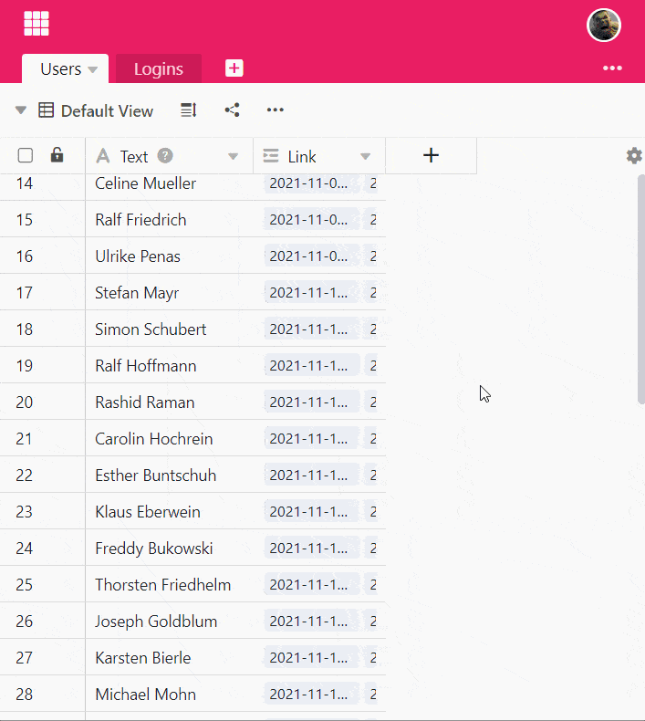

La **fórmula Findmax** busca el **valor máximo** entre las entradas de la columna vinculada y lo devuelve. Esto es útil si hay **varias entradas** en la tabla vinculada que hacen referencia al mismo registro (por ejemplo, de una persona) en otra tabla.

La fórmula Findmax sólo funciona con **valores numéricos**, por lo que el contenido de la columna vinculada también debe constar de valores numéricos. Además, el uso de la fórmula Findmax sólo tiene sentido si el control deslizante **Permitir vincular a varias filas** está activado al crear la columna **Vincular a otras entradas**. Si la opción estuviera desactivada, la fórmula Findmax contendría siempre el mismo número que en la columna vinculada.

## Para qué necesitas la fórmula Findmax

La **función Findmax** debe utilizarse cuando desee **cruzar** valores numéricos almacenados en diferentes tablas. Digamos que utiliza SeaTable para recoger las **horas de trabajo de** sus empleados, donde una tabla almacena los empleados y otra tabla almacena la actividad diaria. A continuación, puede vincular cada registro de empleado a las horas de trabajo introducidas.

Para saber cuándo se conectó por última vez un empleado, puede utilizar la **fórmula Buscarmáx** para mostrar el **valor mayor** -en este caso la última vez- del total de horas de conexión de una columna.

Puede utilizar la fórmula Findmax con todos los valores numéricos para representar el **valor máximo**.

## Para utilizar la fórmula Findmax

### Añadir un enlace a la tabla

Consulte el artículo [Cómo vincular tablas en SeaTable]() para obtener información sobre cómo crear una columna del tipo **Vincular a otras entradas**. Este es un requisito básico para poder utilizar la fórmula Findmax.

### Añadir una columna con la fórmula Findmax

1. Cree una nueva columna del tipo **Fórmula para los enlaces**.
2. Establezca la opción **Findmax** como fórmula.
3. Seleccione la columna creada anteriormente del tipo **Vincular a otras entradas** de esta tabla.
4. En el campo **Seleccionar columna de consulta en la tabla vinculada "..."**, defina la columna de la otra tabla que desea vincular a la columna de aquí.
5. Haga clic en **Enviar**.


