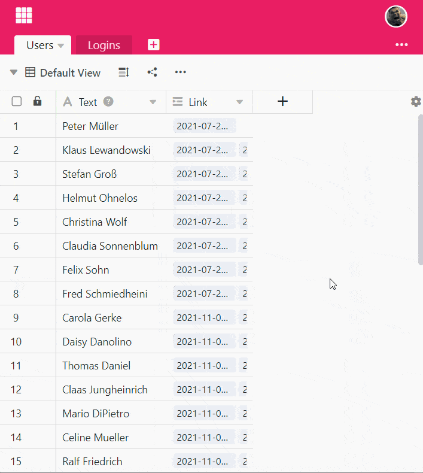

La **fórmula Findmin** busca el **valor mínimo** entre las entradas de una columna vinculada y lo devuelve. Esto es útil si hay **varias entradas** en la tabla vinculada que hacen referencia al mismo registro (por ejemplo, de una persona) en otra tabla.

La fórmula de Findmin sólo funciona con valores **numéricos**, por lo que el contenido de la columna vinculada también debe constar de valores numéricos. Además, el uso de la fórmula Findmin sólo tiene sentido si el control deslizante **Permitir enlazar con varias filas** está activado al crear la columna **Enlazar con otras entradas**. Si la opción estuviera desactivada, la fórmula Findmin contendría siempre el mismo número que en la columna vinculada.

## Para qué necesita la fórmula Findmin

La **función Findmin** debe utilizarse cuando desee **cruzar** valores numéricos almacenados en diferentes tablas. Digamos que utiliza SeaTable para recoger las **horas de trabajo de** sus empleados, donde una tabla almacena los empleados y otra tabla almacena la actividad diaria. A continuación, puede vincular cada registro de empleado a las horas de trabajo introducidas.

Para determinar cuándo inició sesión por primera vez un miembro del personal, puede utilizar la **fórmula de Findmin** para mostrar el **valor más pequeño** -en este caso el primer inicio de sesión- del total de inicios de sesión en una columna.

Puede utilizar la fórmula Findmin para todos los valores numéricos para representar el **valor mínimo**.

## Para utilizar la fórmula Findmin

### Añadir un enlace a la tabla

Descubra cómo crear una columna del tipo **Vincular a otras entradas** [en](). Este es un requisito básico para poder utilizar la fórmula Findmin.

### Añadir una columna con la fórmula Findmin

1. Cree una nueva columna del tipo **Fórmula para los enlaces**.
2. Establezca la opción **Findmin** como fórmula.
3. Seleccione la columna creada anteriormente del tipo **Vincular a otras entradas** de esta tabla.
4. En el campo **Seleccionar columna de consulta** de la **tabla vinculada "...", seleccione** la columna de la otra tabla que desea vincular a la columna de aquí.
5. Haga clic en **Enviar**.


