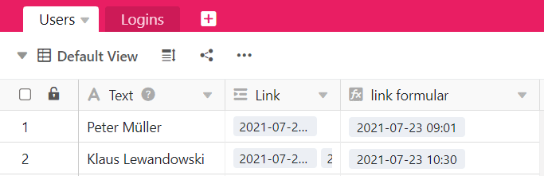
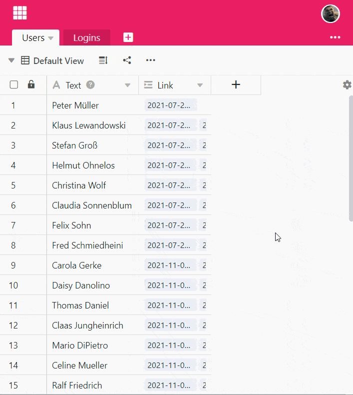

**Формула Findmin** ищет **минимальное значение** среди записей связанного столбца и возвращает его. Это полезно, если в связанной таблице есть **несколько записей**, которые ссылаются на одну и ту же запись (например, о человеке) в другой таблице.

Формула Findmin работает только с **числовыми значениями**, поэтому содержимое связанного столбца также должно состоять из числовых значений. Кроме того, использование формулы Findmin имеет смысл только в том случае, если при создании колонки **Связывание с другими записями** активирован ползунок **Разрешить связывание с несколькими строками**. Если бы опция была выключена, формула Findmin всегда содержала бы то же число, что и в связанном столбце.

## Для чего вам нужна формула Findmin

**Функцию Findmin** следует использовать, когда необходимо провести **перекрестные ссылки на** числовые значения, хранящиеся в разных таблицах. Допустим, вы используете SeaTable для сбора данных о **рабочем времени** ваших сотрудников, где в одной таблице хранятся сотрудники, а в другой - ежедневная деятельность. Затем вы можете связать каждую запись о сотруднике с введенными рабочими часами.

Чтобы определить, когда сотрудник впервые вошел в систему, вы можете использовать **формулу Findmin** для отображения **наименьшего значения** - в данном случае первого входа - из общего количества времени входа в столбец.

Вы можете использовать формулу Findmin для всех числовых значений, чтобы представить **минимальное значение**.

## Чтобы использовать формулу Финдмина

### Добавить ссылку на таблицу

Узнайте, как создать колонку типа **Ссылка на другие записи** [в](). Это основное требование для того, чтобы иметь возможность использовать формулу Findmin.

### Добавить столбец с формулой Findmin

1. Создайте новый столбец типа **Формула для ссылок**.
2. Задайте в качестве формулы параметр **Findmin**.
3. Выберите ранее созданный столбец типа **Связь с другими записями** в этой таблице.
4. В поле **Select look-up column** in the **linked table "..." выберите** столбец из другой таблицы, который вы хотите связать со столбцом здесь.
5. Нажмите **Отправить**.


