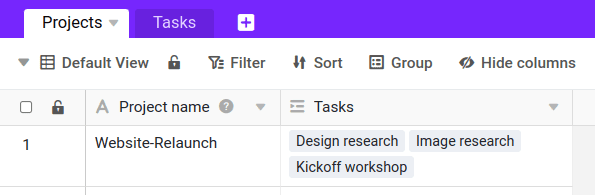
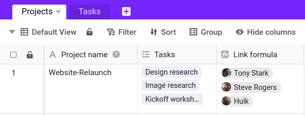

La fonction Lookup vous permet d'afficher des valeurs supplémentaires d'un tableau déjà liée dans votre tableau actuelle. Cela vous évite de devoir saisir les données deux fois et vous permet en même temps de mettre les données en relation les unes avec les autres. Dans Excel, cette fonction est connue sous le nom de _VLOOKUP_ ou _SVERWEIS_.

## Quand a-t-on besoin de la formule de recherche ?

La fonction de recherche devrait être utilisée chaque fois que vous souhaitez faire des références croisées à des informations stockées dans différents tableaux. Supposons que vous utilisiez SeaTable pour la [gestion de projets](), les projets étant stockés dans un tableau et les tâches associées au projet dans un autre tableau. Chaque projet est alors lié à une série de tâches.

En tant que chef de projet, vous souhaitez peut-être afficher des informations sur les tâches associées à chaque projet. La formule de recherche peut être utilisée pour sélectionner une colonne dans le tableau lié et afficher ses valeurs. Vous pouvez par exemple afficher automatiquement les collaborateurs du projet qui sont responsables de chaque tâche.

Cela peut être utile pour accéder facilement à des informations inter-tables, pour mettre en place des automatisations, des formules, etc. Vous trouverez ci-dessous plus d'informations sur l'utilisation de la fonction Lookup.

## Comment utiliser la colonne Lookup

### Ajouter un lien de tableau

La fonction Lookup ne peut être utilisée que s'il existe déjà une colonne de type _lien vers d'autres entrées_. Si vous ne disposez pas encore d'une telle colonne, commencez par en créer une. Pour savoir comment cela fonctionne, [cliquez ici]().

### Ajouter une formule de recherche

Au début, la formule de recherche peut vous dérouter. Mais vous verrez qu'en peu de temps, vous adorerez cette fonction de colonne incroyablement polyvalente et puissante. Voici comment ajouter une colonne avec la formule de recherche :

1. Créez une nouvelle colonne de type **Formule pour les liens**.
2. Définissez l'option **Lookup** comme formule.
3. Sélectionnez une **colonne de liens**. Ce champ est automatiquement rempli correctement si vous n'avez qu'une seule colonne de liens.
4. Avec la **colonne de référence dans le tableau lié**, vous déterminez de quelle colonne de l'autre tableau les valeurs doivent être reprises.
5. Cliquez sur **Envoyer**.

## Questions fréquentes sur la colonne de recherche

Sans aucun doute. Créez simplement une autre colonne et utilisez à nouveau la fonction Lookup. Vous pouvez ainsi lire et afficher autant d'informations que vous le souhaitez à partir du tableau lié.

C'est bien sûr possible. Cliquez sur l'**icône en forme de triangle** à droite du nom de la colonne, puis sur **Personnaliser le type de colonne**. Adaptez les paramètres de la colonne et les informations souhaitées s'affichent immédiatement.

Chaque formule de recherche ne peut récupérer que les informations d **'une seule** colonne de vos tableaux liés. Mais vous pouvez bien sûr utiliser des colonnes de liaison pour lier plusieurs tableaux et créer d'autres colonnes de lookup pour extraire et afficher encore plus d'informations.

Oui, vous pouvez filtrer les entrées comme vous le souhaitez. Pour ce faire, activez le **Régulateur** dans les _Paramètres des colonnes_ et sélectionnez la **Colonne(s)** dont les entrées doivent être recherchées. Vous pouvez sélectionner autant de **Conditions de filtrage** définir.


