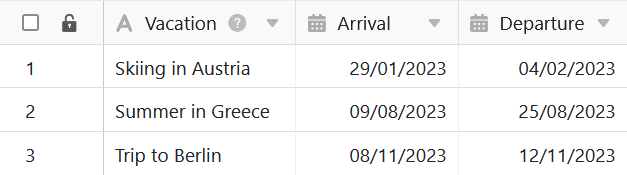
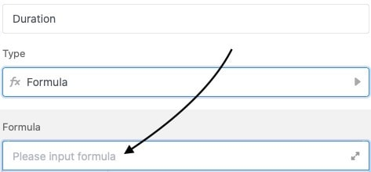
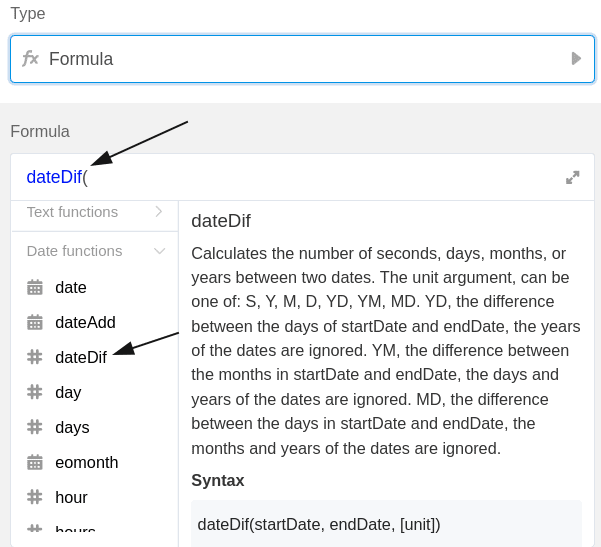
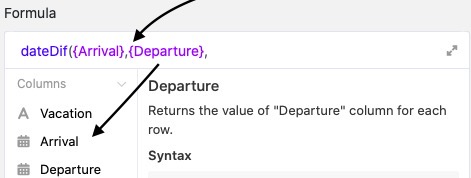
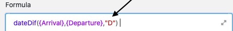
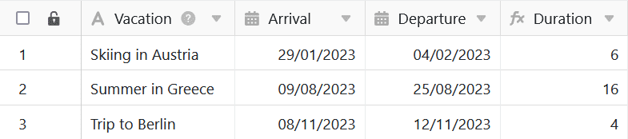
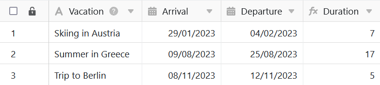

SeaTable formulas offer you several ways to work with the data in your tables. For example, formulas can be used to automatically determine the **time between two dates**. By entering a corresponding formula, you can thus calculate the duration of a vacation, among other things, and add it to a formula column of your table.

## Calculate duration of a vacation

In the concrete example, the goal is to use a formula to calculate the **duration of** the **vacations** collected in the table.

To do this, first add a **formula column** to the table, in whose editor you can then insert the **formula**.

To calculate the time between two dates, first add the **"dateDif"** function to the formula, which you can find in the formula editor under the **Date functions** tab.

In order for the formula to calculate the duration of each vacation, you must refer to the **columns** where the **arrival and departure dates** are recorded. It is especially important that the column names are framed with **curly brackets**.



Finally, you add the **calculation methodology to** the formula, which decides in which **format** the duration of your vacations will be displayed afterwards. If you want to calculate the time in **days**, write a **"D"** (for days) at the end of the formula. Before confirming, you must **close the parenthesis** so that the formula is accepted as valid.

After confirming the entered formula, the duration of each vacation will be **calculated** and automatically displayed in the **formula column of** your table.

Please note that the formula always calculates a date **from/to 00:00**, so the **departure day** is **not included**. If you want to include the departure day as a lump sum, for example November 8, 9, 10, 11 **and** 12, you can write "+1" at the end of your formula.

