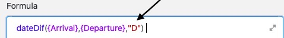

Les formules de SeaTable vous offrent différentes possibilités de travailler avec les données de vos tableaux. Par exemple, les formules peuvent être utilisées pour calculer automatiquement le **temps entre deux dates**. En saisissant une formule correspondante, vous pouvez notamment calculer la durée d'un congé et l'ajouter dans une colonne de formule de votre tableau.

## Calculer la durée d'un congé

Dans l'exemple concret, l'objectif est de calculer à l'aide d'une formule la **durée** des **congés** relevés dans le tableau.

Pour cela, vous ajoutez d'abord une **colonne de formule** au tableau, dans l'éditeur de laquelle vous pouvez ensuite insérer la **formule**.

Pour calculer le temps entre deux dates, ajoutez d'abord à la formule la fonction **"dateDif"**, que vous trouverez dans l'éditeur de formules sous l'onglet **Fonctions de date**.

Pour que la formule calcule la durée des différents congés, vous devez faire référence aux **colonnes** dans lesquelles les **dates d'arrivée et de départ** sont saisies. Il est particulièrement important que les noms des colonnes soient encadrés par des **accolades**.



Pour finir, ajoutez à la formule la **méthode de calcul** qui déterminera le **format** dans lequel la durée de vos vacances sera affichée. Si vous souhaitez calculer la durée en **jours**, inscrivez un **"D"** (pour days) à la fin de la formule. Avant de confirmer, vous devez encore **fermer** la **parenthèse** pour que la formule soit acceptée comme valable.

Après confirmation de la formule saisie, la durée des différents congés est **calculée** et s'affiche automatiquement dans la **colonne des formules de** votre tableau.

Veuillez noter que la formule calcule toujours une date **de/à 00:00**, le **jour de départ** n'est donc **pas pris en compte**. Si vous souhaitez inclure globalement le jour de départ, par exemple les 8, 9, 10, 11 **et** 12 novembre, vous pouvez écrire "+1" à la fin de votre formule.

