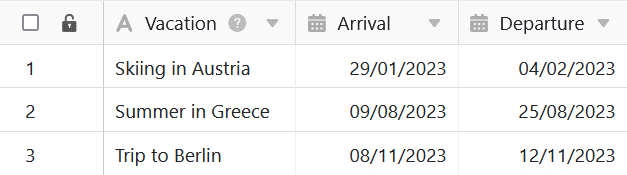
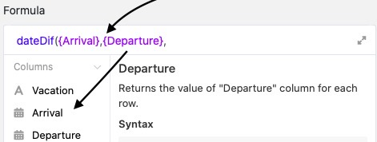
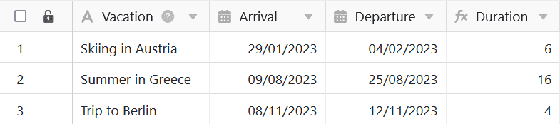

Формулы SeaTable предлагают различные способы работы с данными в таблицах. Например, формулы могут использоваться для автоматического определения **времени между двумя датами**. Введя соответствующую формулу, можно, в частности, рассчитать продолжительность отпуска и добавить ее в столбец формулы в таблице.

## Рассчитать продолжительность отпуска

В конкретном примере целью является использование формулы для расчета **продолжительности** **отпусков**, собранных в таблице.

Для этого сначала добавьте в таблицу **столбец формул**, в редактор которого затем можно вставить **формулу**.

Чтобы вычислить время между двумя датами, сначала добавьте в формулу функцию **"dateDif"**, которую можно найти в редакторе формул на вкладке **Функции даты**.

Для того чтобы формула вычислила продолжительность каждого отпуска, необходимо обратиться к **столбцам**, в которых записаны **даты приезда и отъезда**. Особенно важно, чтобы названия столбцов были заключены в **фигурные скобки**.



Наконец, добавьте **в** формулу **метод расчета**, определяющий **формат**, в котором будет отображаться продолжительность отпуска. Если вы хотите рассчитать время в **днях**, напишите в конце формулы **"D"** (для дней). Перед подтверждением необходимо **закрыть круглую скобку**, чтобы формула была принята как действительная.

После подтверждения введенной формулы продолжительность отдельных отпусков будет **рассчитана** и автоматически отображена в **столбце формул** вашей таблицы.

Обратите внимание, что в формуле всегда рассчитывается дата **от/до 00:** 00, поэтому **день вылета** **не учитывается**. Если вы хотите включить день вылета единовременно, например, 8, 9, 10, 11 **и** 12 ноября, то в конце формулы можно написать "+1".

