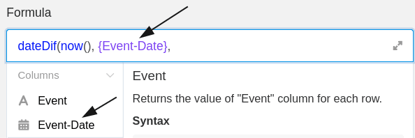
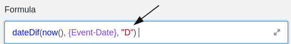
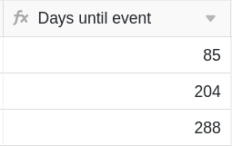

Les formules de SeaTable vous offrent plusieurs possibilités pour travailler avec les données de vos tableaux. L'une d'entre elles consiste à **calculer le nombre de jours avant un événement futur**. Vous pouvez par exemple utiliser une formule pour calculer le nombre de jours restants avant une formation, un anniversaire ou un autre événement.

## Calculer les jours jusqu'à un événement

Dans l'exemple concret, l'objectif est de calculer, à l'aide d'une formule, le **nombre de jours restants** jusqu'aux trois événements retenus.

Pour cela, vous ajoutez d'abord une **colonne de formule** au tableau, dans l'éditeur de laquelle vous pouvez ensuite insérer la **formule**.

Pour calculer les jours restants avant les événements, ajoutez d'abord à la formule la fonction **"dateDif"**, que vous trouverez dans l'éditeur de formules sous l'onglet **Fonctions de date**.

Ensuite, insérez la fonction **"now"** dans la formule, que vous trouverez également dans les fonctions de date. Cette fonction renvoie toujours la **date actuelle** et est donc essentielle pour que les jours restants jusqu'aux événements soient toujours affichés à partir de la date actuelle. Veillez à bien **fermer** les parenthèses de la fonction dans la formule, sinon elle ne sera **pas** reconnue par SeaTable.

Pour que la formule calcule les jours restants jusqu'aux événements, vous devez faire référence à la **colonne** dans laquelle la **date de l'événement** est saisie. Il est particulièrement important que le nom de la colonne soit encadré par des **accolades**.



Pour finir, ajoutez la **méthode de calcul** qui détermine le **format** dans lequel le temps restant jusqu'aux événements sera ensuite affiché. Si vous souhaitez calculer le temps restant en **jours**, ajoutez un **"D"** (pour days) à la formule. Avant de confirmer, vous devez **fermer** la **parenthèse** pour que la formule soit acceptée comme valable.

Après confirmation de la formule saisie, les jours restants jusqu'aux événements sont **calculés** et automatiquement affichés dans la **colonne des formules de** votre tableau.

