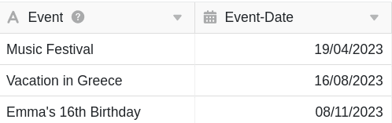
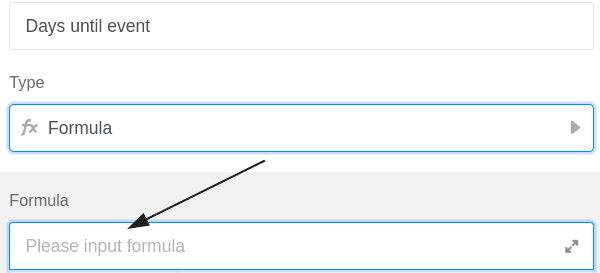
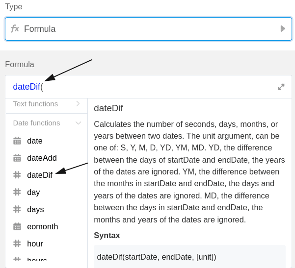
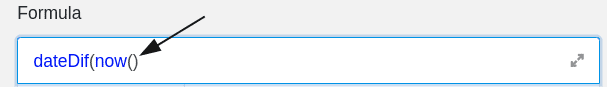
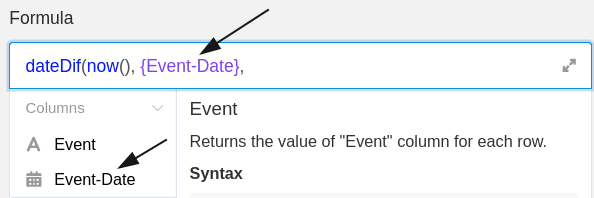
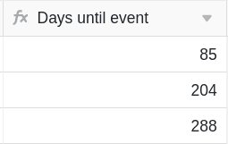

As fórmulas SeaTable oferecem-lhe várias formas de trabalhar com os dados das suas tabelas. Uma delas é calcular os **dias até um evento futuro**. Por exemplo, pode utilizar uma fórmula para calcular os dias que faltam para uma formação, aniversário ou outro evento.

## Calcular dias até um evento

No exemplo concreto, o objectivo é utilizar uma fórmula para calcular os **dias restantes** até aos três eventos registados.

Para o fazer, comece por adicionar uma **coluna de fórmula** à tabela, em cujo editor pode então inserir a **fórmula**.

Para calcular os dias que faltam para os eventos, comece por adicionar a função **"dateDif"** à fórmula, que pode encontrar no editor de fórmulas no separador **Funções de data**.

Em seguida, inserir a função **"now"** na fórmula, que também se encontra nas funções de data. A função devolve sempre a **data atual** e é, por isso, essencial para garantir que os dias que faltam para os eventos são sempre apresentados a partir da hora atual. Na fórmula, certifique-se de que **fecha** os parêntesis da função, caso contrário **não** será reconhecida pelo SeaTable.

Para que a fórmula calcule os dias que faltam para os eventos, é necessário fazer referência à **coluna** em que está registada a **data do evento**. É particularmente importante que o nome da coluna seja enquadrado **entre parênteses rect** os.



Por fim, adicione o **método de cálculo**, que determina o **formato** em que é apresentado o tempo restante até aos eventos. Se se pretender calcular o tempo restante em **dias**, acrescentar um **"D"** (de dias) à fórmula. Antes de confirmar, é necessário **fechar os parênteses** para que a fórmula seja aceite como válida.

Depois de confirmar a fórmula introduzida, os dias que faltam para os eventos são **calculados** e automaticamente apresentados na **coluna da fórmula da** sua tabela.

