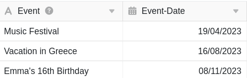
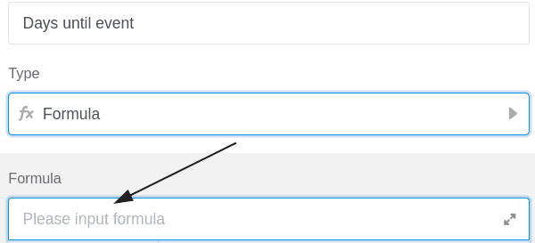
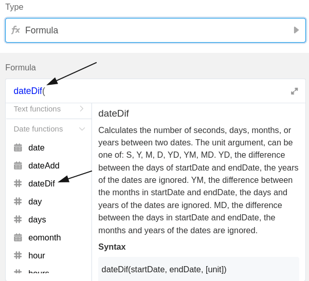

Формулы SeaTable предлагают несколько способов работы с данными в таблицах. Один из них - вычисление количества **дней до будущего события**. Например, с помощью формулы можно рассчитать количество дней, оставшихся до тренинга, дня рождения или другого события.

## Рассчитать количество дней до события

В конкретном примере цель состоит в том, чтобы с помощью формулы рассчитать **оставшиеся дни** до записанных трех событий.

Для этого сначала добавьте в таблицу **столбец формул**, в редактор которого затем можно вставить **формулу**.

Чтобы рассчитать оставшиеся дни до событий, сначала добавьте в формулу функцию **"dateDif"**, которую можно найти в редакторе формул на закладке **Date functions**.

После этого вставьте в формулу функцию **"сейчас"**, которую вы также найдете в функциях даты. Эта функция всегда возвращает **текущую дату** и поэтому необходима для того, чтобы оставшиеся до событий дни всегда отображались по текущему времени. В формуле обязательно **закройте** круглые скобки функции, иначе она **не** будет распознана SeaTable.

Для того чтобы формула вычислила оставшиеся дни до событий, необходимо обратиться к **столбцу**, в котором записана **дата события**. Особенно важно, чтобы имя столбца было обрамлено **фигурными скобками**.



Наконец, добавьте **метод расчета**, который определяет **формат** отображения оставшегося времени до событий. Если вы хотите вычислить оставшееся время в **днях**, добавьте в формулу символ **"D"** (для дней). Перед подтверждением необходимо **закрыть круглую скобку**, чтобы формула была принята как действительная.

После подтверждения введенной формулы оставшиеся дни до событий будут **рассчитаны** и автоматически отображены в **столбце формул** вашей таблицы.

