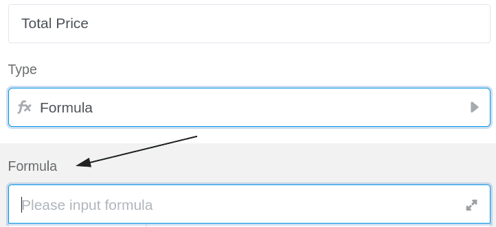
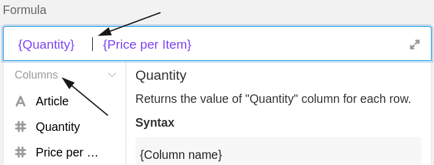
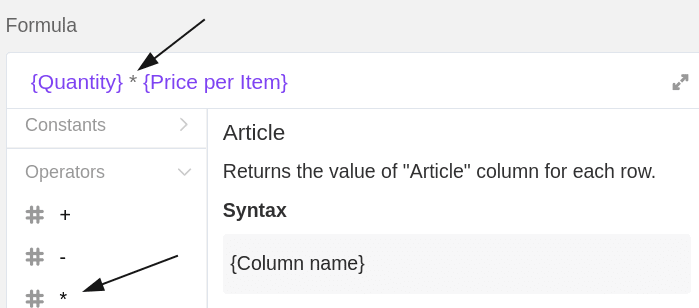

SeaTable Formeln bieten Ihnen verschiedene Möglichkeiten, mit den Daten in Ihren Tabellen zu arbeiten. Eine davon ist die **Multiplikation**. Mithilfe einer entsprechenden Formel können Sie einzelne Werte in den Spalten Ihrer Tabellen miteinander multiplizieren.

## Einfache Multiplikation

Im konkreten Beispiel ist das Ziel, mithilfe einer Formel den **Gesamtpreis** der angegebenen Artikel zu berechnen. Dafür muss man die **Anzahl** mit dem **Stückpreis** multiplizieren.

Hierfür fügen Sie der Tabelle zunächst eine **Formel-Spalte** hinzu, in deren Editor Sie anschließend eine Formel definieren können.

Um zwei Werte einer Zeile miteinander zu multiplizieren, müssen Sie in der Formel auf die **Namen der Spalten** verweisen, in denen die entsprechenden **Werte** zu finden sind. Besonders wichtig dabei ist, dass die Spaltennamen mit **geschweiften Klammern** umrahmt sind, da SeaTable ansonsten nicht erkennen kann, welche Werte miteinander multipliziert werden sollen.



Um die Formel abzuschließen, fügen Sie zwischen den beiden Spaltennamen noch ein **Multiplikationszeichen** hinzu, welches Sie im Formeleditor bei den **Operanden** finden.

Alternativ können Sie die Multiplikation auch als Formel nach dem Schema **multiply({column1}, {column2})** in den Formeleditor schreiben.

Nach Bestätigung der eingegebenen Formel werden die Werte in den ausgewählten Spalten miteinander multipliziert und die **Ergebnisse** erscheinen automatisch in der Formel-Spalte.

Zuletzt legen Sie noch in den **Formateinstellungen** der Formel-Spalte fest, dass die Ergebnisse in Euro angezeigt und auf zwei Nachkommastellen gerundet werden sollen.

