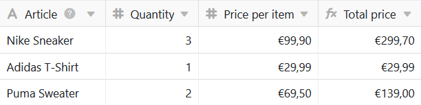

SeaTable formulas offer you several ways to work with the data in your tables. One of them is **multiplication**. With the help of an appropriate formula you can multiply individual values in the columns of your tables with each other.

## Simple multiplication

In the concrete example, the goal is to use a formula to calculate the **total price of** the specified items. To do this, you need to multiply the **number** by the **unit price**.

To do this, you first add a **formula column** to the table, in whose editor you can then define a formula.

In order to multiply two values of a row with each other, you have to refer to the **names of the columns** in which the corresponding **values** can be found in the formula. It is especially important that the column names are framed with **curly brackets**, otherwise SeaTable cannot recognize which values are to be multiplied together.



To complete the formula, add a **multiplication sign** between the two column names, which you can find in the formula editor at the **operands**.

Alternatively, you can write the multiplication as a formula according to the scheme **multiply({column1}, {column2})** in the formula editor.

After confirming the entered formula, the values in the selected columns are multiplied together and the **results** appear automatically in the formula column.

Finally, in the **format settings of** the formula column, you specify that the results should be displayed in euros and rounded to two decimal places.

