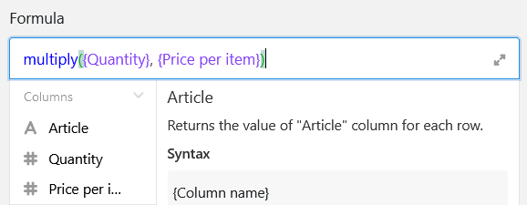
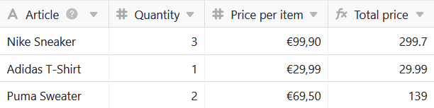

Las fórmulas de SeaTable le ofrecen varias formas de trabajar con los datos de sus tablas. Una de ellas es la **multiplicación**. Con la ayuda de una fórmula correspondiente, puede multiplicar entre sí valores individuales de las columnas de sus tablas.

## Multiplicación simple

En el ejemplo concreto, el objetivo es utilizar una fórmula para calcular el **precio total de** los artículos dados. Para ello, multiplica el **número** por el **precio unitario**.

Para ello, añada primero una **columna de fórmulas** a la tabla, en cuyo editor podrá definir una fórmula.

Para multiplicar dos valores de una fila entre sí, debe hacer referencia a los **nombres de las columnas** en las que se encuentran los **valores** correspondientes en la fórmula. Es especialmente importante que los nombres de las columnas estén entre **paréntesis**, ya que de lo contrario SeaTable no podrá reconocer qué valores deben multiplicarse entre sí.



Para completar la fórmula, añada un **signo de multiplicación** entre los dos nombres de columna, que encontrará en el editor de fórmulas bajo los **operandos**.

Alternativamente, puede escribir la multiplicación como una fórmula según el esquema **multiplicar({columna1}, {columna2})** en el editor de fórmulas.

Tras confirmar la fórmula introducida, los valores de las columnas seleccionadas se multiplican entre sí y los **resultados** aparecen automáticamente en la columna de la fórmula.

Por último, en los **ajustes de formato de** la columna de fórmulas, se especifica que los resultados se muestren en euros y redondeados a dos decimales.

