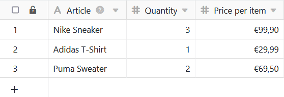

Les formules de SeaTable vous offrent plusieurs possibilités pour travailler avec les données de vos tableaux. L'une d'entre elles est la **multiplication**. En utilisant une formule, vous pouvez multiplier les valeurs individuelles dans les colonnes de vos tableaux.

## Multiplication simple

Dans l'exemple concret, l'objectif est de calculer le **prix total** des articles indiqués à l'aide d'une formule. Pour cela, il faut multiplier le **nombre** par le **prix unitaire**.

Pour cela, vous ajoutez d'abord une **colonne de formule** au tableau, dans l'éditeur de laquelle vous pouvez ensuite définir une formule.

Pour multiplier deux valeurs d'une ligne, vous devez faire référence dans la formule aux **noms des colonnes** dans lesquelles se trouvent les **valeurs** correspondantes. Il est particulièrement important que les noms des colonnes soient encadrés par des **accolades**, sinon SeaTable ne pourra pas identifier les valeurs à multiplier entre elles.



Pour terminer la formule, ajoutez encore un **signe de multiplication** entre les deux noms de colonne, que vous trouverez dans l'éditeur de formules sous les **opérandes**.

Vous pouvez également écrire la multiplication dans l'éditeur de formules sous forme de formule selon le schéma **multiply({column1}, {column2})**.

Après confirmation de la formule saisie, les valeurs des colonnes sélectionnées sont multipliées entre elles et les **résultats** apparaissent automatiquement dans la colonne des formules.

Enfin, dans les **paramètres de format** de la colonne de formule, vous spécifiez que les résultats doivent être affichés en euros et arrondis à deux chiffres après la virgule.

