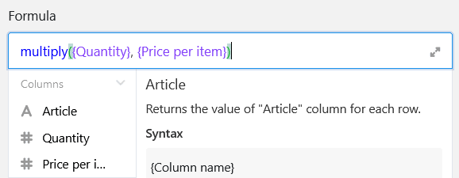
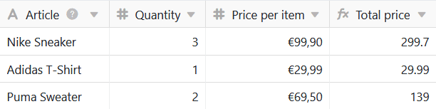
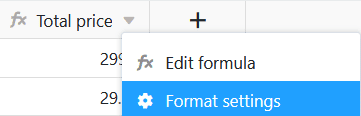
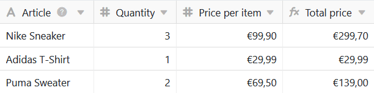

Формулы SeaTable предлагают несколько способов работы с данными в таблицах. Одним из них является **умножение**. С помощью соответствующей формулы можно перемножать между собой отдельные значения в столбцах таблиц.

## Простое умножение

В конкретном примере задача состоит в том, чтобы с помощью формулы вычислить **общую стоимость** указанных товаров. Для этого необходимо умножить **количество** на **цену единицы** товара.

Для этого сначала добавьте в таблицу **столбец формул**, в редакторе которого можно задать формулу.

Для того чтобы перемножить два значения строки между собой, необходимо сослаться в формуле на **названия столбцов**, в которых находятся соответствующие **значения**. Особенно важно, чтобы имена столбцов были заключены в **фигурные скобки**, иначе SeaTable не сможет распознать, какие значения необходимо перемножить.



Чтобы завершить формулу, добавьте между двумя именами столбцов **знак умножения**, который вы найдете в редакторе формул под **операндами**.

В качестве альтернативы можно записать умножение в виде формулы по схеме **multiply({column1}, {column2})** в редакторе формул.

После подтверждения введенной формулы значения в выбранных столбцах перемножаются, и **результат** автоматически появляется в столбце формулы.

Наконец, в **настройках формата** столбца формул указывается, что результаты должны отображаться в евро и округляться до двух знаков после запятой.

