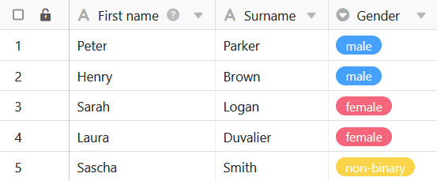
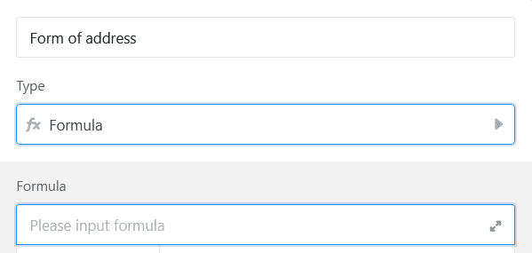
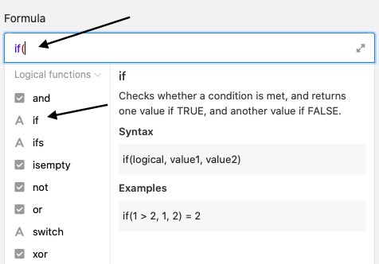
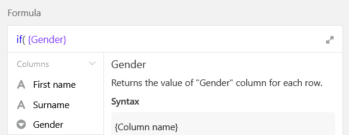
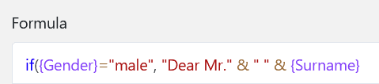
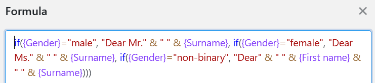
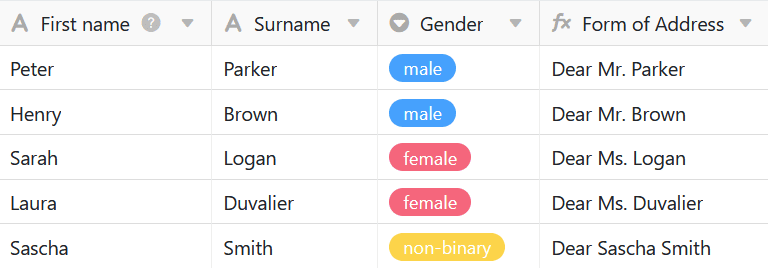

SeaTable Formeln bieten Ihnen verschiedene Möglichkeiten, mit den Daten in Ihren Tabellen zu arbeiten. Eine Möglichkeit stellt das bedingte Ausfüllen von Werten mittels **If-Operatoren** dar. Durch die Eingabe einer entsprechenden Formel können Sie die Werte in der Formel-Spalte – abhängig von den Daten in anderen Tabellenspalten – automatisch befüllen lassen.

## Logische If-Operatoren

Im konkreten Beispiel ist das Ziel, mithilfe einer Formel die **Anrede** verschiedener Kunden, abhängig von deren **Geschlecht**, automatisch in einer Formel-Spalte zu erfassen.

Hierfür fügen Sie der Tabelle zunächst eine **Formel-Spalte** hinzu, in deren Editor Sie anschließend die **Formel** einfügen können.

Um die geschlechtsspezifische Anrede der Kunden automatisch in der Formel-Spalte zu erheben, fügen Sie der Formel zunächst einen **If-Operator** hinzu. Sie finden diesen im Formeleditor unter dem Reiter **Logische Funktionen**. If-Operatoren **prüfen**, ob der Eintrag in einer ausgewählten Spalte den im Vorhinein definierten Bedingungen entspricht und geben je nach positivem oder negativen Ergebnis einen entsprechenden **Wert** zurück.

Im nächsten Schritt definieren Sie die **Bedingungen**, die in der gewünschten Spalte zutreffen müssen, damit die Formel-Spalte automatisch mit den entsprechenden Werten befüllt wird.

Hierzu müssen Sie zunächst auf die konkrete **Spalte** verweisen, in welcher die Bedingung zutreffen muss. Dabei muss der Spaltenname mit **geschweiften Klammern** umrahmt sein.



Direkt hinter der Spalte "Geschlecht" setzen Sie zunächst einen gewünschten **Operator**. Muss in der Spalte ein exakter Wert vorliegen, nutzen Sie zum Beispiel den Operator **\=** (ist gleich). Sie finden die Operatoren auch links im Formeleditor.

Nach dem Operator definieren Sie die konkreten **Bedingungen**, die in der Spalte zutreffen müssen, damit die Formel-Spalte automatisch mit der entsprechenden Anrede befüllt wird. Schreiben Sie dabei zunächst den **Wert**, der in der Spalte "Geschlecht" vorliegen muss, in **Anführungszeichen** in die Formel. Durch ein **Komma** getrennt folgt anschließend, ebenfalls in Anführungszeichen, die **Anrede**, welche in die Formel-Spalte eingefügt wird.

Um die Anrede mit den jeweiligen **Namen** zu befüllen, referenzieren Sie mit geschweiften Klammern auf die Spalten "Vorname" und/oder "Nachname". Erfahren Sie mehr zum [Zusammenführen von Text-Spalten mithilfe einer Formel]().

Die beschriebenen Schritte zur Definition einer Bedingung können Sie im Anschluss für **jeden Wert** der Spalte "Geschlecht" wiederholen. Die verschiedenen Bedingungen müssen Sie dabei stets durch ein **Komma** voneinander trennen. Vor der Bestätigung gilt es noch zu beachten, dass Sie unbedingt **alle Klammern schließen** müssen, damit die Formel als gültig akzeptiert wird.

Nach Bestätigung der eingegebenen Formel werden die für jede Bedingung definierten **Werte** automatisch in die **Formel-Spalte** Ihrer Tabelle geschrieben.

