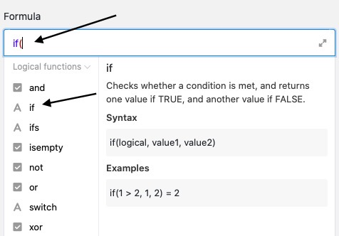
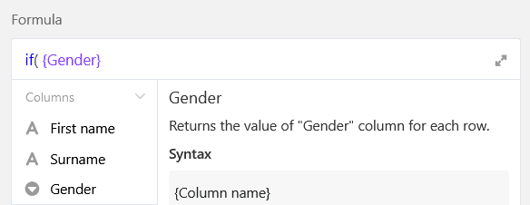

Las fórmulas de SeaTable le ofrecen diferentes formas de trabajar con los datos de sus tablas. Una posibilidad es el relleno condicional de valores utilizando **operadores if**.  
Introduciendo la fórmula correspondiente, puede rellenar automáticamente los valores de la columna de la fórmula en función de los datos de otras columnas de la tabla.

## Operadores lógicos if

En el ejemplo concreto, se trata de utilizar una fórmula para introducir automáticamente el **saludo** de distintos clientes, en función de su **sexo**, en una columna de fórmulas.

Para ello, añada primero una **columna de fórmulas** a la tabla, en cuyo editor podrá insertar después la **fórmula**.

Para recoger automáticamente el saludo de los clientes según su sexo en la columna de la fórmula, añada primero un operador **if** a la fórmula. Lo encontrará en el editor de fórmulas, en la pestaña **Funciones lógicas**. Los operadores if **comprueban** si la entrada de una columna seleccionada corresponde a las condiciones definidas de antemano y devuelven un **valor** correspondiente en función del resultado positivo o negativo.

En el siguiente paso, se definen las **condiciones** que deben aplicarse en la columna deseada para que la columna de fórmulas se rellene automáticamente con los valores correspondientes.

Para ello, primero debe hacer referencia a la **columna** concreta en la que debe aplicarse la condición. El nombre de la columna debe ir entre **corchetes**.



En primer lugar, establezca un **operador** deseado directamente detrás de la columna "Sexo". Si la columna debe contener un valor exacto, utilice el operador **\=** (es igual a), por ejemplo. También puede encontrar los operadores a la izquierda en el editor de fórmulas.

Después del operador, defina las **condiciones** concretas que deben aplicarse en la columna para que la columna de la fórmula se rellene automáticamente con el saludo correspondiente. Escriba primero el **valor** que debe estar presente en la columna "Sexo" **entre com** illas en la fórmula. A continuación, separada por **una coma**, se inserta el **saludo** en la columna de la fórmula, también entre comillas.

Para rellenar el saludo con los **nombres** respectivos, haga referencia a las columnas "Nombre" y/o "Apellidos" con llaves. Más información sobre la [combinación de columnas de texto mediante una fórmula](https://seatable.io/es/docs/formeln/formelbeispiel-zusammenfuehren-von-text-spalten-mit-hilfe-einer-formel/).

A continuación, puede repetir los pasos descritos para definir una condición para **cada valor** de la columna "Sexo". Debe separar siempre las distintas condiciones entre sí con una **coma**. Antes de confirmar, es importante que **cierre todos los paréntesis** para que la fórmula se acepte como válida.

Tras confirmar la fórmula introducida, los **valores** definidos para cada condición se escriben automáticamente en la **columna de fórmulas de** la tabla.

