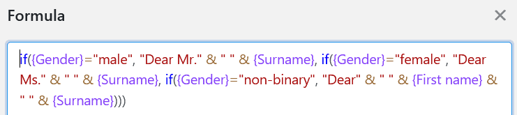

Les formules de SeaTable vous offrent différentes possibilités de travailler avec les données de vos tableaux. L'une d'entre elles consiste à remplir les valeurs de manière conditionnelle à l'aide d **'opérateurs If**.  
En saisissant une formule correspondante, vous pouvez remplir automatiquement les valeurs dans la colonne de la formule - en fonction des données dans les autres colonnes du tableau.

## Opérateurs If logiques

Dans l'exemple concret, l'objectif est de saisir automatiquement, à l'aide d'une formule, la **formule de politesse** de différents clients, en fonction de leur **sexe**, dans une colonne de formule.

Pour cela, vous ajoutez d'abord une **colonne de formule** au tableau, dans l'éditeur de laquelle vous pouvez ensuite insérer la **formule**.

Pour relever automatiquement la formule de politesse spécifique au sexe des clients dans la colonne de formule, ajoutez d'abord un **opérateur If** à la formule. Vous le trouverez dans l'éditeur de formules sous l'onglet **Fonctions logiques**. Les opérateurs If **vérifient** si l'entrée dans une colonne sélectionnée correspond aux conditions définies au préalable et renvoient une **valeur** correspondante en fonction du résultat positif ou négatif.

Dans l'étape suivante, vous définissez les **conditions** qui doivent s'appliquer dans la colonne souhaitée pour que la colonne de formule soit automatiquement remplie avec les valeurs correspondantes.

Pour ce faire, vous devez d'abord vous référer à la **colonne** concrète dans laquelle la condition doit s'appliquer. Le nom de la colonne doit être entouré d'**accolades**.



Juste après la colonne "sexe", placez d'abord l'**opérateur** souhaité. Si la colonne doit contenir une valeur exacte, utilisez par exemple l'opérateur **\=** (est égal à). Vous trouverez également les opérateurs à gauche dans l'éditeur de formules.

Après l'opérateur, vous définissez les **conditions** concrètes qui doivent être remplies dans la colonne pour que la colonne de formule soit automatiquement remplie avec la formule de politesse correspondante. Pour cela, écrivez d'abord la **valeur** qui doit être présente dans la colonne "sexe" entre **guillemets** dans la formule. Séparée par une **virgule**, la **formule de politesse** est ensuite insérée dans la colonne de formule, également entre guillemets.

Pour remplir la formule de politesse avec les **noms** respectifs, faites référence aux colonnes "Prénom" et/ou "Nom" à l'aide d'accolades. En savoir plus sur la [fusion de colonnes de texte à l'aide d'une formule](https://seatable.io/fr/docs/formeln/formelbeispiel-zusammenfuehren-von-text-spalten-mit-hilfe-einer-formel/).

Vous pouvez ensuite répéter les étapes décrites pour définir une condition pour **chaque valeur** de la colonne "sexe". Vous devez toujours séparer les différentes conditions par une **virgule**. Avant de confirmer, il faut absolument **fermer toutes les parenthèses** pour que la formule soit acceptée comme valable.

Après confirmation de la formule saisie, les **valeurs** définies pour chaque condition sont automatiquement inscrites dans la **colonne de formule** de votre tableau.

