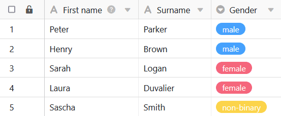
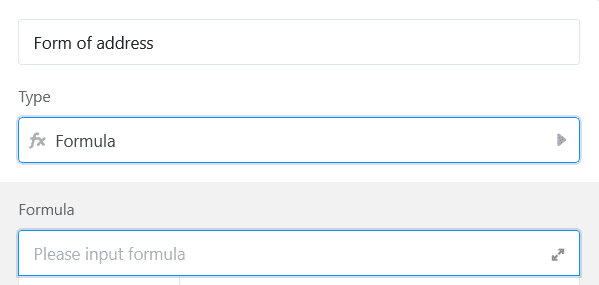

Формулы SeaTable предлагают различные способы работы с данными в таблицах. Одним из них является условное заполнение значений с помощью **операторов if**.  
Введя соответствующую формулу, можно добиться автоматического заполнения значений в столбце формулы - в зависимости от данных в других столбцах таблицы.

## Логические операторы if

В конкретном примере задача состоит в том, чтобы с помощью формулы автоматически вводить в столбец формулы **приветствия** различных клиентов в зависимости от их **пола**.

Для этого сначала добавьте в таблицу **столбец формул**, в редактор которого затем можно вставить **формулу**.

Чтобы автоматически собирать в столбце формулы приветствие клиентов по половому признаку, сначала добавьте в формулу оператор **if**. Он находится в редакторе формул на вкладке **Логические функции**. Операторы if **проверяют**, соответствует ли запись в выбранном столбце заранее заданным условиям, и в зависимости от положительного или отрицательного результата возвращают соответствующее **значение**.

На следующем шаге задаются **условия**, которые должны применяться в нужном столбце, чтобы столбец формул автоматически заполнялся соответствующими значениями.

Для этого необходимо сначала сослаться на конкретный **столбец**, в котором должно выполняться условие. Имя колонки должно быть заключено в **фигурные скобки**.



Во-первых, задайте нужный **оператор** непосредственно за столбцом "Пол". Если столбец должен содержать точное значение, используйте, например, оператор **\=** (равно). Операторы можно также найти слева в редакторе формул.

После оператора определите конкретные **условия**, которые должны действовать в столбце, чтобы столбец формулы автоматически заполнился соответствующим приветствием. Сначала в формулу через **запятую** записывается **значение**, которое должно присутствовать в столбце "Пол". Затем через **запятую** в столбец формулы вставляется **приветствие**, также через запятую.

Чтобы заполнить приветствие соответствующими **именами**, укажите столбцы "Имя" и/или "Фамилия" с помощью фигурных скобок. Подробнее об [объединении текстовых столбцов с помощью формулы](https://seatable.io/ru/docs/formeln/formelbeispiel-zusammenfuehren-von-text-spalten-mit-hilfe-einer-formel/).

Затем можно повторить шаги, описанные для определения условия для **каждого значения** в столбце "Пол". Различные условия всегда следует отделять друг от друга **запятой**. Перед подтверждением необходимо **закрыть все скобки**, чтобы формула была принята как действительная.

После подтверждения введенной формулы **значения**, определенные для каждого условия, автоматически записываются в **столбец формул** вашей таблицы.

