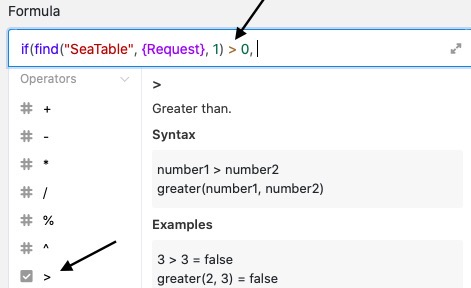

SeaTable Formeln bieten Ihnen verschiedene Möglichkeiten, mit den Daten in Ihren Tabellen zu arbeiten. Eine Möglichkeit ist die **Suche nach Wörtern in einem Text**. Durch die Eingabe einer entsprechenden Formel können Sie eine [Text-Spalte](https://seatable.io/docs/text-und-zahlen/die-spalten-text-und-formatierter-text/) automatisch nach beliebigen Wörtern durchsuchen und einen Hinweis - z. B. "Wort gefunden/nicht gefunden" - als Ergebnis in eine Formel-Spalte Ihrer Tabelle schreiben lassen.

## Nach einem Wort in einem Text suchen

Im konkreten Beispiel ist das Ziel, mithilfe einer Formel nach einem **Wort** in der Text-Spalte **"Request"** zu suchen.

Hierfür fügen Sie der Tabelle zunächst eine **Formel-Spalte** hinzu, in deren Editor Sie anschließend die **Formel** einfügen können.

Um nach einem Wort in einer Text-Spalte zu suchen, fügen Sie der Formel zunächst einen **If-Operator** hinzu, den Sie im Formeleditor unter dem Reiter **Logische Funktionen** finden. Er untersucht, ob eine definierte **Bedingung** zutrifft oder nicht, und gibt je nach positivem oder negativem Ergebnis einen bestimmten **Wert** zurück.

Im nächsten Schritt erweitern Sie die Formel um die Funktion **find**, mit deren Hilfe die Text-Spalte nach einem spezifischen Wort durchsucht werden kann. Sie finden die Funktion im Formeleditor bei den **Textfunktionen**.

Nach den beiden Funktionen folgt in der Formel das **spezifische Wort**, das Sie in der Text-Spalte suchen lassen möchten. Schreiben Sie das Wort in **Anführungszeichen** in die Formel.

Der nächste Bestandteil der Formel ist der **Name der Spalte**, die auf das Vorhandensein des gesuchten Wortes überprüft werden soll. Besonders wichtig ist dabei, dass der Spaltenname mit **geschweiften Klammern** umrahmt ist, da SeaTable ansonsten **nicht** erkennen kann, welcher Text mithilfe der Formel überprüft werden soll.



Hinter dem Spaltennamen fügen Sie die mathematische Gleichung "**1 > 0**" ein. Diese ist für die Formel von Bedeutung, da Sie angibt, dass ein spezifischer **Wert** zurückgegeben wird, sobald das gesuchte Wort **mindestens einmal** in der Text-Spalte gefunden wird. Achten Sie in der Formel darauf, die Klammer **nach** der ersten Zahl zu **schließen**. Die **Vergleichszeichen** ( > , < , = , etc.) finden Sie im Formeleditor unter **Operatoren**.

Abschließend definieren Sie in der Formel noch die **Werte**, die Ihnen in der Formel-Spalte für das **Finden** bzw. **Nicht-Finden** des gesuchten Wortes im Text zurückgegeben werden. Der **zuerst** eingegebene Wert erscheint dabei stets in der Formel-Spalte, wenn das gesuchte Wort im Text **gefunden** wurde, der zweite Wert im gegenteiligen Fall. Setzen Sie die Werte stets in **Anführungszeichen** und trennen Sie diese mit einem **Komma**.

Vor der Bestätigung gilt es noch zu beachten, dass Sie die **Klammer schließen** müssen, damit die Formel als gültig akzeptiert wird.

Nach Bestätigung der eingegebenen Formel können Sie anhand des Werts in der **Formel-Spalte** erkennen, ob das gesuchte Wort in der Text-Spalte gefunden wurde.

