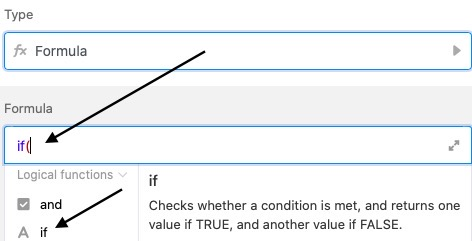
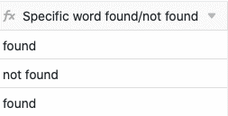

Les formules de SeaTable vous offrent différentes possibilités de travailler avec les données de vos tableaux. Une possibilité est la **recherche de mots dans un texte**. En saisissant une formule correspondante, vous pouvez rechercher automatiquement n'importe quel mot [dans une colonne de texte]() et faire écrire une note - par exemple "mot trouvé/non trouvé" - comme résultat dans une colonne de formule de votre tableau.

## Rechercher un mot dans un texte

Dans l'exemple concret, l'objectif est de rechercher un **mot** dans la colonne de texte **"Request"** à l'aide d'une formule.

Pour cela, vous ajoutez d'abord une **colonne de formule** au tableau, dans l'éditeur de laquelle vous pouvez ensuite insérer la **formule**.

Pour rechercher un mot dans une colonne de texte, ajoutez d'abord à la formule un **opérateur If**, que vous trouverez dans l'éditeur de formules sous l'onglet **Fonctions logiques**. Il examine si une **condition** définie s'applique ou non et renvoie une certaine **valeur** en fonction du résultat positif ou négatif.

L'étape suivante consiste à ajouter à la formule la fonction **find**, qui permet de rechercher un mot spécifique dans la colonne de texte. Vous trouverez cette fonction dans l'éditeur de formules, sous les **fonctions de texte**.

Après les deux fonctions, la formule contient le **mot spécifique** que vous souhaitez rechercher dans la colonne de texte. Écrivez le mot entre **guillemets** dans la formule.

L'élément suivant de la formule est le **nom de la colonne** dont la présence du mot recherché doit être vérifiée. Il est particulièrement important que le nom de la colonne soit entouré d'**accolades**, sinon SeaTable ne pourra **pas** identifier le texte à vérifier à l'aide de la formule.



Après le nom de la colonne, insérez l'équation mathématique `1 > 0`. Celle-ci est importante pour la formule, car elle indique qu'une **valeur** spécifique est renvoyée dès que le mot recherché est trouvé **au moins une fois** dans la colonne de texte. Dans la formule, veillez à **fermer** la parenthèse **après** le premier chiffre. Les **caractères de comparaison** ( > , < , = , etc.) se trouvent dans l'éditeur de formules sous **Opérateurs**.

Pour finir, vous définissez dans la formule les **valeurs** qui vous sont renvoyées dans la colonne de formule lorsque le mot recherché a été **trouvé** ou **non** dans le texte. La **première** valeur saisie apparaît toujours dans la colonne de formule si le mot recherché a été **trouvé** dans le texte, la deuxième valeur dans le cas contraire. Placez toujours les valeurs entre **guillemets** et séparez-les par une **virgule**.

Avant de confirmer, il faut encore noter que vous devez **fermer** la **parenthèse** pour que la formule soit acceptée comme valable.

Après avoir confirmé la formule saisie, vous pouvez voir si le mot recherché a été trouvé dans la colonne de texte en fonction de la valeur indiquée dans la colonne de **formule**.

