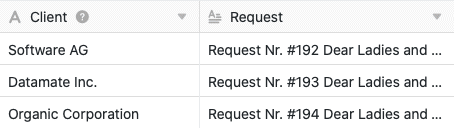
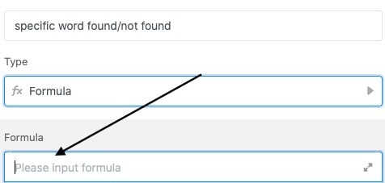
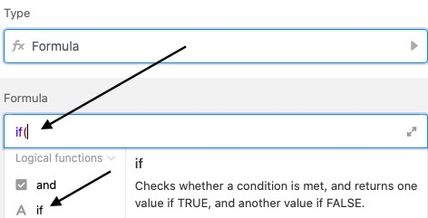
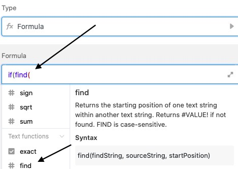
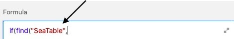
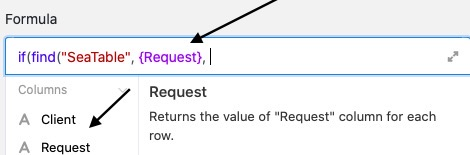
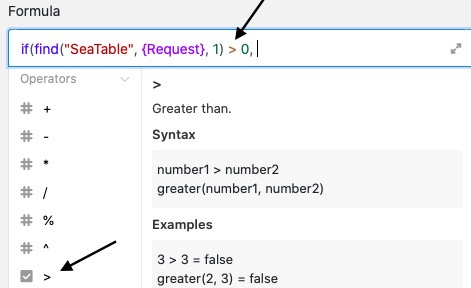
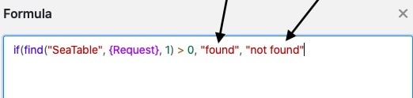

As fórmulas SeaTable oferecem-lhe diferentes formas de trabalhar com os dados das suas tabelas. Uma possibilidade é procurar **palavras num texto**. Ao introduzir uma fórmula correspondente, pode procurar automaticamente numa [coluna de texto]() por quaisquer palavras e obter uma sugestão - por exemplo, "palavra encontrada/não encontrada" - escrita como resultado numa coluna de fórmula da sua tabela.

## Procura de uma palavra num texto

No exemplo concreto, o objetivo é procurar uma **palavra** na coluna de texto **"Pedido"** utilizando uma fórmula.

Para o fazer, comece por adicionar uma **coluna de fórmula** à tabela, em cujo editor pode então inserir a **fórmula**.

Para procurar uma palavra numa coluna de texto, comece por adicionar um operador **Se** à fórmula, que se encontra no editor de fórmulas no separador **Funções lógicas**. Este operador examina se uma **condição** definida se aplica ou não e devolve um determinado **valor** consoante o resultado seja positivo ou negativo.

Na etapa seguinte, alarga-se a fórmula com a função **procurar**, com a ajuda da qual a coluna de texto pode ser pesquisada por uma palavra específica. A função encontra-se no editor de fórmulas, nas **funções de texto**.

As duas funções são seguidas na fórmula pela **palavra específica** que se pretende procurar na coluna de texto. Escreva a palavra **entre aspas** na fórmula.

O próximo componente da fórmula é o **nome da coluna** que deve ser verificada quanto à presença da palavra pesquisada. É particularmente importante que o nome da coluna esteja **entre parênteses rect** os, caso contrário o SeaTable **não consegue** reconhecer o texto que deve ser verificado utilizando a fórmula.



Hinter dem Spaltennamen fügen Sie die mathematische Gleichung “**1 > 0**” ein. Diese ist für die Formel von Bedeutung, da Sie angibt, dass ein spezifischer **Wert** zurückgegeben wird, sobald das gesuchte Wort **mindestens einmal** in der Text-Spalte gefunden wird. Achten Sie in der Formel darauf, die Klammer **nach** der ersten Zahl zu **schließen**. Die **Vergleichszeichen** ( > , < , = , etc.) finden Sie im Formeleditor unter **Operatoren**.

Finalmente, define os **valores** na coluna de fórmulas que lhe são devolvidos por **encontrar** ou **não** a palavra pesquisada no texto. O **primeiro** valor introduzido aparece sempre na coluna de fórmulas se a palavra procurada foi **encontrada** no texto, o segundo valor no caso oposto. Coloque sempre os valores **entre aspas** e separe-os com uma **vírgula**.

Antes de confirmar, é ainda importante notar que é necessário **fechar os parênteses** para que a fórmula seja aceite como válida.

Depois de confirmar a fórmula introduzida, pode ver, a partir do valor na **coluna da fórmula**, se a palavra procurada foi encontrada na coluna do texto.

