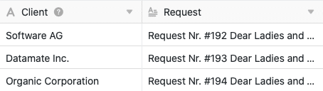
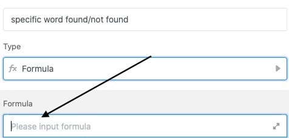
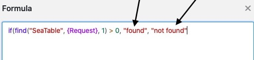

Формулы SeaTable предлагают различные способы работы с данными в таблицах. Одним из них является поиск **слов в тексте**. Введя соответствующую формулу, можно автоматически искать в [текстовом столбце]() какие-либо слова и получать подсказку - например, "слово найдено/не найдено" - в виде результата в столбце формул таблицы.

## Поиск слова в тексте

В конкретном примере задача заключается в поиске **слова** в текстовом столбце **"Запрос"** с помощью формулы.

Для этого сначала добавьте в таблицу **столбец формул**, в редактор которого затем можно вставить **формулу**.

Для поиска слова в текстовом столбце сначала добавьте в формулу оператор **If**, который находится в редакторе формул на вкладке **Логические функции**. Он проверяет, выполняется или нет заданное **условие**, и в зависимости от положительного или отрицательного результата возвращает определенное **значение**.

На следующем шаге формула расширяется функцией **find**, с помощью которой в текстовом столбце можно искать определенное слово. Эта функция находится в редакторе формул в разделе **текстовых функций**.

После этих двух функций в формуле следует **конкретное слово**, которое необходимо искать в текстовом столбце. Запишите это слово в формуле через **инвертированную запятую**.

Следующим компонентом формулы является **имя столбца**, который проверяется на наличие искомого слова. Особенно важно, чтобы имя столбца было окружено **фигурными скобками**, иначе SeaTable **не сможет** распознать, какой текст необходимо проверить с помощью формулы.



Hinter dem Spaltennamen fügen Sie die mathematische Gleichung “**1 > 0**” ein. Diese ist für die Formel von Bedeutung, da Sie angibt, dass ein spezifischer **Wert** zurückgegeben wird, sobald das gesuchte Wort **mindestens einmal** in der Text-Spalte gefunden wird. Achten Sie in der Formel darauf, die Klammer **nach** der ersten Zahl zu **schließen**. Die **Vergleichszeichen** ( > , < , = , etc.) finden Sie im Formeleditor unter **Operatoren**.

Наконец, в столбце формул задаются **значения**, которые возвращаются в случае **нахождения** или **ненахождения** искомого слова в тексте. **Первое** введенное значение всегда появляется в столбце формул, если искомое слово было **найдено** в тексте, второе - в обратном случае. Значения всегда располагаются **в инвертированных запятых** и отделяются друг от друга **запятой**.

Перед подтверждением важно отметить, что для того, чтобы формула была принята как действительная, необходимо **закрыть круглые скобки**.

После подтверждения введенной формулы по значению в **столбце формул** можно узнать, найдено ли искомое слово в столбце текста.

