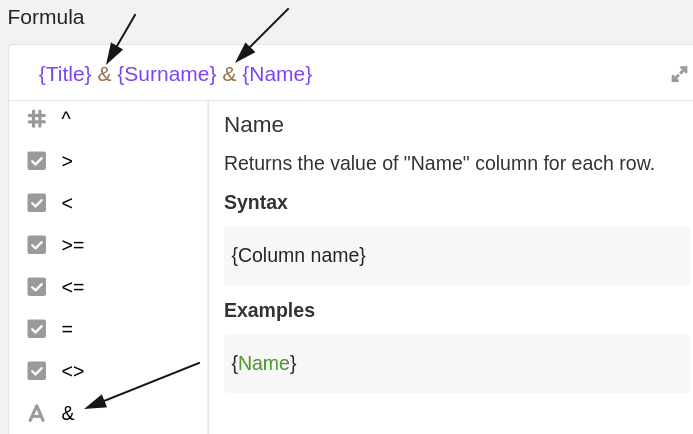

SeaTable Formeln bieten Ihnen verschiedene Möglichkeiten, mit den Daten in Ihren Tabellen zu arbeiten. Eine davon ist das Zusammenführen von Inhalten aus verschiedenen [Text-Spalten](). Mithilfe einer entsprechenden Formel können Sie beliebig viele Inhalte aus unterschiedlichen Spalten in einer Formel-Spalte zusammenführen.

## Zusammenführen von Text-Spalten

Im konkreten Beispiel ist das Ziel, mithilfe einer Formel die Inhalte (Name, Vorname und Titel) der ersten drei Spalten zu einem **vollständigen Namen** zusammenzuführen.


Hierfür fügen Sie der Tabelle zunächst eine **Formel-Spalte** hinzu, in deren Editor Sie anschließend die Formel einfügen können.


Um Inhalte aus verschiedenen Text-Spalten in einer Spalte zusammenzuführen, müssen Sie stets auf die **Namen der Spalten** verweisen, in denen die entsprechenden Inhalte in Ihrer Tabelle zu finden sind. Besonders wichtig ist dabei, dass die Spaltennamen mit **geschweiften Klammern** umrahmt sind, da SeaTable ansonsten **nicht** erkennen kann, welche Inhalte zusammengeführt werden sollen.




Um die Inhalte der Text-Spalten in einer Formel-Spalte zusammenzuführen, ordnen Sie die Spaltennamen zunächst in der gewünschten **Reihenfolge** in der Formel an und trennen diese jeweils mit einem **&-Symbol**, das Sie im Formeleditor bei den **Operanden** finden.



Damit die verschiedenen Inhalte jeweils durch ein **Leerzeichen** getrennt werden, fügen Sie jeweils **hinter** den ersten beiden Spaltennamen zusätzlich noch ein **&-Symbol** und zwei **Anführungszeichen (oben)** hinzu.


Nach Bestätigung der eingegebenen Formel werden die Inhalte der Text-Spalten automatisch zusammengeführt und das **Ergebnis** erscheint automatisch in der Formel-Spalte.




Immer wenn Sie Text-Spalten in einer Formel verwenden und diese Spalten auch leer sein können, empfiehlt sich der Einsatz der Funktion _trim( )_. Mit dieser werden Leerzeichen am Anfang und Ende eines Textes entfernt. Die komplette Formel lautet dann z. B.

```
trim( {Title} & " " & {Surname} & " " & {Name} )
```


