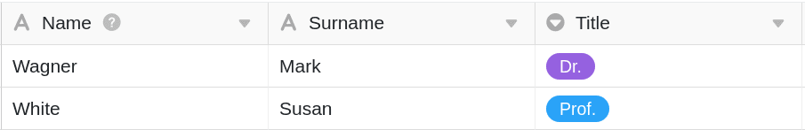
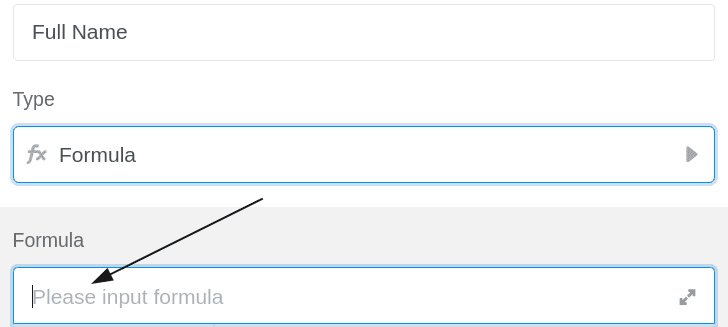
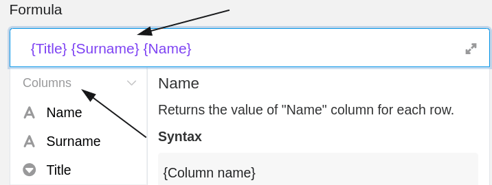
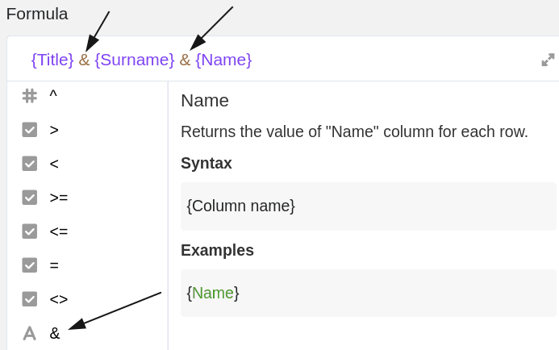
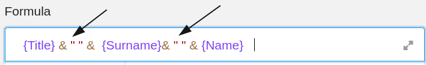

Формулы SeaTable предлагают несколько способов работы с данными в таблицах. Одним из них является объединение содержимого разных [текстовых колонок](https://seatable.io/ru/docs/text-und-zahlen/die-spalten-text-und-formatierter-text/). С помощью соответствующей формулы можно объединить любое количество содержимого из разных столбцов в один столбец с формулой.

## Объединение текстовых колонок

В конкретном примере задача состоит в том, чтобы с помощью формулы объединить содержимое (фамилию, имя и должность) первых трех столбцов в **полное имя**.



Для этого сначала добавьте в таблицу **столбец формул**, в редактор которого затем можно вставить формулу.



Чтобы объединить содержимое разных текстовых колонок в одну колонку, необходимо всегда ссылаться на **названия колонок**, в которых находится соответствующее содержимое таблицы. Особенно важно, чтобы имена колонок были заключены в **фигурные скобки**, иначе SeaTable **не сможет** распознать, какое содержимое нужно объединить.





Чтобы объединить содержимое текстовых колонок в колонку формулы, сначала расположите имена колонок в нужном **порядке** в формуле и отделите каждое из них **символом &**, который находится в редакторе формул вместе с **операндами**.



Для разделения содержимого **пробелом** добавьте **символ &** и **две перевернутые запятые (см. выше)** **после** первых двух названий столбцов.



После подтверждения введенной формулы содержимое текстовых колонок автоматически объединяется, и **результат** автоматически появляется в колонке формул.




Если в формуле используются текстовые колонки, которые могут быть и пустыми, рекомендуется использовать функцию _trim( )_. Эта функция удаляет пробелы в начале и конце текста. Полная формула будет выглядеть так, например,

```
trim( {Title} & " " & {Surname} & " " & {Name} )
```


