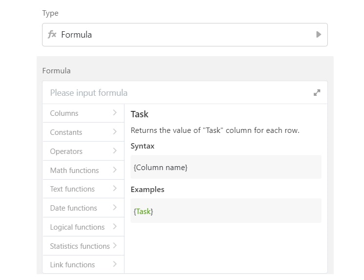

## Formelspalte bei SeaTable

Eine der stärksten Funktionen von SeaTable ist die Formelspalte. Mit Formeln können Sie die Werte von anderen Spalten von der aktuellen Tabelle oder sogar von einer anderen (verknüpften) Tabelle der selben Base automatisch transformieren, kalkulieren, kombinieren oder beliebig zusammenfassen. Darauf können Sie natürlich auch weiteren Formelspalten hinzufügen, die die Resultate aus den existierenden Formalspalten nehmen und rechnen. Die von den anderen Spalten abhängige Formelspalten werden automatisch aktualisiert, sobald die Werte dort geändert werden.

Momentan bietet SeaTable die folgenden Funktionen in der Spalte "Formel":

- Konstanten
- Operanden
- Mathematische Funktionen
- Textfunktionen
- Datumsfunktionen
- Logische Funktionen
- Statistische Funktionen

Und eine Kollektion von Verknüpfungsfunktionen in der Spalte "Link Formel":

- Verknüpfungsfunktionen

Außer den oberen Funktionen gibt es im Formeleditor noch eine bzw. mehrere Spaltenlisten. Das sind jene Spalten in der aktuellen Tabelle und die verlinkten Spalten der anderen Tabelle in der Base. Wenn Sie auf das "+" Symbol daneben klicken, wird der Spaltenname als Element in das Eingabefeld hinzugefügt, und zwar in dem Format {Spaltenname} bzw. {VerlinkteTabelle.Spaltenname}. Dieses Element können Sie direkt in Ihrer Formel nutzen. Alternativ können Sie natürlich einen Spaltennamen in der Form von {Spaltenname} per Hand eingeben.

In diesem Artikel zeigen wir Ihnen eine komplette Übersicht von allen Formeln in SeaTable mit passenden Beispielen. Wenn Sie nach einer bestimmte Funktion suchen, können Sie die Tastenkombination + nutzen, um schnell einen Eintrag auf dieser Seite zu finden.

 

## Die Formelsammlung von SeaTable mit Beispiele

### Konstanten

| Operator | Beschreibung                                 | Beispiele                         |
| -------- | -------------------------------------------- | --------------------------------- |
| e        | Gibt die Eulersche Zahl e=2.71828... zurück. |  = 3.71828183 |
| pi       | Gibt die Kreiszahl Pi zurück.                |  = 3.14159265  |
| true()   | Gibt den logischen Wert 'true' zurück.       |  = true    |
| false()  | Gibt den logischen Wert 'false' zurück.      |  = false  |

### Operanden

| Operator                           | Beschreibung                                                                                                                                | Beispiele                                                                     |
| ---------------------------------- | ------------------------------------------------------------------------------------------------------------------------------------------- | ----------------------------------------------------------------------------- |
| add(num1, num2)                    | Addiert zwei numerische Werte (num1 und num2) und gibt das Ergebnis zurück.                                                                 |  = 3                                                |
|                                    | Alternativ: +                                                                                                                               |  = 3                                                      |
| subtract(num1, num2)               | Subtrahiert einen numerischen Wert (num2) von einem anderen (num1).                                                                         |  = 1                                           |
|                                    | Alternativ: -                                                                                                                               |  = 1                                                      |
| multiply(num1, num2)               | Multipliziert zwei numerische Werte.                                                                                                        |  = 12                                          |
|                                    | Alternativ: \*                                                                                                                              |  = 12                                                     |
| divide(num1, num2)                 | Teilt einen numerischen Wert (num1) durch einen anderen (num2).                                                                             |  = 2.5                                           |
|                                    | Alternativ: /                                                                                                                               |  = 1.5                                                    |
| mod(num1, num2)                    | Berechnet den Rest einer Division.                                                                                                          |  = 3                                               |
|                                    | Alternativ: %                                                                                                                               |  = 1                                                     |
| power(num1, num2)                  | Berechnet die Potenz (num2) einer Zahl (num1).                                                                                              |  = 9                                              |
|                                    | Alternativ: ^                                                                                                                               |  = 9                                                      |
| greater(num1, num2)                | Prüft, ob ein numerischer Wert (num1) größer als ein anderer (num2) ist und gibt den logischen Wert 'true' oder 'false' zurück.             |  = false                                        |
|                                    | Alternativ: &gt;                                                                                                                            |  = false                                                  |
| lessthan(num1, num2)               | Prüft, ob ein numerischer Wert (num1) kleiner als ein anderer (num2) ist und gibt den logischen Wert 'true' oder 'false' zurück.            |  = true                                        |
|                                    | Alternativ: &lt;                                                                                                                            |  = true                                                   |
| greatereq(num1, num2)              | Prüft, ob ein numerischer Wert (num1) größer als oder gleich ein andere (num2) ist und gibt den logischen Wert 'true' oder 'false' zurück.  |  = false                                      |
|                                    | Alternativ: &gt;=                                                                                                                           |  = false                                                 |
| lessthaneq(num1, num2)             | Prüft, ob ein numerischer Wert (num1) kleiner als oder gleich ein andere (num2) ist und gibt den logischen Wert 'true' oder 'false' zurück. |  = true                                      |
|                                    | Alternativ: &lt;=                                                                                                                           |  = true                                                  |
| equal(number1, number2)            | Prüft, ob zwei Werte (number1, number 2) gleich sind und gibt jeweils den logischen Wert 'true' oder 'false' zurück.                        | {{< key "equal({Old price}, {New price})" >}} = false                   |
|                                    | Alternativ: =                                                                                                                               | {{< key "{Old price}={New price}" >}} = false                              |
| unequal(number1, number2)          | Prüft, ob zwei Werte (number1, number2) ungleich sind und gibt jeweils den logischen Wert 'true' oder 'false' zurück.                       | {{< key "unequal({Old price}, {New price})" >}} = true                  |
|                                    | Alternativ: &lt;&gt;                                                                                                                        | {{< key "{Old price}<>{New price}" >}} = true                              |
| concatenate(string1, string2, ...) | Verknüpft mehrere Zeichenfolgen (string1, string 2, ...) zu einer Zeichenfolge.                                                             | {{< key "concatenate({Supplier}, \" is \", {Status})" >}} = Linux is great |
|                                    | Alternativ: &amp;                                                                                                                           | {{< key "{Supplier} & \" is \" & {Status}" >}} = Linux is great            |

### Mathematische Funktionen

| Operator                      | Beschreibung                                                                                                                                                                                                                                                                                                                      | Beispieleingabe    | Resultat   |
| ----------------------------- | --------------------------------------------------------------------------------------------------------------------------------------------------------------------------------------------------------------------------------------------------------------------------------------------------------------------------------- | ------------------ | ---------- |
| abs(number)                   | Gibt den Absolutbetrag einer Zahl (number) zurück.                                                                                                                                                                                                                                                                                | abs(-2)            | 2          |
| ceiling(number, significance) | Rundet eine Zahl (number) auf die nächste Ganzzahl oder auf das nächste Vielfache des angegebenen Schritts (significance) auf. Wenn eines von beiden Argumenten nicht-numerisch ist, dann gibt die Formel einen leeren Wert zurück.                                                                                               | ceiling(2.14)      | 3          |
|                               | Wenn die Zahl (number) ein exaktes Vielfaches des Schritts (significance) ist, dann erfolgt keine Rundung. Wenn die Zahl (number) und der Schritt (significance) negativ sind, dann erfolgt die Rundung weg von 0. Wenn die Zahl (number) negativ und der Schritt (significance) positiv sind, dann erfolgt die Rundung zu 0 hin. | ceiling(-2.14, 4)  | 0          |
| even(number)                  | Ordnet einer reellen Zahl (number) die nächstliegende größere gerade Zahl zu.                                                                                                                                                                                                                                                     | even(2.14)         | 4          |
| exp(number)                   | Exponentialfunktion für die Eulersche Zahl e. Gibt den Wert von e hoch gegebener Zahl (number) zurück.                                                                                                                                                                                                                            | exp(1)             | 2.71828... |
| floor(number, significance)   | Rundet eine Zahl (number) auf die nächste Ganzzahl oder auf das nächste Vielfache des angegebenen Schritts (significance) ab. Wenn eines von beiden Argumenten nicht-numerisch ist, dann gibt die Formel einen leeren Wert zurück.                                                                                                | floor(2.86)        | 2          |
|                               | Wenn die Zahl (number) ein exaktes Vielfaches des Schritts (significance) ist, dann erfolgt keine Rundung. Wenn das Vorzeichen von der Zahl (number) positiv ist, dann erfolgt die Abrundung hin zu 0. Wenn das Vorzeichen von der Zahl (number) negativ ist, dann erfolgt die Abrundung weg von 0.                               | floor(-3.14, 5)    | -5         |
| int(number)                   | Ordnet einer reellen Zahl (number) die nächstliegende kleinere ganze Zahl zu.                                                                                                                                                                                                                                                     | int(-3.14)         | -4         |
| lg(number)                    | Logarithmusfunktion (number) mit 10 als Basis.                                                                                                                                                                                                                                                                                    | lg(100)            | 2          |
| ln(number)                    | Logarithmusfunktion (number) mit der Eulerschen Zahl e als Basis.                                                                                                                                                                                                                                                                 | ln(e)              | 1          |
| log(number, base)             | Logarithmusfunktion (number) mit definierbarer Basis (base).                                                                                                                                                                                                                                                                      | log(81, 3)         | 4          |
|                               | Wenn aber keine Basis gegeben ist, wirkt diese Funktion genau wie lg(), also mit 10 als Basis.                                                                                                                                                                                                                                    | log(1000)          | 3          |
| odd(number)                   | Ordnet einer reellen Zahl (number) die nächstliegende größere ungerade Zahl zu.                                                                                                                                                                                                                                                   | odd(-2.14)         | -1         |
| round(number, digits)         | Rundet eine Zahl (number) auf eine bestimmte Anzahl an Dezimalstellen (digits). Wenn keine Dezimalstelle (digits) angegeben ist, wird die Zahl zur 1. Stelle links vom Komma gerundet.                                                                                                                                            | round(3.14)        | 3          |
|                               | Wenn eine positive Dezimalstelle (digits) gegeben ist, wird zu der Stelle rechts vom Komma gerundet.                                                                                                                                                                                                                              | round(3.14, 1)     | 3.1        |
|                               | Wenn eine negative Dezimalstelle (digits) gegeben ist,  wird nach links vom Komma gerundet.                                                                                                                                                                                                                                    | round(3.14, -3)    | 0          |
|                               |                                                                                                                                                                                                                                                                                                                                   | round(99.1, -2)    | 100        |
| rounddown(number, digits)     | Rundet eine Zahl (number) in Richtung Null ab. Wenn keine Dezimalstelle (digits) gegeben ist, wird die Zahl zur 1. Stelle links vom Komma gerundet.                                                                                                                                                                               | rounddown(3.12, 1) | 3.1        |
|                               |                                                                                                                                                                                                                                                                                                                                   | rounddown(-3.15)   | -3         |
| roundup(number, digits)       | Rundet eine Zahl (numbers) von Null aus auf. Wenn keine Dezimalstelle (digits) gegeben ist, wird die Zahl zur 1. Stelle links vom Komma gerundet.                                                                                                                                                                                 | roundup(3.12, 1)   | 3.2        |
|                               |                                                                                                                                                                                                                                                                                                                                   | roundup(-3.15)     | -4         |
| sign(number)                  | Prüft ob eine Zahl (number) größer, gleich oder kleiner als 0 ist. Gibt jeweils den Wert 1, 0 und -1 zurück. In anderen Worte: es gibt das Vorzeichen von einer Zahl zurück, jeweils für '+', 'Null' und '-' mit 1, 0, und -1.                                                                                                    | sign(-2)           | -1         |
| sqrt(number)                  | Gibt die Quadratwurzel einer Zahl (number) zurück.                                                                                                                                                                                                                                                                                | sqrt(81)           | 9          |
| sum(num1, num2, ...)          | Gibt die Summe von den Zahlen (num1, num2, ...) zurück.                                                                                                                                                                                                                                                                           | sum(7,8,9)         | 24         |

### Textfunktionen

| Operator                                               | Beschreibung                                                                                                                                                                                                                                                                                                                                                                                                                                                                                                           | Beispieleingabe                                   | Resultat                     |
| ------------------------------------------------------ | ---------------------------------------------------------------------------------------------------------------------------------------------------------------------------------------------------------------------------------------------------------------------------------------------------------------------------------------------------------------------------------------------------------------------------------------------------------------------------------------------------------------------- | ------------------------------------------------- | ---------------------------- |
| exact(string1, string2)                                | Prüft, ob zwei Zeichenfolge (string1, string2) exakt identisch sind. Gibt jeweils die Werte 'true' oder 'false' zurück. Groß-/Kleinschreibung wird beachtet.                                                                                                                                                                                                                                                                                                                                                           | exact('SeaTable', 'Seatable')                     | false                        |
| find(findString, sourceString, startPosition)          | Gibt die Startposition einer Zeichenfolge (findString) innerhalb einer anderen Zeichenfolge (sourceString) zurück. Groß-/Kleinschreibung wird beachtet. Ohne Fund wird 0 zurück gegeben. Wenn die Startposition (startPosition) als Dezimal gegeben wurde, wird sie abgerundet.  Wenn die Zelle in der Spalte für das Stichwort (findString) noch leer ist, wird 1 zurück gegeben. Wenn die Zelle in der Spalte für das Zielstring (sourceString) noch leer ist, wird ein leerer Wert ('') zurück gegeben.       | find('Sea', 'seaTable', 1)                        | 0                            |
|                                                        | Die Suche wird ab der gegebenen 'startPosition' anfangen. Diese 'startPosition' hat aber keinen Einfluß auf das Ergebnis: es gibt dann immer die absolute Startposition zurück. Wenn die 'startPosition' der zu suchende Zeichenfolge (findString) hinter der tatsächlichen Startposition der Zeichenfolge (sourceString) gegeben wurde, wird 0 zurückgegeben, da ab dieser Position nichts gefunden wurde.                                                                                                            | find('table', 'big table', 4)                     | 5                            |
|                                                        |                                                                                                                                                                                                                                                                                                                                                                                                                                                                                                                        | find('table', 'big table', 6)                     | 0                            |
| left(string, count)                                    | Gibt die angegebene Anzahl (count) von Zeichen am Anfang einer Zeichenfolge (string) zurück.                                                                                                                                                                                                                                                                                                                                                                                                                           | left('SeaTable', 3)                               | Sea                          |
| len(string)                                            | Gibt die Anzahl der Zeichen in einer Zeichenfolge (string) zurück.                                                                                                                                                                                                                                                                                                                                                                                                                                                     | len('SeaTable')                                   | 8                            |
| lower(string)                                          | Wandelt eine Zeichenfolge (string) in Kleinbuchstaben um.                                                                                                                                                                                                                                                                                                                                                                                                                                                              | lower('DeutscH')                                  | deutsch                      |
| mid(string, startPosition, count)                      | Gibt die angegebene Anzahl (count) von Zeichen ab der angegebenen Startposition (startPosition) aus einer Zeichenfolge (string) zurück.                                                                                                                                                                                                                                                                                                                                                                                | mid('SeaTable is the best', 1, 8)                 | SeaTable                     |
|                                                        | Startposition (startPosition) und Anzahl (count) dürfen nicht leer, negativ oder gleich Null sein. Wenn aber Startposition (startPosition) und Anzahl (count) als Dezimal gegeben wurde, werde sie abgerundet. Zu viel gegebene Anzahl (count) werden ignoriert.                                                                                                                                                                                                                                                       | mid('SeaTable is the best.', 10.9, 27.3)          | is the best.                 |
| replace(sourceString, startPosition, count, newString) | Ersetzt einen Teil (count) einer Zeichenfolge (sourceString) ab einer bestimmten Startposition (startPosition) mit einer anderen Zeichenfolge (newString). Anzahl (count) von Zeichen wird nur für die alten Zeichenfolge (sourceString), aber nicht für die neue Zeichenfolge (newString) berücksichtig.                                                                                                                                                                                                              | replace('SeaTable is the best.', 1, 8, 'Seafile') | Seafile is the best.         |
|                                                        | Wenn Anzahl (count) als Null gegeben ist, wird die neue Zeichenfolge (newString) einfach ab der Startposition (startPosition) in der alten Zeichenfolge (sourceString) hinzugefügt.                                                                                                                                                                                                                                                                                                                                    | replace('SeaTable is the best.', 1, 0, 'Seafile') | SeafileSeaTable is the best. |
| rept(string, number)                                   | Wiederholt eine Zeichenfolge (string) so oft (number) wie angegeben.                                                                                                                                                                                                                                                                                                                                                                                                                                                   | rept('Sea ', 3)                                   | Sea Sea Sea                  |
| right(string, count)                                   | Gibt die angegebene Anzahl (count) von Zeichen am Ende einer Zeichenfolge (string) zurück.                                                                                                                                                                                                                                                                                                                                                                                                                             | right('SeaTable', 5)                              | Table                        |
| search(findString, sourceString, startPosition)        | Gibt die Startposition einer Zeichenfolge (findString) innerhalb einer anderen Zeichenfolge (sourceString) zurück. Groß-/Kleinschreibung wird nicht beachtet. Ohne Fund wird 0 zurück gegeben. Wenn die Startposition (startPosition) als Dezimal gegeben wurde, wird sie abgerundet.  Wenn die Zelle in der Spalte für das Stichwort (findString) noch leer ist, wird 1 zurück gegeben. Wenn die Zelle in der Spalte für das Zielstring (sourceString) noch leer ist, wird ein leerer Wert ('') zurück gegeben. | search('Sea', 'seaTable', 1)                      | 1                            |
|                                                        | Die Suche wird ab der gegebenen 'startPosition' anfangen. Diese 'startPosition' hat aber keinen Einfluß auf das Ergebnis: es gibt dann immer die absolute Startposition zurück. Wenn die 'startPosition' der zu suchende Zeichenfolge (findString) hinter der tatsächlichen Startposition der Zeichenfolge (sourceString) gegeben wurde, wird 0 zurückgegeben, da ab dieser Position nichts gefunden wurde.                                                                                                            | search('table', 'big table', 4)                   | 5                            |
|                                                        |                                                                                                                                                                                                                                                                                                                                                                                                                                                                                                                        | search('table', 'big table', 6)                   | 0                            |
| substitute(sourceString, oldString, newString, index)  | Ersetzt bestehenden Text (oldString) durch einen neuen Text (newString) in einer Zeichenfolge (sourceString). Wenn es in der Zeichenfolge (sourceString) mehrmals den Text (oldString) gibt, wird nur der 'index'-te Text ersetzt. Groß-/Kleinschreibung wird beachtet.                                                                                                                                                                                                                                                | substitute('SeaTableTable', 'Table', 'file', 1)   | SeafileTable                 |
|                                                        | Wenn der Index (index) als 0 oder nicht gegeben ist, werden alle gefundene Textteile (oldString) durch den neuen Text (newString) ersetzt.                                                                                                                                                                                                                                                                                                                                                                             | substitute('SeaTableTable', 'Table', 'file')      | Seafilefile                  |
| T(value)                                               | Prüft, ob ein Wert (value) Text ist. Wenn ja, wird der Text zurück gegeben. Wenn nein, dann ist der Rückgabewert leer.                                                                                                                                                                                                                                                                                                                                                                                                 | T(123)                                            | (leer)                       |
|                                                        |                                                                                                                                                                                                                                                                                                                                                                                                                                                                                                                        | T('123')                                          | 123                          |
| text(number, format)                                   | Wandelt eine Zahl (number) in Text um und formatiert ihn im angegebenen Format (format). Das Format kann Prozent ('percent') und Zahl sowie Dollar ('dollar'), Euro ('euro') und Yuan ('yuan') sein.                                                                                                                                                                                                                                                                                                                   | text(150, 'euro')                                 | €150                         |
|                                                        | Wenn eine Zahl direkt in Prozent umgewandelt ist, bleibt ihr absoluter Wert beibehalten. Das heißt, 50 wird in 5000% umgewandelt. Wenn Sie aber 50% wünschen, müssen Sie die Zahl (number) noch vor der Umwandlung durch 100 teilen.                                                                                                                                                                                                                                                                                   | text(50, 'percent')                               | 5000%                        |
|                                                        |                                                                                                                                                                                                                                                                                                                                                                                                                                                                                                                        | text(50/100, 'percent')                           | 50%                          |
| trim(string)                                           | Entfernt Leerzeichen am Anfang und Ende einer Zeichenfolge (string).                                                                                                                                                                                                                                                                                                                                                                                                                                                   | trim(' SeaTable ')                                | SeaTable                     |
| upper(string)                                          | Wandelt eine Zeichenfolge (string) in Großbuchstaben um.                                                                                                                                                                                                                                                                                                                                                                                                                                                               | upper('DeutscH')                                  | DEUTSCH                      |
| value(string)                                          | Wandelt einen Text (string), der eine Zahl darstellt, in eine Zahl um.                                                                                                                                                                                                                                                                                                                                                                                                                                                 | value('123')                                      | 123                          |

### Datumsfunktionen

| Operator                                                 | Beschreibung                                                                                                                                                                                                                                                                                                                                                                                                                                                                                                                                                                     | Beispieleingabe                                                                                | Resultat            |
| -------------------------------------------------------- | -------------------------------------------------------------------------------------------------------------------------------------------------------------------------------------------------------------------------------------------------------------------------------------------------------------------------------------------------------------------------------------------------------------------------------------------------------------------------------------------------------------------------------------------------------------------------------- | ---------------------------------------------------------------------------------------------- | ------------------- |
| +                                                        | Addiert Tagen oder Dauer zu einem Datum mit oder ohne Minuten. Wenn das Datumsspalte keine Minuten hat, wird 00:00 Uhr von diesem Tag als Standardwert genommen.                                                                                                                                                                                                                                                                                                                                                                                                                 | date(2021, 1, 31)+1                                                                            | 2021-02-01          |
|                                                          | Zum Beispiel, wenn eine Dauer von 8 Stunden 20 Minuten in der Spalte {Dauer} hat:                                                                                                                                                                                                                                                                                                                                                                                                                                                                                                | date(2021, 1, 31)+{Dauer}                                                                      | 2021-01-31 08:20    |
| -                                                        | Subtrahiert Tagen oder Dauer von einem Datum mit oder ohne Minuten. Wenn das Datumsspalte keine Minuten hat, wird 00:00 Uhr von diesem Tag als Standardwert genommen.                                                                                                                                                                                                                                                                                                                                                                                                            | date(2021, 1, 31) - 30                                                                         | 2021-01-01          |
|                                                          | Zum Beispiel, wenn eine Dauer von 8 Stunden 20 Minuten in der Spalte {Dauer} hat:                                                                                                                                                                                                                                                                                                                                                                                                                                                                                                | date(2021, 1, 31)-{Dauer}                                                                      | 2021-01-30 15:40    |
|                                                          | Mit {Datum1}-{Datum2} gibt es den Zeitunterschied in Tagen zurück.                                                                                                                                                                                                                                                                                                                                                                                                                                                                                                               | date(2021, 1, 31)-date(2020, 12, 23)                                                           | 39                  |
| date(year, month, day)                                   | Gibt ein Datum im internationalen Format (ISO) zurück aus eingegebenen Jahr (year), Monat (month) und Tag (day). Bei zweistelliger Eingabe des Jahres (year) wird es automatisch als ein Jahr in den 1900er Jahren verstanden. Wenn die Zahl des Monats (month) oder des Tages (day) zu groß (jeweils größer als 12 oder 31) ist, werden diese Monate oder Tage automatisch zu den nächsten Jahr oder Monat umgerechnet.                                                                                                                                                         | date(2021, 1, 3)                                                                               | 2021-01-03          |
| dateAdd(date, count, unit)                               | Addiert die angegebene Anzahl (count) an Jahren ('years'), Monaten ('months'), Wochen ('weeks'), Tagen ('days'), Stunden ('hours'), Minuten ('minutes') oder Sekunden ('seconds') einem Datum/einer Uhrzeit (date) hinzu.                                                                                                                                                                                                                                                                                                                                                        | dateAdd('2020-02-03', 2, 'days')                                                               | 2020-02-05          |
|                                                          | Tipp: wenn Sie eine komplexe Zeitdauer (count) wie z. B. 1 Tag 12 Stunden addiren wollen, können Sie diese in z.B. 24+12=36 Stunden ('hours') umrechnen und als eine einheitliche Dauer (count) in die Formel eingeben. Dabei umrechnen die Dauer zu der kleinste Einheit: in diesem Fall, Stunden.                                                                                                                                                                                                                                                                              | dateAdd('2020-09-04 13:05:18', 36, 'hours') ODER dateAdd({form submission}, 36, 'hours') | 2020-09-06 01:05:18 |
| datedif(startDate, endDate, unit)                        | Berechnet die Sekunden, Tage, Monate oder Jahre zwischen zwei Datumswerten. Das optionale Unit-Argument kann eines der folgenden sein: S (Sekunden), D (volle Tage), M (volle Monate), Y (volle Jahre), YD (volle Tage, ohne Berücksichtigung der Jahre), YM (volle Monate, ohne Berücksichtigung der Tage und Jahre), MD (volle Tage, ohne Berücksichtigung der Monate und Jahre).                                                                                                                                                                                              | dateDif('2018-01-01', '2020-01-01')                                                            | 2                   |
|                                                          | Das optionale Unit-Argument kann eines der folgenden sein: S (Sekunden), D (volle Tage), M (volle Monate), Y (volle Jahre), YD (volle Tage, ohne Berücksichtigung der Jahre), YM (volle Monate, ohne Berücksichtigung der Tage und Jahre), MD (volle Tage, ohne Berücksichtigung der Monate und Jahre).                                                                                                                                                                                                                                                                          | dateDif('2019-10-11', '2020-12-12', 'M')                                                       | 14                  |
| day(date)                                                | Gibt den Tag eines Datums (date) als eine Zahl zurück. Die zurückgegebene Zahl liegt zwischen 1 und 31.                                                                                                                                                                                                                                                                                                                                                                                                                                                                          | day('2020-01-03')                                                                              | 3                   |
| days(startDate, endDate)                                 | Gibt die Anzahl an Tagen zwischen zwei Datumswerten (startDate und endDate) zurück.                                                                                                                                                                                                                                                                                                                                                                                                                                                                                              | days('2020-01-01', '2020-02-03')                                                               | 33                  |
| eomonth(startDate, months)                               | Ermittelt das Datum des letzten Tag des Monats, der die angegebene Anzahl (months) an Monaten nach dem angegebenem Datum (startDate) liegt. Wenn die Anzahl (months) als 0 gegeben ist, wird einfach der letzte Tag des Monats ermittelt.                                                                                                                                                                                                                                                                                                                                        | eomonth('2020-01-01', 1)                                                                       | 2020-02-29          |
|                                                          | Wenn die Anzahl (months) als negativ gegeben ist, wird das Datum des letzten Tag des Monats, der die absolute Anzahl (months) an Monaten vor dem angegebenen Datum (startDate) ermittelt.                                                                                                                                                                                                                                                                                                                                                                                        | eomonth('2020-01-01', -1)                                                                      | 2019-12-31          |
| hour(date)                                               | Gibt die Stunde einer Zeitangabe (date) als eine Zahl zurück. Die zurückgegebene Zahl liegt zwischen 0 und 23.                                                                                                                                                                                                                                                                                                                                                                                                                                                                   | hour('2020-02-14 13:14:52')                                                                    | 13                  |
|                                                          | Wenn keine Stunde in der Zeitangabe (date) enthalten ist, wird 0 zurückgegeben.                                                                                                                                                                                                                                                                                                                                                                                                                                                                                                  | hour('2020-02-14')                                                                             | 0                   |
| hours(startDate, endDate)                                | Gibt die Anzahl der Stunden zwischen zwei Datumswerten (startDate und endDate) zurück. Die Minuten in der Datumswerten werden nicht berücksichtigt.                                                                                                                                                                                                                                                                                                                                                                                                                              | hours('2020-02-14 13:14', '2020-02-14 15:14')                                                  | 2                   |
|                                                          | Wenn keine Stunden in der Zeitangabe (startDate oder endDate) enthalten ist, wird automatisch 0 Uhr an diesem Tag angenommen.                                                                                                                                                                                                                                                                                                                                                                                                                                                    | hours('2020-02-14', '2020-02-14 15:14')                                                        | 15                  |
| minute(date)                                             | Gibt die Minuten einer Zeitangabe (date) als Zahl zurück. Die zurückgegebene Zahl liegt zwischen 0 und 59.                                                                                                                                                                                                                                                                                                                                                                                                                                                                       | minute('2020-02-14 13:14:52')                                                                  | 14                  |
|                                                          | Wenn keine Minuten in der Zeitangabe (date) enthalten ist, wird 0 zurückgegeben.                                                                                                                                                                                                                                                                                                                                                                                                                                                                                                 | minute('2020-02-14')                                                                           | 0                   |
| month(date)                                              | Gibt den Monat eines Datums (date) als Zahl zurück. Die zurückgegebene Zahl liegt zwischen 1 (Januar) und 12 (Dezember).                                                                                                                                                                                                                                                                                                                                                                                                                                                         | month('2020-02-14 13:14:52')                                                                   | 2                   |
| months(startDate, endDate)                               | Gibt die Anzahl der Monate zwischen zwei Datumswerten (startDate und endDate) zurück. Die Tagen und Uhrzeit in der Datumswerten werden nicht berücksichtigt.                                                                                                                                                                                                                                                                                                                                                                                                                     | months('2020-02-01 13:14', '2020-03-31 15:54')                                                 | 1                   |
|                                                          | Wenn kein Monat in der Datumswerten (startDate, endDate) gegeben ist, wird automatisch Januar als Monat angenommen.                                                                                                                                                                                                                                                                                                                                                                                                                                                              | months('2020', '2021')                                                                         | 12                  |
| networkdays(startDate, endDate, holiday1, holiday2, ...) | Gibt die Anzahl ganzer Arbeitstage zwischen zwei Datumswerten (startDate und endDate) zurück. Dabei kann man auch Feiertagen außer Samstag und Sonntag definieren (holiday1, holiday2, usw.), diese werden auch abgezogen. Wenn keine Feiertagen mitberechnet werden soll, kann man diese Parameter einfach weg lassen.                                                                                                                                                                                                                                                          | networkdays('2020-01-01', '2020-01-07','2020-01-01')                                           | 4                   |
|                                                          | Beachten Sie darauf, dass der angegebene letzte Tag (endDate) in der Formel auch mitgerechnet wird. Das heißt, wie zum Beispiel in dieser Formel, es wird drei Werktagen gezählt: der 7., 8. und 9. vom September, 2020.                                                                                                                                                                                                                                                                                                                                                         | networkdays('2020-09-07', '2020-09-09')                                                        | 3                   |
| now()                                                    | Gibt das aktuelle Datum und Uhrzeit zurück. Diese Spalte wird nur dann automatisch aktualisiert, wenn die Base neu geladen wurde.                                                                                                                                                                                                                                                                                                                                                                                                                                                | now()                                                                                          | 2020-09-07 12:59    |
| second(date)                                             | Gibt die Sekunden einer Zeitangabe (date) als Zahl zurück. Die zurückgegebene Zahl liegt zwischen 0 und 59.                                                                                                                                                                                                                                                                                                                                                                                                                                                                      | second('2020-02-14 13:14:52')                                                                  | 52                  |
| today()                                                  | Gibt das aktuelle Datum zurück. Diese Spalte wird nur dann automatisch aktualisiert, wenn die Base neu geladen wurde.                                                                                                                                                                                                                                                                                                                                                                                                                                                            | today()                                                                                        | 2020-09-07          |
|                                                          | Diese Funktion ist praktisch für die Berechnung von Zeitdauer zwischen einem bestimmten Datum &amp; Uhrzeit und jetzt. Auf jedem Neuladen oder Neuberechnung der Base wird die Berechnung aktualisiert.                                                                                                                                                                                                                                                                                                                                                                          | networkdays('2020-09-01', today())                                                             | 4                   |
| weekday(date, weekStart)                                 | Gibt den Wochentag eines Datums (date) als Zahl zurück. Die zurückgegebene Zahl zwischen 1 und 7. Dabei kann man den ersten Tag der Woche (weekStart) definieren: Montag ('Monday') oder Sonntag ('Sunday' oder weg lassen, da der Start als Sonntag standardmäßig ist). Eine dritte Option ist nicht möglich. Groß-/Kleinschreibung werden nicht beachtet.                                                                                                                                                                                                                      | weekday('2020-01-01', 'Monday')                                                                | 3                   |
|                                                          | Wenn kein 'weekStart' gegeben ist oder wenn ein anderer 'weekStart' als 'Monday' oder 'Sunday' gegeben wurde, wird es immer als 'Sunday' angenommen. Deshalb wenn es 'Monday' sein sollte, geben Sie 'Monday' ein; wenn es 'Sunday' sein sollte, können Sie dieser Parameter weg lassen.                                                                                                                                                                                                                                                                                         | weekday('2020-01-01', 'Thursday') ODER weekday('2020-01-01')                             | 4                   |
| weeknum(date, return_type)                               | Gibt die absolute Wochennummer eines Datums (date) als Zahl zurück. Die zurückgegebene Zahl liegt zwischen 1 und 53. Dabei kann man den ersten Tag der Woche (return_type) definieren. Geben Sie die Zahl 1 oder 2, oder 11 bis 17, sowie 21 als "return_type", um den Start einer Woche zu definieren: 1/Sonntag、2/Montag、11/Montag、12/Dienstag、13/Mittwoch、14/Donnerstag、15/Freitag、16/Samstag、17/Sonntag. Wenn die Wochennummer nach ISO-Standard zurückgegeben werden soll, geben sie als "return_type" die Zahl von 21 an, oder nutzen Sie die Funktion isoweeknum. | weeknum('2020-01-12', 11)                                                                      | 2                   |
|                                                          | Wenn kein 'return_type' gegeben ist, wird es immer als 'Sonntag' angenommen.                                                                                                                                                                                                                                                                                                                                                                                                                                                                                                     | weeknum('2020-01-12')                                                                          | 3                   |
| isoweeknum(date)                                         | Gibt die ISO Wochennummer (KW) eines Datums als Zahl zurück.                                                                                                                                                                                                                                                                                                                                                                                                                                                                                                                     | isoweeknum('2021-01-04')                                                                       | 1                   |
|                                                          | Unterschiedlich als die Funktion weeknum(): mit der Funktion isoweeknum() bekommen Sie manchmal auch eine Wochennummer, die noch im Vorjahr liegt. In diesem Beispiel: der 1. Januar 2021 gehört nach ISO-Standard zu der 53. Kalenderwoche des Jahres 2020.                                                                                                                                                                                                                                                                                                                     | isoweeknum('2021-01-01')                                                                       | 53                  |
| year(date)                                               | Gibt das Jahr eines Datums (date) als Zahl zurück.                                                                                                                                                                                                                                                                                                                                                                                                                                                                                                                               | year('2020-01-01')                                                                             | 2020                |

### Logische Funktionen

| Operator                                                          | Beschreibung                                                                                                                                                                                                                                                                                                                                                                                                                                                                                                                                                                                                                                                                                                            | Beispieleingabe                                                                                | Resultat |
| ----------------------------------------------------------------- | ----------------------------------------------------------------------------------------------------------------------------------------------------------------------------------------------------------------------------------------------------------------------------------------------------------------------------------------------------------------------------------------------------------------------------------------------------------------------------------------------------------------------------------------------------------------------------------------------------------------------------------------------------------------------------------------------------------------------- | ---------------------------------------------------------------------------------------------- | -------- |
| and(logical1, logical2, ...)                                      | Prüft, ob alle Argumente (logical1, logical2, ...) wahr (valid, nicht leer und ungleich Null) sind. Wenn ja, wird 'true' zurückgegeben, ansonsten 'false'.                                                                                                                                                                                                                                                                                                                                                                                                                                                                                                                                                              | and(1, '', 2)                                                                                  | false    |
| if(logical, value1, value2)                                       | Prüft, ob ein Argument (logical) wahr ist und wenn ja, gibt den ersten Wert (value1) zurück und wenn nein, gibt den zweiten Wert (value2) zurück.   Achtung: die zwei Werte (value1 und value2) müssen das gleiche Typ sein, z.B. müssen beide String, oder Nummer sein. Ansonsten wird das erste Ergebnis den Spaltentyp definieren und wo es der zweite Wert hinzugefügt werden soll, wird ein leerer Wert gefüllt.                                                                                                                                                                                                                                                                                             | if(1&gt;2, 3, 4)                                                                               | 4        |
|                                                                   | Für die Bedingung (logical) ist nur ein Vergleich mit zugelassen. Wenn Sie nur Bedingung (logical) und den ersten Wert (value1) eingeben: es wird den ersten Wert (value1) zurückgeben, wenn die Bedingung (logical) wahr ist; und es wird einen leeren Wert ('') zurückgegeben wenn die Bedingung (logical) falsch ist.                                                                                                                                                                                                                                                                                                                                                                                                | if({Budget}&gt;{Preis}, 'Ja')                                                                  | Ja       |
| ifs(logical1, value1, logical2, value2, ...)                      | Prüft, ob eine oder mehrere Bedingungen (logical1, logical2, ...) zutreffen und gibt einen Wert (value1, value2, ...) zurück, der mit zur ersten WAHR-Bedingung passt. Versuchen Sie möglichst alle zurückzugebenen Werte (value1, value2) in den gleichen Typen (entweder alles "string" oder alles "number") anzugeben, wie z.B. in ifs({Area}=0,"mini",{Area}&lt;=100,"small",{Area}1000,"large"), ist das Ergebnis immer "string", oder in dem Beispiel rechts, ist das Ergebnis immer "number". Wenn Sie aber Nummer als String gegeben haben, funktioniert die ifs Funktion auch, aber in diesem Fall wird keine Summe mehr automatisch für diese Spalte berechnet, da diese dann als String wahrgenommen werden. | ifs( 1&gt;2, 3, 5&gt;4, 9)                                                                     | 9        |
| not(boolean)                                                      | Umkehrt den logischen Wert (boolean). In anderen Worte: wandelt 'true' in 'false' und 'false' in 'true' um.                                                                                                                                                                                                                                                                                                                                                                                                                                                                                                                                                                                                             | not(and(1, '', 2))                                                                             | true     |
| or(logical1, logical2, ...)                                       | Prüft, ob mindestens 1 der Argumente (value1, value2, ...) wahr (valid, nicht leer und ungleich Null) ist, und gibt in diesem Fall 'true' zurück. Wenn alle Argumente falsch sind, gibt dann 'false' zurück.                                                                                                                                                                                                                                                                                                                                                                                                                                                                                                            | or(1, '', 2)                                                                                   | true     |
| switch(logical, matcher1, value1, matcher2, value2, ..., default) | Wertet einen Ausdruck (logical) anhand einer Werteliste (matcher) aus und gibt das Ergebnis (value) zurück, das dem ersten übereinstimmenden Wert entspricht. Wenn es keine Übereinstimmung gibt, dann wird ein optionaler Standardwert (default) zurückgegeben. Mindestens müssen 3 Parameter (logical, matcher, value) angegeben werden.                                                                                                                                                                                                                                                                                                                                                                              | switch({Noten}, 1, 'Sehr gut', 2, 'gut', 3, 'befriedigend', 4, 'bestanden', 'nicht bestanden') | Sehr gut |
|                                                                   | Wenn es in der Werteliste (matcher) mehrere identischen Werte gibt, wird nur der ersten Treffer berücksichtigt.                                                                                                                                                                                                                                                                                                                                                                                                                                                                                                                                                                                                         | switch(int(68/10), 6, 'OK', 6, 'KO')                                                           | OK       |
| xor(logical1, logical2, ...)                                      | Gibt die Kontravalenz aller Argumente zurück. In anderen Worte: Prüft, ob die Anzahl von wahren Argumente (logical) ungerade ist und gibt den Wert 'true' zurück.                                                                                                                                                                                                                                                                                                                                                                                                                                                                                                                                                       | xor(1, 0, 2&lt;1, 1)                                                                           | false    |

### Statistische Funktionen

| Operator                                      | Beschreibung                                                                                                                                                                                                       | Beispiele                                    |
| --------------------------------------------- | ------------------------------------------------------------------------------------------------------------------------------------------------------------------------------------------------------------------ | -------------------------------------------- |
| average(number1, number2, ...)                | Gibt den Durchschnitt der Zahlen (number1, number2, ...) zurück.                                                                                                                                                   |  = 3  |
| count(number1, number2, ...)                  | Gibt die Anzahl von Zahlen (number1, number2, ...) zurück. Es werde nur validen und nicht leeren Zahlen berücksichtigt. In diesem Beispiel, '' ist ein leerer Wert, und '3' ist nicht eine Zahl, sondern ein Text. |  = 2    |
| counta(textORnumber1, textORnumber2, ...)     | Zählt die Anzahl von nicht leeren Zellen (textORnumber1, textORnumber2, ...). Diese Zellen können Text oder Nummer sein. In diesem Beispiel, 1 und 2 sind Zahlen, '3' ist ein Text, und '' ist ein leerer Wert.    |  = 3   |
| countall(textORnumber1, textORnumber2, ...)   | Zählt die Anzahl von Elementen (textORnumber1, textORnumber2, ...) inklusiv Zahlen (1, 2), Text ('3') und leeren Zellen ('').                                                                                      |  = 4 |
| countblank(textORnumber1, textORnumber2, ...) | Zählt die Anzahl leerer Zellen.                                                                                                                                                                                    |  = 1 |
| countItems("column-name")                     | Zählt die Anzahl an Elementen in einer Zelle. Unterstützte Spaltentypen sind Mehrfachauswahl, Mitarbeiter, Datei und Bild.                                                                                         |  = 6 |
| max(number1, number2, ...)                    | Gibt den größten Wert aus den angegebenen Zahlen (number1, number2, ...) zurück.                                                                                                                                   |  = 4    |
| min(number1, number2, ...)                    | Gibt den kleinsten Wert aus den angegebenen Zahlen (number1, number2, ...) zurück.                                                                                                                                 |  = -1   |
| large(num1, num2, ..., k)                     | Gibt den k-größten Wert aus der Liste der Zahlen (num1, num2, ...) zurück. In diesem Beispiel: large(35, 92, 10, 2) gibt den 2-größten Wert von (35, 92, 10) zurück, welcher 35 ist.                               |  = 35   |
| small(num1, num2, ..., k)                     | Gibt den k-kleinsten Wert aus der Liste der Zahlen (num1, num2, ...) zurück. In diesem Beispiel: small(9, 2, -7, -3, 3) gibt den 3-kleinsten Wert von (9, 2, -7, -3) zurück, welcher 2 ist.                        |  = 2  |

### Verknüpfungsfunktionen

Die Verknüpfungsfunktionen können Sie als Formel benutzen, oder mit der "Link Formula" Spalte einfacher einrichten.

| Operator                                               | Beschreibung                                                                                                                                                                                                                                                                                                                                                                                                                                                                                                                                                                                                                                                                                                    | Beispieleingabe                                                                                                                                                                                               |
| ------------------------------------------------------ | --------------------------------------------------------------------------------------------------------------------------------------------------------------------------------------------------------------------------------------------------------------------------------------------------------------------------------------------------------------------------------------------------------------------------------------------------------------------------------------------------------------------------------------------------------------------------------------------------------------------------------------------------------------------------------------------------------------- | ------------------------------------------------------------------------------------------------------------------------------------------------------------------------------------------------------------- |
| countlinks("Column", [condition])                      | Zählt die verknüpften Einträge in der gegebenen Link-Spalte(Column). Mit dem optionalen Parameter Bedingung([condition]) lassen sich Einträge filtern.   In dem Beispiel: In der aktuellen Tabelle gibt es eine Link-Spalte "Speakers". In einer ihren Zelle gibt es mehrere verlinkten Einträge. Jetzt wollen wir zählen, wieviel Links gibt es in jeder Zelle, wo der "Price" in dem verlinkten Eintrag größer als 500 ist.                                                                                                                                                                                                                                                                             | {{< key "countlinks(\"Speakers\", \"{Price}>500\")" >}} = 3 (Die Anzahl von Einträge, die mit der Spalte "Speakers" verlinkt sind und bei denen "Price" größer als 500 ist.)                            |
| rollup("Column", "Other column", summary, [condition]) | Gibt einen ausgewerteten Wert von verlinkten Einträge in anderen Tabellen zurück. Durch die Verlinkung von der Spalte "Column", wird Einträge in der Spalte "Other column" in der verlinkten Tabelle ausgewertet. Auswertungsmethoden ("summary"), die durchgeführt werden können, sind 'average', 'concatenate', 'count', 'max', 'min' und 'sum'. Optional können noch Filterbedingungen angewandt werden.  In dem Beispiel: In der aktuellen Tabelle gibt es eine Link-Spalte "Speakers", die zu einer anderen Tabelle verlinkt ist. Da jeder "Speaker" ist mit mehreren Einträge verlinkt, wollen wir herausfinden, mit einem "Price" kleiner als 500, was ist die größte "Power" für jeden "Speaker". | {{< key "rollup(\"Speakers\", \"Power\", \"max\", \"{Price} < 500\")" >}} = 80 (Der größte Wert, der mit der Spalte "Speakers" verlinkten Einträge in "Power" bei dem der "Price" kleiner als 500 ist.) |
| lookup(findmax("Column", "Other column"), "Target")    | Sucht nach der größten Wert in der verlinkten Spalte ("Other column") und gibt den Wert in der gleichen Zeile von einer anderen Spalte ("Target") zurück. Dabei geben Sie an, welche verlinkende Spalte ("Column"), und welche verlinkten Spalte ("Other column") sowie Zielspalte ("Target") zu verwenden sind.  In dem Beispiel: In der aktuellen Tabelle gibt es eine Link-Spalte "Speakers", die zu einer anderen Tabelle verlinkt ist. Da jeder "Speaker" ist mit mehreren Einträge verlinkt, wollen wir herausfinden, was für einen "Price" hat jeder "Speaker" für seine größte "Power".                                                                                                           |  = 350 (Liefert den größten Wert "Price" in "Power", der mit der Spalte "Speakers" verlinkt ist.)                                      |
| lookup(findmin("Column", "Other column"), "Target")    | Sucht nach der kleinsten Wert in der verlinkten Spalte ("Other column") und gibt den Wert in der gleichen Zeile von einer anderen Spalte ("Target") zurück. Dabei geben Sie an, welche verlinkende Spalte ("Column"), und welche verlinkten Spalte ("Other column") sowie Zielspalte ("Target") zu verwenden sind.  In dem Beispiel: In der aktuellen Tabelle gibt es eine Link-Spalte "Speakers", die zu einer anderen Tabelle verlinkt ist. Da jeder "Speaker" ist mit mehreren Einträge verlinkt, wollen wir herausfinden, was für einen "Price" hat jeder "Speaker" für seine kleinste "Power".                                                                                                       |  = 210 (Der "Price" von dem kleinsten Wert in "Power", der mit der Spalte "Speakers" verlinkt ist.)                                    |
