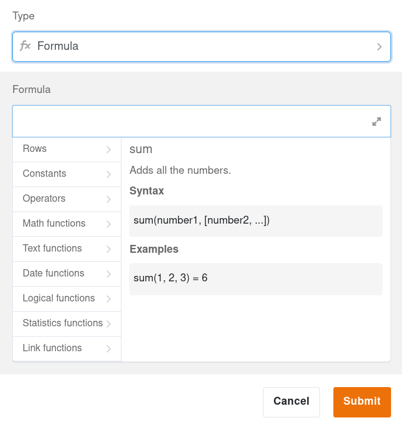

Eine der stärksten Funktionen von SeaTable verkörpert die [Formel-Spalte](). Mit Formeln können Sie die **Werte** von anderen Spalten der aktuellen Tabelle – oder sogar einer anderen [verknüpften]() Tabelle – zählen, für **Berechnungen** nutzen, umwandeln, auswerten, miteinander kombinieren und vergleichen. Darüber hinaus können Formeln **Konstanten** und **logische Werte** zurückgeben.

Sie können beliebig viele Formel-Spalten hinzufügen, die wiederum mit den Resultaten aus existierenden Formel-Spalten weiterrechnen. Der große Vorteil: Die Ergebnisse in Formel-Spalten werden **automatisch aktualisiert**, sobald die Werte in den beteiligten Spalten geändert werden.

Momentan bietet SeaTable die folgenden Funktionen an, wenn Sie den Spaltentyp **Formel** auswählen:

- Zeilen
- Konstanten
- Operanden
- Mathematische Funktionen
- Textfunktionen
- Datumsfunktionen
- Logische Funktionen
- Statistische Funktionen
- Verknüpfungsfunktionen

Außer den Funktionen gibt es im Formeleditor noch eine bzw. mehrere **Spaltenlisten**. Das sind die auswählbaren Spalten in der aktuellen Tabelle und gegebenenfalls jene Spalten in den verlinkten Tabellen. Wenn Sie rechts auf das "+"-Symbol klicken, wird die **Spaltenreferenz** in das Eingabefeld eingefügt, und zwar im Format {Spaltenname} bzw. {Verknüpfungsspalte.Spaltenname}. Diese Elemente können Sie direkt in Ihrer Formel nutzen. Alternativ können Sie natürlich auch Spaltennamen in geschweiften Klammern per Hand eingeben.

In diesem Artikel zeigen wir Ihnen eine komplette Übersicht über alle Formeln in SeaTable mit passenden Beispielen. Wenn Sie nach einer bestimmten Funktion suchen, können Sie die Tastenkombination + nutzen, um schnell einen Eintrag auf dieser Seite zu finden.
 

## Die Formelsammlung von SeaTable mit Beispielen

### Zeilen

| Operator | Beschreibung                                 | Beispiel                         |
| -------- | -------------------------------------------- | --------------------------------- |
| rowID()  | Gibt die eindeutige Identifikationsnummer der aktuellen Zeile als String zurück. | X18XAJeTSWeaO5hlqyUp1w |

### Konstanten

| Operator | Beschreibung                                 | Beispiele                         |
| -------- | -------------------------------------------- | --------------------------------- |
| e        | Gibt die Eulersche Zahl e=2.71828... zurück. |  = 3.71828183 |
| pi       | Gibt die Kreiszahl Pi zurück.                |  = 3.14159265  |
| true()   | Gibt den logischen Wert 'true' zurück.       |  = true    |
| false()  | Gibt den logischen Wert 'false' zurück.      |  = false  |

### Operanden

| Operator                           | Beschreibung                                                                                                                                | Beispiele                                                                     |
| ---------------------------------- | ------------------------------------------------------------------------------------------------------------------------------------------- | ----------------------------------------------------------------------------- |
| add(num1, num2)                    | Addiert zwei numerische Werte (num1 und num2) und gibt das Ergebnis zurück.                                                                 |  = 3                                                |
|                                    | Alternativ: +                                                                                                                               |  = 3                                                      |
| subtract(num1, num2)               | Subtrahiert einen numerischen Wert (num2) von einem anderen (num1).                                                                         |  = 1                                           |
|                                    | Alternativ: -                                                                                                                               |  = 1                                                      |
| multiply(num1, num2)               | Multipliziert zwei numerische Werte.                                                                                                        |  = 12                                          |
|                                    | Alternativ: \*                                                                                                                              |  = 12                                                     |
| divide(num1, num2)                 | Teilt einen numerischen Wert (num1) durch einen anderen (num2).                                                                             |  = 2.5                                           |
|                                    | Alternativ: /                                                                                                                               |  = 1.5                                                    |
| mod(num1, num2)                    | Berechnet den Rest einer Division.                                                                                                          |  = 3                                               |
|                                    | Alternativ: %                                                                                                                               |  = 1                                                     |
| power(num1, num2)                  | Berechnet die Potenz (num2) einer Zahl (num1).                                                                                              |  = 9                                              |
|                                    | Alternativ: ^                                                                                                                               |  = 9                                                      |
| greater(num1, num2)                | Prüft, ob ein numerischer Wert (num1) größer als ein anderer (num2) ist, und gibt den logischen Wert 'true' oder 'false' zurück.             |  = false                                        |
|                                    | Alternativ: &gt;                                                                                                                            |  = false                                                  |
| lessthan(num1, num2)               | Prüft, ob ein numerischer Wert (num1) kleiner als ein anderer (num2) ist, und gibt den logischen Wert 'true' oder 'false' zurück.            |  = true                                        |
|                                    | Alternativ: &lt;                                                                                                                            |  = true                                                   |
| greatereq(num1, num2)              | Prüft, ob ein numerischer Wert (num1) größer als ein anderer (num2) oder gleich ist, und gibt den logischen Wert 'true' oder 'false' zurück.  |  = false                                      |
|                                    | Alternativ: &gt;=                                                                                                                           |  = false                                                 |
| lessthaneq(num1, num2)             | Prüft, ob ein numerischer Wert (num1) kleiner als ein anderer (num2) oder gleich ist, und gibt den logischen Wert 'true' oder 'false' zurück. |  = true                                      |
|                                    | Alternativ: &lt;=                                                                                                                           |  = true                                                  |
| equal(number1, number2)            | Prüft, ob zwei Werte (number1, number 2) gleich sind, und gibt jeweils den logischen Wert 'true' oder 'false' zurück.                        | {{< key "equal({Old price}, {New price})" >}} = false                   |
|                                    | Alternativ: =                                                                                                                               | {{< key "{Old price}={New price}" >}} = false                              |
| unequal(number1, number2)          | Prüft, ob zwei Werte (number1, number2) ungleich sind, und gibt jeweils den logischen Wert 'true' oder 'false' zurück.                       | {{< key "unequal({Old price}, {New price})" >}} = true                  |
|                                    | Alternativ: &lt;&gt;                                                                                                                        | {{< key "{Old price}<>{New price}" >}} = true                              |
| concatenate(string1, string2, ...) | Verkettet mehrere Zeichenfolgen (string1, string 2, ...) zu einer Zeichenfolge.                                                             | {{< key "concatenate({Supplier}, \" is \", {Status})" >}} = Linux is great |
|                                    | Alternativ: &amp;                                                                                                                           | {{< key "{Supplier} & \" is \" & {Status}" >}} = Linux is great            |

### Mathematische Funktionen

| Operator                      | Beschreibung                                                                                                                                                                                                                                                                                                                      | Beispieleingabe    | Resultat   |
| ----------------------------- | --------------------------------------------------------------------------------------------------------------------------------------------------------------------------------------------------------------------------------------------------------------------------------------------------------------------------------- | ------------------ | ---------- |
| abs(number)                   | Gibt den Absolutbetrag einer Zahl (number) zurück.                                                                                                                                                                                                                                                                                | abs(-2)            | 2          |
| ceiling(number, significance) | Rundet eine Zahl (number) auf die nächste Ganzzahl oder auf das nächste Vielfache des angegebenen Schritts (significance) auf. Wenn eines von beiden Argumenten nicht-numerisch ist, dann gibt die Formel einen leeren Wert zurück.                                                                                               | ceiling(2.14)      | 3          |
|                               | Wenn die Zahl (number) ein exaktes Vielfaches des Schritts (significance) ist, dann erfolgt keine Rundung. Wenn die Zahl (number) und der Schritt (significance) negativ sind, dann erfolgt die Rundung weg von 0. Wenn die Zahl (number) negativ und der Schritt (significance) positiv sind, dann erfolgt die Rundung zu 0 hin. | ceiling(-2.14, 4)  | 0          |
| even(number)                  | Ordnet einer reellen Zahl (number) die nächstliegende größere gerade Zahl zu.                                                                                                                                                                                                                                                     | even(2.14)         | 4          |
| exp(number)                   | Exponentialfunktion für die Eulersche Zahl e. Gibt den Wert von e hoch gegebener Zahl (number) zurück.                                                                                                                                                                                                                            | exp(1)             | 2.71828... |
| floor(number, significance)   | Rundet eine Zahl (number) auf die nächste Ganzzahl oder auf das nächste Vielfache des angegebenen Schritts (significance) ab. Wenn eines von beiden Argumenten nicht-numerisch ist, dann gibt die Formel einen leeren Wert zurück.                                                                                                | floor(2.86)        | 2          |
|                               | Wenn die Zahl (number) ein exaktes Vielfaches des Schritts (significance) ist, dann erfolgt keine Rundung. Wenn das Vorzeichen von der Zahl (number) positiv ist, dann erfolgt die Abrundung hin zu 0. Wenn das Vorzeichen von der Zahl (number) negativ ist, dann erfolgt die Abrundung weg von 0.                               | floor(-3.14, 5)    | -5         |
| int(number)                   | Ordnet einer reellen Zahl (number) die nächstliegende kleinere ganze Zahl zu.                                                                                                                                                                                                                                                     | int(-3.14)         | -4         |
| lg(number)                    | Logarithmusfunktion (number) mit 10 als Basis.                                                                                                                                                                                                                                                                                    | lg(100)            | 2          |
| ln(number)                    | Logarithmusfunktion (number) mit der Eulerschen Zahl e als Basis.                                                                                                                                                                                                                                                                 | ln(e)              | 1          |
| log(number, base)             | Logarithmusfunktion (number) mit definierbarer Basis (base).                                                                                                                                                                                                                                                                      | log(81, 3)         | 4          |
|                               | Wenn aber keine Basis gegeben ist, wirkt diese Funktion genau wie lg(), also mit 10 als Basis.                                                                                                                                                                                                                                    | log(1000)          | 3          |
| odd(number)                   | Ordnet einer reellen Zahl (number) die nächstliegende größere ungerade Zahl zu.                                                                                                                                                                                                                                                   | odd(-2.14)         | -1         |
| round(number, digits)         | Rundet eine Zahl (number) auf eine bestimmte Anzahl an Dezimalstellen (digits). Wenn keine Dezimalstelle (digits) angegeben ist, wird die Zahl zur 1. Stelle links vom Komma gerundet.                                                                                                                                            | round(3.14)        | 3          |
|                               | Wenn eine positive Dezimalstelle (digits) gegeben ist, wird zu der Stelle rechts vom Komma gerundet.                                                                                                                                                                                                                              | round(3.14, 1)     | 3.1        |
|                               | Wenn eine negative Dezimalstelle (digits) gegeben ist,  wird nach links vom Komma gerundet.                                                                                                                                                                                                                                    | round(3.14, -3)    | 0          |
|                               |                                                                                                                                                                                                                                                                                                                                   | round(99.1, -2)    | 100        |
| rounddown(number, digits)     | Rundet eine Zahl (number) in Richtung Null ab. Wenn keine Dezimalstelle (digits) gegeben ist, wird die Zahl zur 1. Stelle links vom Komma gerundet.                                                                                                                                                                               | rounddown(3.12, 1) | 3.1        |
|                               |                                                                                                                                                                                                                                                                                                                                   | rounddown(-3.15)   | -3         |
| roundup(number, digits)       | Rundet eine Zahl (numbers) von Null aus auf. Wenn keine Dezimalstelle (digits) gegeben ist, wird die Zahl zur 1. Stelle links vom Komma gerundet.                                                                                                                                                                                 | roundup(3.12, 1)   | 3.2        |
|                               |                                                                                                                                                                                                                                                                                                                                   | roundup(-3.15)     | -4         |
| sign(number)                  | Prüft ob eine Zahl (number) größer, gleich oder kleiner als 0 ist. Gibt jeweils den Wert 1, 0 und -1 zurück. In anderen Worten: Es gibt das Vorzeichen von einer Zahl zurück, jeweils für '+', 'Null' und '-' mit 1, 0, und -1.                                                                                                    | sign(-2)           | -1         |
| sqrt(number)                  | Gibt die Quadratwurzel einer Zahl (number) zurück.                                                                                                                                                                                                                                                                                | sqrt(81)           | 9          |
| sum(num1, num2, ...)          | Gibt die Summe der Zahlen (num1, num2, ...) zurück.                                                                                                                                                                                                                                                                           | sum(7,8,9)         | 24         |

### Textfunktionen

| Operator                                               | Beschreibung                                                                                                                                                                                                                                                                                                                                                                                                                                                                                                           | Beispieleingabe                                   | Resultat                     |
| ------------------------------------------------------ | ---------------------------------------------------------------------------------------------------------------------------------------------------------------------------------------------------------------------------------------------------------------------------------------------------------------------------------------------------------------------------------------------------------------------------------------------------------------------------------------------------------------------- | ------------------------------------------------- | ---------------------------- |
| concatenate(text1, text2, text3) | Verkettet mehrere Zeichenfolgen (text1, text2, text3, ...) zu einer Zeichenfolge.                                   | concatenate("Sea", "Table", " ", "Cloud") | SeaTable Cloud |
|                                    | Alternativ: text1 & text2 & text3                                                                                                 | "Sea" & "Table" & " " & "Cloud"    | SeaTable Cloud |
| exact(string1, string2)                                | Prüft, ob zwei Zeichenfolgen (string1, string2) exakt identisch sind. Gibt jeweils die Werte 'true' oder 'false' zurück. Groß-/Kleinschreibung wird beachtet.                                                                                                                                                                                                                                                                                                                                                           | exact('SeaTable', 'Seatable')                     | false                        |
| find(findString, sourceString, startPosition)          | Gibt die Startposition einer Zeichenfolge (findString) innerhalb einer anderen Zeichenfolge (sourceString) zurück. Groß-/Kleinschreibung wird beachtet. Ohne Fund wird 0 zurückgegeben. Wenn die Startposition (startPosition) als Dezimal angegeben wurde, wird sie abgerundet.  Wenn die Zelle in der Spalte für das Stichwort (findString) noch leer ist, wird 1 zurückgegeben. Wenn die Zelle in der Spalte für den Zielstring (sourceString) noch leer ist, wird ein leerer Wert ('') zurückgegeben.       | find('Sea', 'seaTable', 1)                        | 0                            |
|                                                        | Die Suche wird ab der gegebenen 'startPosition' anfangen. Diese 'startPosition' hat aber keinen Einfluss auf das Ergebnis: Es gibt dann immer die absolute Startposition zurück. Wenn die 'startPosition' der zu suchenden Zeichenfolge (findString) hinter der tatsächlichen Startposition der Zeichenfolge (sourceString) angegeben wurde, wird 0 zurückgegeben, da ab dieser Position nichts gefunden wurde.                                                                                                            | find('table', 'big table', 4)                     | 5                            |
|                                                        |                                                                                                                                                                                                                                                                                                                                                                                                                                                                                                                        | find('table', 'big table', 6)                     | 0                            |
| left(string, count)                                    | Gibt die angegebene Anzahl (count) von Zeichen am Anfang einer Zeichenfolge (string) zurück.                                                                                                                                                                                                                                                                                                                                                                                                                           | left('SeaTable', 3)                               | Sea                          |
| len(string)                                            | Gibt die Anzahl der Zeichen in einer Zeichenfolge (string) zurück.                                                                                                                                                                                                                                                                                                                                                                                                                                                     | len('SeaTable')                                   | 8                            |
| lower(string)                                          | Wandelt eine Zeichenfolge (string) in Kleinbuchstaben um.                                                                                                                                                                                                                                                                                                                                                                                                                                                              | lower('DeutscH')                                  | deutsch                      |
| mid(string, startPosition, count)                      | Gibt die angegebene Anzahl (count) von Zeichen ab der angegebenen Startposition (startPosition) aus einer Zeichenfolge (string) zurück.                                                                                                                                                                                                                                                                                                                                                                                | mid('SeaTable is the best', 1, 8)                 | SeaTable                     |
|                                                        | Startposition (startPosition) und Anzahl (count) dürfen nicht leer, negativ oder gleich Null sein. Wenn aber Startposition (startPosition) und Anzahl (count) als Dezimal angegeben wurden, werden sie abgerundet. Eine zu hohe Anzahl (count) wird ignoriert.                                                                                                                                                                                                                                                       | mid('SeaTable is the best.', 10.9, 27.3)          | is the best.                 |
| replace(sourceString, startPosition, count, newString) | Ersetzt einen Teil (count) einer Zeichenfolge (sourceString) ab einer bestimmten Startposition (startPosition) mit einer anderen Zeichenfolge (newString). Die Anzahl (count) an Zeichen wird nur für die alte Zeichenfolge (sourceString), aber nicht für die neue Zeichenfolge (newString) berücksichtigt.                                                                                                                                                                                                              | replace('SeaTable is the best.', 1, 8, 'Seafile') | Seafile is the best.         |
|                                                        | Wenn die Anzahl (count) als Null angegeben ist, wird die neue Zeichenfolge (newString) einfach ab der Startposition (startPosition) in der alten Zeichenfolge (sourceString) hinzugefügt.                                                                                                                                                                                                                                                                                                                                    | replace('SeaTable is the best.', 1, 0, 'Seafile') | SeafileSeaTable is the best. |
| rept(string, number)                                   | Wiederholt eine Zeichenfolge (string) so oft (number) wie angegeben.                                                                                                                                                                                                                                                                                                                                                                                                                                                   | rept('Sea ', 3)                                   | Sea Sea Sea                  |
| right(string, count)                                   | Gibt die angegebene Anzahl (count) von Zeichen am Ende einer Zeichenfolge (string) zurück.                                                                                                                                                                                                                                                                                                                                                                                                                             | right('SeaTable', 5)                              | Table                        |
| search(findString, sourceString, startPosition)        | Gibt die Startposition einer Zeichenfolge (findString) innerhalb einer anderen Zeichenfolge (sourceString) zurück. Groß-/Kleinschreibung wird nicht beachtet. Ohne Fund wird 0 zurückgegeben. Wenn die Startposition (startPosition) als Dezimal angegeben wurde, wird sie abgerundet.  Wenn die Zelle in der Spalte für das Stichwort (findString) noch leer ist, wird 1 zurückgegeben. Wenn die Zelle in der Spalte für den Zielstring (sourceString) noch leer ist, wird ein leerer Wert ('') zurückgegeben. | search('Sea', 'seaTable', 1)                      | 1                            |
|                                                        | Die Suche wird ab der gegebenen 'startPosition' anfangen. Diese 'startPosition' hat aber keinen Einfluss auf das Ergebnis: Es gibt dann immer die absolute Startposition zurück. Wenn die 'startPosition' der zu suchenden Zeichenfolge (findString) hinter der tatsächlichen Startposition der Zeichenfolge (sourceString) angegeben wurde, wird 0 zurückgegeben, da ab dieser Position nichts gefunden wurde.                                                                                                            | search('table', 'big table', 4)                   | 5                            |
|                                                        |                                                                                                                                                                                                                                                                                                                                                                                                                                                                                                                        | search('table', 'big table', 6)                   | 0                            |
| substitute(sourceString, oldString, newString, index)  | Ersetzt bestehenden Text (oldString) durch einen neuen Text (newString) in einer Zeichenfolge (sourceString). Wenn es in der Zeichenfolge (sourceString) mehrmals den Text (oldString) gibt, wird nur der 'index'-te Textteil ersetzt. Groß-/Kleinschreibung wird beachtet.                                                                                                                                                                                                                                                | substitute('SeaTableTable', 'Table', 'file', 1)   | SeafileTable                 |
|                                                        | Wenn der Index (index) als 0 oder nicht angegeben ist, werden alle gefundenen Textteile (oldString) durch den neuen Text (newString) ersetzt.                                                                                                                                                                                                                                                                                                                                                                             | substitute('SeaTableTable', 'Table', 'file')      | Seafilefile                  |
| T(value)                                               | Prüft, ob ein Wert (value) Text ist. Wenn ja, wird der Text zurückgegeben. Wenn nein, dann ist der Rückgabewert leer.                                                                                                                                                                                                                                                                                                                                                                                                 | T(123)                                            | (leer)                       |
|                                                        |                                                                                                                                                                                                                                                                                                                                                                                                                                                                                                                        | T('123')                                          | 123                          |
| text(number, format)                                   | Wandelt eine Zahl (number) in Text um und formatiert ihn im angegebenen Format (format). Das Format kann Prozent ('percent') und Zahl sowie Dollar ('dollar'), Euro ('euro') und Yuan ('yuan') sein.                                                                                                                                                                                                                                                                                                                   | text(150, 'euro')                                 | €150                         |
|                                                        | Wenn eine Zahl direkt in Prozent umgewandelt ist, bleibt ihr absoluter Wert beibehalten. Das heißt, 50 wird in 5000% umgewandelt. Wenn Sie aber 50% wünschen, müssen Sie die Zahl (number) noch vor der Umwandlung durch 100 teilen.                                                                                                                                                                                                                                                                                   | text(50, 'percent')                               | 5000%                        |
|                                                        |                                                                                                                                                                                                                                                                                                                                                                                                                                                                                                                        | text(50/100, 'percent')                           | 50%                          |
| trim(string)                                           | Entfernt Leerzeichen am Anfang und Ende einer Zeichenfolge (string).                                                                                                                                                                                                                                                                                                                                                                                                                                                   | trim(' SeaTable ')                                | SeaTable                     |
| upper(string)                                          | Wandelt eine Zeichenfolge (string) in Großbuchstaben um.                                                                                                                                                                                                                                                                                                                                                                                                                                                               | upper('DeutscH')                                  | DEUTSCH                      |
| value(string)                                          | Wandelt einen Text (string), der eine Zahl darstellt, in eine Zahl um.                                                                                                                                                                                                                                                                                                                                                                                                                                                 | value('123')                                      | 123                          |

### Datumsfunktionen

| Operator                                                 | Beschreibung                                                                                                                                                                                                                                                                                                                                                                                                                                                                                                                                                                     | Beispieleingabe                                                                                | Resultat            |
| -------------------------------------------------------- | -------------------------------------------------------------------------------------------------------------------------------------------------------------------------------------------------------------------------------------------------------------------------------------------------------------------------------------------------------------------------------------------------------------------------------------------------------------------------------------------------------------------------------------------------------------------------------- | ---------------------------------------------------------------------------------------------- | ------------------- |
| date(year, month, day)                                   | Gibt ein Datum im internationalen Format (ISO) zurück, bestehend aus eingegebenem Jahr (year), Monat (month) und Tag (day). Bei zweistelliger Eingabe des Jahres (year) wird es automatisch als ein Jahr in den 1900er Jahren verstanden. Wenn die Zahl des Monats (month) oder des Tages (day) zu groß (jeweils größer als 12 oder 31) ist, werden diese Monate oder Tage automatisch zu dem nächsten Jahr oder Monat dazugerechnet.                                                                                                                                                         | date(2021, 1, 3)                                                                               | 2021-01-03          |
| +                                                        | Addiert Tage oder eine Dauer zu einem Datum mit oder ohne Uhrzeit. Wenn die Datum-Spalte keine Uhrzeit hat, wird 00:00 Uhr von diesem Tag als Standardwert genommen.                                                                                                                                                                                                                                                                                                                                                                                                                 | date(2021, 1, 31)+1                                                                            | 2021-02-01          |
|                                                          | Beispiel, wenn eine Dauer von 8 Stunden und 20 Minuten in der Spalte {Dauer} zum Datum hinzugefügt wird:                                                                                                                                                                                                                                                                                                                                                                                                                                                                                                | date(2021, 1, 31)+{Dauer}                                                                      | 2021-01-31 08:20    |
| -                                                        | Subtrahiert Tage oder eine Dauer von einem Datum mit oder ohne Uhrzeit. Wenn die Datum-Spalte keine Uhrzeit hat, wird 00:00 Uhr von diesem Tag als Standardwert genommen.                                                                                                                                                                                                                                                                                                                                                                                                            | date(2021, 1, 31) - 30                                                                         | 2021-01-01          |
|                                                          | Beispiel, wenn eine Dauer von 8 Stunden und 20 Minuten in der Spalte {Dauer} vom Datum abgezogen wird:                                                                                                                                                                                                                                                                                                                                                                                                                                                                                                | date(2021, 1, 31)-{Dauer}                                                                      | 2021-01-30 15:40    |
|                                                          | Mit {Datum1}-{Datum2} gibt es den Zeitunterschied in Tagen zurück.                                                                                                                                                                                                                                                                                                                                                                                                                                                                                                               | date(2021, 1, 31)-date(2020, 12, 23)                                                           | 39                  |
| dateAdd(date, count, unit)                               | Addiert die angegebene Anzahl (count) an Jahren ('years'), Monaten ('months'), Wochen ('weeks'), Tagen ('days'), Stunden ('hours'), Minuten ('minutes') oder Sekunden ('seconds') zu einem Datum/einer Uhrzeit (date) hinzu.                                                                                                                                                                                                                                                                                                                                                        | dateAdd('2020-02-03', 2, 'days')                                                               | 2020-02-05          |
|                                                          | Tipp: Wenn Sie eine komplexe Zeitdauer wie z. B. 1 Tag und 12 Stunden addieren wollen, können Sie diese in 24+12=36 Stunden ('hours') umrechnen und als einheitliche Dauer (count) in die Formel eingeben. Dabei rechnen Sie die Dauer in die kleinste Einheit um; in diesem Fall: Stunden.                                                                                                                                                                                                                                                                              | dateAdd('2020-09-04 13:05:18', 36, 'hours') ODER dateAdd({form submission}, 36, 'hours') | 2020-09-06 01:05:18 |
| dateDif(startDate, endDate, unit)                        | Berechnet die Sekunden, Tage, Monate oder Jahre zwischen zwei Datumswerten. Das optionale Unit-Argument kann eines der folgenden sein: S (Sekunden), D (volle Tage), M (volle Monate), Y (volle Jahre), YD (volle Tage ohne Berücksichtigung der Jahre), YM (volle Monate ohne Berücksichtigung der Tage und Jahre), MD (volle Tage ohne Berücksichtigung der Monate und Jahre).                                                                                                                                                                                              | dateDif('2018-01-01', '2020-01-01', 'Y')                                                            | 2                   |
|                                                          | Das optionale Unit-Argument kann eines der folgenden sein: S (Sekunden), D (volle Tage), M (volle Monate), Y (volle Jahre), YD (volle Tage, ohne Berücksichtigung der Jahre), YM (volle Monate, ohne Berücksichtigung der Tage und Jahre), MD (volle Tage, ohne Berücksichtigung der Monate und Jahre).                                                                                                                                                                                                                                                                          | dateDif('2019-10-11', '2020-12-12', 'M')                                                       | 14                  |
| datetimeFormat(date, format)                             | Konvertiert den Wert einer Datum-Spalte in einen String. Durch die Platzhalter (format) kann das Ausgabeformat von Monat, Tag, Stunde, Minute und Sekunde im jeweils gewünschten Format erfolgen.  | datetimeFormat("2020-01-01", "MM/DD/YYYY") | 01/01/2020 |
|                                                          | Tipp: Wenn Sie den Platzhalter MMMM einfügen, wird der volle Monatsname in Buchstaben angezeigt.  | datetimeFormat({Birthday}, "D. MMMM YYYY") | 6. November 1972 |
| day(date)                                                | Gibt den Tag eines Datums (date) als Zahl zurück. Die zurückgegebene Zahl liegt zwischen 1 und 31.                                                                                                                                                                                                                                                                                                                                                                                                                                                                          | day('2020-01-03')                                                                              | 3                   |
| days(startDate, endDate)                                 | Gibt die Anzahl an Tagen zwischen zwei Datumswerten (startDate und endDate) zurück.                                                                                                                                                                                                                                                                                                                                                                                                                                                                                              | days('2020-01-01', '2020-02-03')                                                               | 33                  |
| eomonth(startDate, months)                               | Ermittelt das Datum des letzten Tages von dem Monat, der die angegebene Anzahl (months) an Monaten nach dem angegebenen Datum (startDate) liegt. Wenn die Anzahl (months) als 0 angegeben ist, wird einfach der letzte Tag des Monats ermittelt.                                                                                                                                                                                                                                                                                                                                        | eomonth('2020-01-01', 1)                                                                       | 2020-02-29          |
|                                                          | Wenn die Anzahl (months) negativ ist, wird der letzte Tag des Monats ermittelt, der die absolute Anzahl (months) an Monaten vor dem angegebenen Datum (startDate) liegt.                                                                                                                                                                                                                                                                                                                                                                                       | eomonth('2020-01-01', -1)                                                                      | 2019-12-31          |
| hour(date)                                               | Gibt die Stunde einer Zeitangabe (date) als eine Zahl zurück. Die zurückgegebene Zahl liegt zwischen 0 und 23.                                                                                                                                                                                                                                                                                                                                                                                                                                                                   | hour('2020-02-14 13:14:52')                                                                    | 13                  |
|                                                          | Wenn keine Stunde in der Zeitangabe (date) enthalten ist, wird 0 zurückgegeben.                                                                                                                                                                                                                                                                                                                                                                                                                                                                                                  | hour('2020-02-14')                                                                             | 0                   |
| hours(startDate, endDate)                                | Gibt die Anzahl ganzer Stunden zwischen zwei Datumswerten (startDate und endDate) zurück. Die übrigen Minuten werden nicht berücksichtigt.                                                                                                                                                                                                                                                                                                                                                                                                                              | hours('2020-02-14 13:14', '2020-02-14 15:14')                                                  | 2                   |
|                                                          | Wenn keine Stunden in der Zeitangabe (startDate oder endDate) enthalten sind, wird automatisch 0 Uhr an diesem Tag angenommen.                                                                                                                                                                                                                                                                                                                                                                                                                                                    | hours('2020-02-14', '2020-02-14 15:14')                                                        | 15                  |
| minute(date)                                             | Gibt die Minuten einer Zeitangabe (date) als Zahl zurück. Die zurückgegebene Zahl liegt zwischen 0 und 59.                                                                                                                                                                                                                                                                                                                                                                                                                                                                       | minute('2020-02-14 13:14:52')                                                                  | 14                  |
|                                                          | Wenn keine Minuten in der Zeitangabe (date) enthalten sind, wird 0 zurückgegeben.                                                                                                                                                                                                                                                                                                                                                                                                                                                                                                 | minute('2020-02-14')                                                                           | 0                   |
| month(date)                                              | Gibt den Monat eines Datums (date) als Zahl zurück. Die zurückgegebene Zahl liegt zwischen 1 (Januar) und 12 (Dezember).                                                                                                                                                                                                                                                                                                                                                                                                                                                         | month('2020-02-14 13:14:52')                                                                   | 2                   |
| months(startDate, endDate)                               | Gibt die Anzahl ganzer Monate zwischen zwei Datumswerten (startDate und endDate) zurück. Tage und Uhrzeit in den Datumswerten werden nicht berücksichtigt.                                                                                                                                                                                                                                                                                                                                                                                                                     | months('2020-02-01 13:14', '2020-03-31 15:54')                                                 | 1                   |
|                                                          | Wenn kein Monat in den Datumswerten (startDate, endDate) angegeben ist, wird automatisch Januar als Monat angenommen.                                                                                                                                                                                                                                                                                                                                                                                                                                                              | months('2020', '2021')                                                                         | 12                  |
| networkdays(startDate, endDate, holiday1, holiday2, ...) | Gibt die Anzahl ganzer Werktage zwischen zwei Datumswerten (startDate und endDate) zurück. Dabei kann man auch Feiertage außer Samstag und Sonntag definieren (holiday1, holiday2, usw.); diese werden dann abgezogen. Wenn keine Feiertage abgezogen werden sollen, kann man diese Parameter einfach weglassen.                                                                                                                                                                                                                                                          | networkdays('2020-01-01', '2020-01-07','2020-01-01')                                           | 4                   |
|                                                          | Beachten Sie dabei, dass der letzte angegebene Tag (endDate) in der Formel auch mitgerechnet wird. Das heißt zum Beispiel in dieser Formel, es werden drei Werktage gezählt: der 7., 8. und 9. September 2020.                                                                                                                                                                                                                                                                                                                                                         | networkdays('2020-09-07', '2020-09-09')                                                        | 3                   |
| now()                                                    | Gibt das aktuelle Datum mit Uhrzeit zurück. Diese Spalte wird nur dann automatisch aktualisiert, wenn die Base neu geladen wurde.                                                                                                                                                                                                                                                                                                                                                                                                                                                | now()                                                                                          | 2020-09-07 12:59    |
| second(date)                                             | Gibt die Sekunden einer Zeitangabe (date) als Zahl zurück. Die zurückgegebene Zahl liegt zwischen 0 und 59.                                                                                                                                                                                                                                                                                                                                                                                                                                                                      | second('2020-02-14 13:14:52')                                                                  | 52                  |
| today()                                                  | Gibt das aktuelle Datum zurück. Diese Spalte wird nur dann automatisch aktualisiert, wenn die Base neu geladen wurde.                                                                                                                                                                                                                                                                                                                                                                                                                                                            | today()                                                                                        | 2020-09-07          |
|                                                          | Diese Funktion ist praktisch für die Berechnung einer Zeitdauer zwischen einem bestimmten Datum und jetzt. Nach jedem Neuladen der Base wird die Berechnung aktualisiert.                                                                                                                                                                                                                                                                                                                                                                          | networkdays('2020-09-01', today())                                                             | 4                   |
| weekday(date, weekStart)                                 | Gibt den Wochentag eines Datums (date) als Zahl zurück. Die zurückgegebene Zahl liegt zwischen 1 und 7. Dabei kann man den ersten Tag der Woche (weekStart) definieren: Montag ('Monday') bzw. Sonntag ('Sunday' oder weglassen, da der Start am Sonntag standardmäßig ist). Eine dritte Option ist nicht möglich. Groß-/Kleinschreibungen werden nicht beachtet.                                                                                                                                                                                                                      | weekday('2020-01-01', 'Monday')                                                                | 3                   |
|                                                          | Wenn kein 'weekStart' gegeben ist oder wenn ein anderer 'weekStart' als 'Monday' oder 'Sunday' gegeben wurde, wird es immer als 'Sunday' angenommen. Deshalb geben Sie 'Monday' ein, wenn es 'Monday' sein soll; wenn es 'Sunday' sein soll, können Sie diesen Parameter weglassen.                                                                                                                                                                                                                                                                                         | weekday('2020-01-01', 'Thursday') ODER weekday('2020-01-01')                             | 4                   |
| weeknum(date, return_type)                               | Gibt die absolute Wochennummer eines Datums (date) als Zahl zurück. Die zurückgegebene Zahl liegt zwischen 1 und 53. Dabei kann man den ersten Tag der Woche (return_type) definieren. Geben Sie die Zahl 1 oder 2, oder 11 bis 17, oder 21 als "return_type" an, um den Start einer Woche zu definieren: 1/Sonntag、2/Montag、11/Montag、12/Dienstag、13/Mittwoch、14/Donnerstag、15/Freitag、16/Samstag、17/Sonntag. Wenn die Wochennummer nach ISO-Standard zurückgegeben werden soll, geben sie als "return_type" die Zahl 21 an oder nutzen Sie die Funktion isoweeknum. | weeknum('2020-01-12', 11)                                                                      | 2                   |
|                                                          | Wenn kein 'return_type' gegeben ist, wird es immer als 'Sonntag' angenommen.                                                                                                                                                                                                                                                                                                                                                                                                                                                                                                     | weeknum('2020-01-12')                                                                          | 3                   |
| isoweeknum(date)                                         | Gibt die ISO Wochennummer (KW) eines Datums als Zahl zurück.                                                                                                                                                                                                                                                                                                                                                                                                                                                                                                                     | isoweeknum('2021-01-04')                                                                       | 1                   |
|                                                          | Im Unterschied zur Funktion weeknum() bekommen Sie mit der Funktion isoweeknum()  manchmal auch eine Wochennummer, die noch im Vorjahr liegt. In diesem Beispiel gehört der 1. Januar 2021 nach ISO-Standard zu der 53. Kalenderwoche des Jahres 2020.                                                                                                                                                                                                                                                                                                                     | isoweeknum('2021-01-01')                                                                       | 53                  |
| year(date)                                               | Gibt das Jahr eines Datums (date) als Zahl zurück.                                                                                                                                                                                                                                                                                                                                                                                                                                                                                                                               | year('2020-01-01')                                                                             | 2020                |

### Logische Funktionen

| Operator                                                          | Beschreibung                                                                                                                                                                                                                                                                                                                                                                                                                                                                                                                                                                                                                                                                                                            | Beispieleingabe                                                                                | Resultat |
| ----------------------------------------------------------------- | ----------------------------------------------------------------------------------------------------------------------------------------------------------------------------------------------------------------------------------------------------------------------------------------------------------------------------------------------------------------------------------------------------------------------------------------------------------------------------------------------------------------------------------------------------------------------------------------------------------------------------------------------------------------------------------------------------------------------- | ---------------------------------------------------------------------------------------------- | -------- |
| and(logical1, logical2, ...)                                      | Prüft, ob alle Argumente (logical1, logical2, ...) wahr (valide, nicht leer und ungleich Null) sind. Wenn ja, wird 'true' zurückgegeben, ansonsten 'false'.                                                                                                                                                                                                                                                                                                                                                                                                                                                                                                                                                              | and(1, '', 2)                                                                                  | false    |
| if(logical, value1, value2)                                       | Prüft, ob ein Argument (logical) wahr ist. Wenn ja, gibt es den ersten Wert (value1) zurück, und wenn nein, gibt es den zweiten Wert (value2) zurück.   Achtung: Die zwei Werte (value1 und value2) müssen den gleichen Typ haben, z. B. müssen beide Strings oder Zahlen sein. Ansonsten wird das erste Ergebnis den Spaltentyp definieren und wo der zweite Wert hinzugefügt werden soll, wird ein leerer Wert eingefügt.                                                                                                                                                                                                                                                                                             | if(1&gt;2, 3, 4)                                                                               | 4        |
|                                                                   | Für die Bedingung (logical) ist nur ein Vergleich zugelassen. Wenn Sie nur die Bedingung (logical) und den ersten Wert (value1) eingeben, wird es den ersten Wert (value1) zurückgeben, wenn die Bedingung (logical) wahr ist; und es wird einen leeren Wert ('') zurückgeben, wenn die Bedingung (logical) falsch ist.                                                                                                                                                                                                                                                                                                                                                                                                | if({Budget}&gt;{Preis}, 'Ja')                                                                  | Ja       |
| ifs(logical1, value1, logical2, value2, ...)                      | Prüft, ob eine oder mehrere Bedingungen (logical1, logical2, ...) zutreffen und gibt einen Wert (value1, value2, ...) zurück, der mit zur ersten WAHR-Bedingung passt. Versuchen Sie möglichst alle zurückzugebenden Werte (value1, value2) in den gleichen Typen (entweder alles "string" oder alles "number") anzugeben, wie z. B. in ifs({Area}=0,"mini",{Area}&lt;=100,"small",{Area}1000,"large") ist das Ergebnis immer "string"; oder in dem Beispiel rechts ist das Ergebnis immer "number". Wenn Sie eine Zahl als String angegeben haben, funktioniert die ifs Funktion auch, aber in diesem Fall wird keine Summe mehr automatisch für diese Spalte berechnet, da diese dann als String wahrgenommen wird. | ifs( 1&gt;2, 3, 5&gt;4, 9)                                                                     | 9        |
| isempty("columnname")                                             | Prüft, ob eine Zelle in der angegebenen Spalte leer ist. Wenn sie leer ist, wird 'true' zurückgegeben; wenn sie nicht leer ist, 'false'.                                                      | isempty("Calendar Event ID")                                                                             | true     |
| iserror(value)                                                    | Prüft, ob das Argument ein Fehlerwert ist. Wenn ja, gibt es 'true' zurück; wenn nein, 'false'.                                                      | iserror("#VALUE!")                                                                           | true     |
| not(boolean)                                                      | Kehrt den logischen Wert (boolean) um. In anderen Worten: wandelt 'true' in 'false' und 'false' in 'true' um.                                                                 | not(and(1, '', 2))                                                                             | true     |
| or(logical1, logical2, ...)                                       | Prüft, ob mindestens 1 der Argumente (value1, value2, ...) wahr (valide, nicht leer und ungleich Null) ist, und gibt in diesem Fall 'true' zurück. Wenn alle Argumente falsch sind, gibt es 'false' zurück.                                                                                                                                                                                                                                                                                                                                                                                                                                                                                                            | or(1, '', 2)                                                                                   | true     |
| switch(logical, matcher1, value1, matcher2, value2, ..., default) | Wertet einen Ausdruck (logical) anhand einer Werteliste (matcher) aus und gibt das Ergebnis (value) zurück, das dem ersten übereinstimmenden Wert entspricht. Wenn es keine Übereinstimmung gibt, dann wird ein optionaler Standardwert (default) zurückgegeben. Mindestens müssen 3 Parameter (logical, matcher, value) angegeben werden.                                                                                                                                                                                                                                                                                                                                                                              | switch(weekday("2000-01-01"), 1, "Sunday", 2, "Monday", 3, "Tuesday", 4, "Wednesday", 5,  "Thursday", 6, "Friday", 7, "Saturday", "no match") | Saturday |
|                                                                   | Wenn es in der Werteliste (matcher) mehrere identische Werte gibt, wird nur der erste Treffer berücksichtigt.                                                                                                                                                                                                                                                                                                                                                                                                                                                                                                                                                                                                         | switch(int(68/10), 6, 'OK', 6, 'KO')                                                           | OK       |
| xor(logical1, logical2, ...)                                      | Gibt die Kontravalenz aller Argumente zurück. In anderen Worten: Prüft, ob die Anzahl von wahren Argumenten (logical) ungerade ist, und gibt dann den Wert 'true' zurück.                                                                                                                                                                                                                                                                                                                                                                                                                                                                                                                                                       | xor(1, 0, 2&lt;1, 1)                                                                           | false    |

### Statistische Funktionen

| Operator                                      | Beschreibung                                                                                                                                                                                                       | Beispiele                                    |
| --------------------------------------------- | ------------------------------------------------------------------------------------------------------------------------------------------------------------------------------------------------------------------ | -------------------------------------------- |
| average(number1, number2, ...)                | Gibt den Durchschnitt der Zahlen (number1, number2, ...) zurück.                                                                                                                                                   |  = 3  |
| count(number1, number2, ...)                  | Gibt die Anzahl von Zahlen (number1, number2, ...) zurück. Es werden nur valide und nicht leere Zahlen berücksichtigt. In diesem Beispiel ist '' ein leerer Wert und '3' ist keine Zahl, sondern ein Text. |  = 2    |
| counta(textORnumber1, textORnumber2, ...)     | Zählt die Anzahl von nicht leeren Zellen (textORnumber1, textORnumber2, ...). Diese Zellen können Text oder Nummer sein. In diesem Beispiel sind 1 und 2 Zahlen, '3' ist ein Text und '' ist ein leerer Wert.    |  = 3   |
| countall(textORnumber1, textORnumber2, ...)   | Zählt die Anzahl von Elementen (textORnumber1, textORnumber2, ...) inklusive Zahlen (1, 2), Text ('3') und leeren Zellen ('').                                                                                      |  = 4 |
| countblank(textORnumber1, textORnumber2, ...) | Zählt die Anzahl leerer Zellen.                                                                                                                                                                                    |  = 1 |
| countItems("column-name")                     | Zählt die Anzahl an Elementen in einer Zelle. Unterstützte Spaltentypen sind Mehrfachauswahl, Mitarbeiter, Datei und Bild.                                                                                         |  = 6 |
| max(number1, number2, ...)                    | Gibt den größten Wert aus den angegebenen Zahlen (number1, number2, ...) zurück.                                                                                                                                   |  = 4    |
| min(number1, number2, ...)                    | Gibt den kleinsten Wert aus den angegebenen Zahlen (number1, number2, ...) zurück.                                                                                                                                 |  = -1   |
| large(num1, num2, ..., k)                     | Gibt den k-größten Wert aus der Liste der Zahlen (num1, num2, ...) zurück. In diesem Beispiel: large(35, 92, 10, 2) gibt den zweitgrößten Wert von (35, 92, 10) zurück, welcher 35 ist.                               |  = 35   |
| small(num1, num2, ..., k)                     | Gibt den k-kleinsten Wert aus der Liste der Zahlen (num1, num2, ...) zurück. In diesem Beispiel: small(9, 2, -7, -3, 3) gibt den drittkleinsten Wert von (9, 2, -7, -3) zurück, welcher 2 ist.                        |  = 2  |

### Verknüpfungsfunktionen

Die Verknüpfungsfunktionen können Sie hier als Formel benutzen oder direkt mit der Spalte **Formel für Verknüpfungen** einrichten.

| Operator                                               | Beschreibung                                                                                                                                                                                                                                                                                                                                                                                                                                                                                                                                                                                                                                                                                                    | Beispiele                                                                                                                                                                                              |
| ------------------------------------------------------ | --------------------------------------------------------------------------------------------------------------------------------------------------------------------------------------------------------------------------------------------------------------------------------------------------------------------------------------------------------------------------------------------------------------------------------------------------------------------------------------------------------------------------------------------------------------------------------------------------------------------------------------------------------------------------------------------------------------- | ------------------------------------------------------------------------------------------------------------------------------------------------------------------------------------------------------------- |
| countlinks("Column", [condition])                      | Zählt die verknüpften Einträge in der gegebenen Link-Spalte(Column). Mit dem optionalen Parameter Bedingung([condition]) lassen sich Einträge filtern.   In dem Beispiel: In der aktuellen Tabelle gibt es eine Link-Spalte "Speakers". In einer ihrer Zellen gibt es mehrere verlinkte Einträge. Jetzt wollen wir zählen, wie viele Links es in jeder Zelle gibt, wenn der "Price" in der verlinkten Zeile größer als 500 ist.                                                                                                                                                                                                                                                                             | {{< key "countlinks(\"Speakers\", \"{Price}>500\")" >}} = 3 (Die Anzahl von Einträgen, die mit der Spalte "Speakers" verlinkt sind und bei denen "Price" größer als 500 ist.)                            |
| rollup("Column", "Other column", summary, [condition]) | Gibt einen zusammengefassten Wert von verlinkten Einträgen in einer anderen Tabelle zurück. Durch die Verlinkung der Spalte "Column" werden die Einträge in der Spalte "Other column" in der verlinkten Tabelle ausgewertet. Auswertungsmethoden ("summary"), die durchgeführt werden können, sind 'average', 'concatenate', 'count', 'max', 'min' und 'sum'. Optional können noch Filterbedingungen angewandt werden.  In dem Beispiel: In der aktuellen Tabelle gibt es eine Link-Spalte "Speakers", die zu einer anderen Tabelle verlinkt ist. Da jeder "Speaker" mit mehreren Einträgen verlinkt ist, wollen wir herausfinden, was die größte "Power" für jeden "Speaker" mit einem "Price" kleiner als 500 ist. | {{< key "rollup(\"Speakers\", \"Power\", \"max\", \"{Price} < 500\")" >}} = 80 (Der größte Wert der mit der Spalte "Speakers" verlinkten Einträge in "Power", bei dem der "Price" kleiner als 500 ist.) |
| lookup(findmax("Column", "Other column"), "Target")    | Sucht nach dem größten Wert in der verlinkten Spalte ("Other column") und gibt den Wert in der gleichen Zeile von einer anderen Spalte ("Target") zurück. Dabei geben Sie an, welche verlinkende Spalte ("Column") und welche verlinkte Spalte ("Other column") sowie welche Zielspalte ("Target") zu verwenden sind.  In dem Beispiel: In der aktuellen Tabelle gibt es eine Link-Spalte "Speakers", die zu einer anderen Tabelle verlinkt ist. Da jeder "Speaker" mit mehreren Einträgen verlinkt ist, wollen wir herausfinden, was für einen "Price" der "Speaker" mit der größten "Power" hat.                                                                                                           |  = 350 (Liefert den "Price" von dem größten Wert in "Power", der mit der Spalte "Speakers" verlinkt ist.)                                      |
| lookup(findmin("Column", "Other column"), "Target")    | Sucht nach dem kleinsten Wert in der verlinkten Spalte ("Other column") und gibt den Wert in der gleichen Zeile von einer anderen Spalte ("Target") zurück. Dabei geben Sie an, welche verlinkende Spalte ("Column") und welche verlinkte Spalte ("Other column") sowie welche Zielspalte ("Target") zu verwenden sind.  In dem Beispiel: In der aktuellen Tabelle gibt es eine Link-Spalte "Speakers", die zu einer anderen Tabelle verlinkt ist. Da jeder "Speaker" mit mehreren Einträgen verlinkt ist, wollen wir herausfinden, was für einen "Price" der "Speaker" mit der kleinsten "Power" hat.                                                                                                       |  = 210 (Liefert den "Price" von dem kleinsten Wert in "Power", der mit der Spalte "Speakers" verlinkt ist.)                                    |
