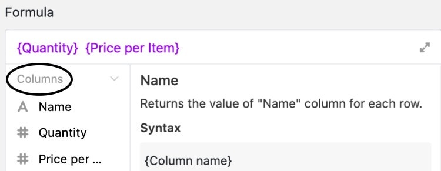

SeaTable bietet Ihnen viele verschiedene Funktionen, die Sie zu Ihrer Tabelle hinzufügen können. Eine davon ist die sogenannte **Formel-Spalte**. Mithilfe von Formeln können Sie Werte von unterschiedlichen Spalten verknüpfen und basierend auf den Datentypen dieser Spalten verschiedene Funktionen erstellen. Sie können unter anderem mit Werten in einer Zeile rechnen, sie zusammenführen oder miteinander in Beziehung setzen.



## Anlegen einer Formel-Spalte

Um eine Formel anzuwenden, müssen Sie zunächst eine neue Formel-Spalte zu Ihrer Tabelle hinzufügen. Wie das geht, erfahren Sie [hier]().

SeaTable bietet Ihnen einen **Formeleditor**, um Ihnen die Eingabe von Formeln zu erleichtern.

## Eine erste Formel schreiben

Sobald Ihre Formel-Spalte angelegt ist, können Sie mit dem Schreiben der Formel beginnen. Die folgende Abbildung zeigt eine einfache Formel, um den Durchschnitt von fünf Zahlen zu berechnen.

Diese Formel schreibt als Ergebnis immer den statischen Wert _13.2_ in die Formel-Spalte. Die wahre Stärke der Formel-Spalte kommt aber erst zur Geltung, wenn Sie die Werte anderer Spalten für Ihre Formel nutzen. Mit dem **{Spaltennamen}** in geschweiften Klammern können Sie auf bestehende Spalten in Ihrer Tabelle referenzieren.



Anschließend können Sie bestimmte **Konstanten**, **Operanden** und **Funktionen** in Ihre Formel einfügen, um mit den Werten der verschiedenen Spalten zu rechnen, sie zusammenzuführen oder in Beziehung zu setzen.

## Klare Farbsprache

Um die verschiedenen Elemente Ihrer Formel voneinander unterscheiden zu können, werden diese je nach Typ in einer unterschiedlichen **Farbe** markiert:

| Objekt            | Example                                                                                             |
| ----------------- | --------------------------------------------------------------------------------------------------- |
| Funktionen        |                        |
| Text / String     |         |
| Zahlen            |          |
| Spaltenreferenzen |  |



Wenn Sie im Formeleditor auf eine öffnende oder schließende Klammer klicken, wird die dazugehörige Klammer ebenfalls hervorgehoben. So können Sie einfacher fehlende oder falsche Klammersetzungen erkennen.



## Formelbeispiele

Im Folgenden finden Sie ein paar Beispiele, die den Nutzen und die Nutzung von Formeln verdeutlichen.

- [Formelbeispiel: Einfache Multiplikation mit einer Formel]()
- [Formelbeispiel: Zusammenführen von Text-Spalten mit Hilfe einer Formel]()
- [Formelbeispiel: Logische If-Operatoren zum Vergleichen von Werten]()
- [Formelbeispiel: Berechne die Dauer eines Urlaubs]()
- [Formelbeispiel: Berechne Tage bis zu einem Event]()
- [Formelbeispiel: Nach einem Wort in einem Text suchen]()

## Mathematische Konventionen gelten auch in SeaTable

Selbstverständlich können Sie sich darauf verlassen, dass mathematische Konventionen auch in den Formeln von SeaTable Ihre Anwendung finden. Hier die wichtigsten Beispiele:

- **Funktionen** können Sie mit Klammern ineinander **verschachteln**. Beispiel: (( 1 + 2 ) \* 3)
- **Punkt vor Strich**, die **Reihenfolge von Klammern** und andere **mathematische Regeln** werden in SeaTable berücksichtigt.

## Formatierung der Formel-Spalte

Die Ergebnisse in der Formel-Spalte können Sie formatieren. Jede Formel in SeaTable hat eine **Zahl**, ein **Datum** oder einen **Text/String** als Ergebnis. Je nachdem stehen Ihnen daher unterschiedliche **Formateinstellungen** zur Verfügung.

