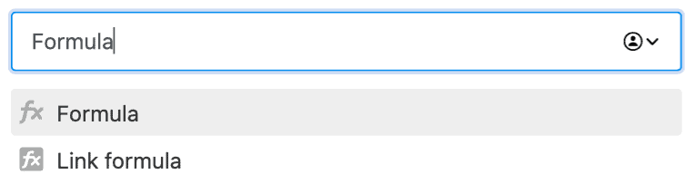
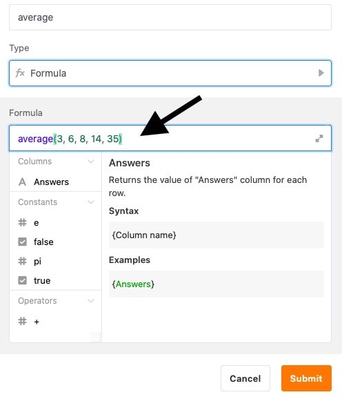
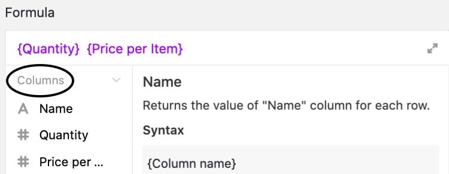

SeaTable offre de nombreuses fonctions différentes que vous pouvez ajouter à votre tableau. L'une d'entre elles est la **colonne des formules**. Les formules vous permettent de combiner les valeurs de différentes colonnes et de créer différentes fonctions basées sur les types de données de ces colonnes.  
Vous pouvez, entre autres, calculer, fusionner ou mettre en relation les valeurs d'une ligne.



## Création d'une colonne de formules

Pour appliquer une formule, vous devez d'abord ajouter une nouvelle colonne de formule à votre tableau. Pour savoir comment faire, [cliquez ici]().

SeaTable propose un **éditeur de formules** pour faciliter la saisie des formules.

## Écrire une première formule

Dès que votre colonne de formules est créée, vous pouvez commencer à écrire la formule. L'illustration suivante montre une formule simple pour calculer la moyenne de cinq nombres.

Cette formule écrit toujours comme résultat la valeur statique _13.2_ dans la colonne de formule. La véritable force de la colonne de formules n'est toutefois mise en valeur que si vous utilisez les valeurs d'autres colonnes pour votre formule. Avec le **{nom de la colonne}** entre accolades, vous pouvez faire référence à des colonnes existantes dans votre tableau.



Vous pouvez ensuite insérer certaines **constantes**, **opérandes** et **fonctions** dans votre formule pour calculer, fusionner ou mettre en relation les valeurs des différentes colonnes.

## Un langage des couleurs clair

Pour pouvoir distinguer les différents éléments de votre formule, ceux-ci sont marqués d'une **couleur** différente selon leur type :

| Objet                   | Exemple                                                                                                                        |
| ----------------------- | ------------------------------------------------------------------------------------------------------------------------------ |
| Fonctions               |                                   |
| Texte / Chaîne          |  |
| Chiffres                |                              |
| Références des colonnes |         |



## Exemples de formules

Vous trouverez ci-dessous quelques exemples qui illustrent l'utilité et l'utilisation des formules.

- [Exemple de formule : multiplication simple par une formule](https://seatable.io/fr/docs/formeln/formelbeispiel-einfache-multiplikation-mit-einer-formel/)
- [Exemple de formule : fusionner des colonnes de texte à l'aide d'une formule](https://seatable.io/fr/docs/formeln/formelbeispiel-zusammenfuehren-von-text-spalten-mit-hilfe-einer-formel/)
- [Exemple de formule : opérateurs logiques If pour comparer des valeurs](https://seatable.io/fr/docs/formeln/formelbeispiel-logische-if-operatoren-zum-vergleichen-von-werten/)
- [Exemple de formule : Calculer la durée d'un congé](https://seatable.io/fr/docs/formeln/formelbeispiel-berechne-die-dauer-eines-urlaubs/)
- [Exemple de formule : calculer les jours jusqu'à un événement](https://seatable.io/fr/docs/formeln/formelbeispiel-berechne-tage-bis-zu-einem-event/)
- [Exemple de formule : Rechercher un mot dans un texte](https://seatable.io/fr/docs/formeln/formelbeispiel-nach-einem-wort-in-einem-text-suchen/)

## Les conventions mathématiques s'appliquent aussi à SeaTable

Vous pouvez bien sûr compter sur le fait que les conventions mathématiques sont également utilisées dans les formules de SeaTable. Voici les exemples les plus importants :

- **Les fonctions** peuvent être **imbriquées** les unes dans les autres à l'aide de parenthèses. Exemple : (( 1 + 2 ) \* 3)
- Le **point avant le tiret**, l'**ordre des parenthèses** et d'autres **règles mathématiques** sont pris en compte dans SeaTable.

## Mise en forme de la colonne de formules

Vous pouvez formater les résultats dans la colonne des formules. Chaque formule de SeaTable a pour résultat un **nombre**, une **date** ou un **texte/une chaîne de caractères**. Vous disposez donc de différents **paramètres de formatage** selon le cas.

