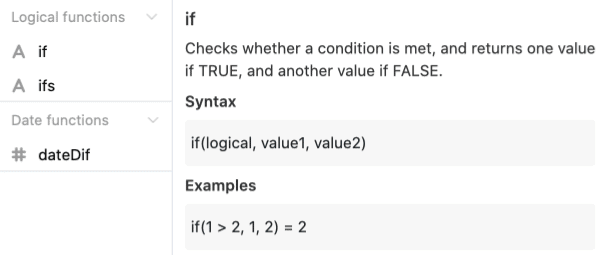

Hier finden Sie Hilfestellungen und Tipps, die Ihnen die Arbeit mit Seatable Formeln erleichtern. Eine Liste aller verfügbaren Formeln finden Sie [hier](https://seatable.io/docs/formeln/formelreferenz/).

## Leerzeichen und Zeilenumbrüche nutzen

Scheuen Sie sich keineswegs davor, beim Erstellen von Formeln mit **Leerzeichen** und **Zeilenumbrüchen** zu arbeiten. Diese helfen Ihnen vor allem in komplexeren Formeln dabei, einen Überblick über die einzelnen Funktionen und andere Elemente zu behalten.

Leerzeichen und Zeilenumbrüche können Sie im **Formeleditor** fast beliebig setzen. Vorsicht ist lediglich bei der Verwendung von **Funktionen** geboten. Direkt **nach** einer Funktion, beispielsweise _lower()_, darf **kein** Leerzeichen gesetzt werden.

### Anwendungsbeispiel

## Syntax im Formeleditor nutzen

Wenn Sie im Formeleditor auf ein **Element** klicken, das Sie zu Ihrer Formel hinzufügen möchten, werden Ihnen hilfreiche Informationen angezeigt. Direkt unter dem Namen des ausgewählten Elements sehen Sie neben einer kurzen Beschreibung der **Funktionsweise** auch eine mögliche **Syntax** und ein konkretes **Beispiel**, wie es in einer Formel aussehen könnte. Beim Schreiben von komplexeren Formeln können diese **Informationen** nützlich sein, um Fehler oder Unsicherheiten zu vermeiden.

## Farbgebung der verschiedenen Formelelemente beachten

Um die verschiedenen Elemente Ihrer Formel voneinander unterscheiden zu können, werden diese je nach Typ in einer unterschiedlichen **Farbe** markiert. Welche Elemente dabei in welcher Farbe dargestellt werden, können Sie [hier](https://seatable.io/docs/formeln/grundlagen-von-seatable-formeln/#klare-farbsprache-zur-orientierung) nachlesen.

Orientieren Sie sich an den verschiedenen **Farben**, um einen besseren Überblick über Ihre Formel zu erhalten. Darüber hinaus kann die farbliche Hervorhebung der Formelelemente in zwei Fällen auch als eine Art **Selbstkontrolle** fungieren:

- **Textelemente** werden in Ihrer Formel erst in **rot** markiert, wenn diese in **Anführungszeichen** gesetzt werden.
- **Verweise auf Spalten** werden in Ihrer Formel erst in **lila** markiert, wenn diese von **geschweiften Klammern** umgeben sind.

Werden die genannten Formelelemente in Ihrer Formel **nicht** in der entsprechenden **Farbe** markiert, haben Sie diese **fehlerhaft** eingegeben. Nutzen Sie zur Korrektur die Syntax oder werfen Sie einen Blick in unsere [Hilfeartikel](https://seatable.io/docs-category/formeln/).

## Hervorhebung von zusammengehörenden Klammern beachten

**Zusammengehörige Klammern** werden im Formeleditor **hervorgehoben**, sobald Sie auf eine öffnende oder schließende Klammer klicken. So können Sie einfacher **fehlende** oder **falsche** Klammersetzungen erkennen.

## Formeln planen

Die Logik und Konstruktion einer Formel kann manchmal eine Herausforderung sein. Eine hilfreiche Übung ist hier, in simpler Sprache aufzuschreiben, welches Ziel Sie konkret erreichen möchten.

Ein optimaler Weg eine Formel zu planen könnte beispielsweise so aussehen:

1. Schreiben Sie zunächst in eigenen Worten auf, welches **Ziel** Sie mit der Formel erreichen möchten (z. B. verbleibende Tage bis zu einem Event berechnen).
2. Suchen Sie im Formeleditor nach einer passenden **Funktion** (z. B. dateDif).
3. Nutzen Sie die **Syntax** der Funktion zur Überprüfung der korrekten Schreibweise, z. B. dateDif(Startdatum, Enddatum, Einheit).
4. Schreiben Sie die **Formel** in das vorgesehene Textfeld im Formeleditor. Nutzen Sie **Zeilenumbrüche** und **Leerzeichen**, um die Logik Ihrer Formel besser sichtbar zu machen. Treten Unklarheiten auf, kontrollieren Sie die Formel anhand der Syntax.
**Tipp**: Vor allem zu Beginn kann es hilfreich sein, zunächst lediglich Teile einer Formel zu schreiben und diese dann nach und nach mit weiteren Elementen zu ergänzen.6. Kontrollieren Sie Ihre Formel auf mögliche **Fehlermeldungen**. Falls Ihnen etwaige angezeigt werden, versuchen Sie zunächst diese selbstständig zu beheben. Falls Sie weitere Hilfe benötigen, nutzen Sie gerne unseren Hilfeartikel [Typische Fehler beim Arbeiten mit Formeln](https://seatable.io/docs/formeln/typische-fehler-beim-arbeiten-mit-formeln/).
