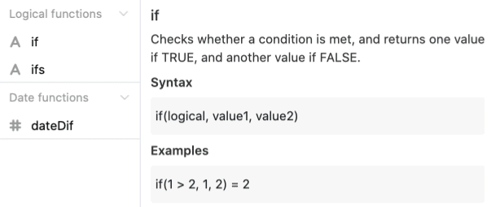

Here you will find help and tips to facilitate your work with Seatable formulas. A list of all available formulas can be found [here](https://seatable.io/en/docs/formeln/formelreferenz/).

## Use spaces and line breaks

Don't be afraid to use **spaces** and **line breaks** when creating formulas. These help you keep an overview of the individual functions and other elements, especially in more complex formulas.

You can set spaces and line breaks almost arbitrarily in the **formula editor**. Caution is only required when using **functions**. Directly **after** a function, for example _lower()_, **no** space must be set.

### Application example

## Using syntax in the formula editor

When you click on an **element** in the formula editor that you want to add to your formula, helpful information is displayed. Directly under the name of the selected element, in addition to a brief description of how it **works**, you'll also see a possible **syntax** and a concrete **example of** how it might look in a formula. When writing more complex formulas, this **information** can be useful to avoid mistakes or uncertainties.

## Note the color scheme of the various form elements

To be able to distinguish the different elements of your formula from each other, they are marked in a different **color** depending on their type. You can find out which elements are displayed in which color [here](https://seatable.io/en/docs/formeln/grundlagen-von-seatable-formeln/#klare-farbsprache-zur-orientierung).

Use the different **colors** as a guide to get a better overview of your formula. In addition, the color highlighting of the formula elements can also act as a kind of **self-control** in two cases:

- **Text elements** are not marked in **red** in your formula until they are enclosed **in quotation marks**.
- **References to columns** are not marked in **purple** in your formula until they are surrounded by **curly braces**.

If the mentioned formula elements are **not** marked in the corresponding **color** in your formula, you have entered them **incorrectly**. To correct this, use the syntax or take a look at our [help articles](https://seatable.io/en/docs-category/formeln/).

## Note highlighting of brackets that belong together

**Matching parentheses** are **highlighted in** the formula editor as soon as you click an opening or closing parenthesis. This makes it easier to spot **missing** or **incorrect** bracket replacements.

## Plan formulas

The logic and construction of a formula can sometimes be challenging. A helpful exercise here is to write down in simple language what specific goal you want to achieve.

For example, an optimal way to plan a formula might look like this:

1. First write down in your own words what **goal** you want to achieve with the formula (e.g. calculate remaining days until an event).
2. Search for a suitable **function** in the formula editor (e.g. dateDif).
3. Use the **syntax of** the function to check the correct spelling, e.g. dateDif(start date, end date, unit).
4. Write the **formula** in the provided text field in the formula editor. Use **line breaks** and **spaces to** make the logic of your formula more visible. If there are any ambiguities, check the formula using the syntax.

**Tip**: Especially at the beginning it can be helpful to write only parts of a formula at first and then gradually add more elements to it.

6. Check your formula for possible **error messages**. If you see any, try to fix them on your own first. If you need further help, feel free to use our help article [Typical errors when working with formulas](https://seatable.io/en/docs/formeln/typische-fehler-beim-arbeiten-mit-formeln/).
