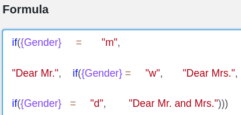

Aquí encontrarás ayuda y consejos para facilitar tu trabajo con las fórmulas de Seatable. [Aquí](https://seatable.io/es/docs/formeln/formelreferenz/) encontrará una lista de todas las fórmulas disponibles.

## Utilizar espacios y saltos de línea

No tengas miedo de utilizar **espacios** y **saltos de línea** al crear fórmulas. Te ayudarán a mantener una visión de conjunto de las distintas funciones y otros elementos, sobre todo en las fórmulas más complejas.

En el **editor de fórmulas** puede establecer espacios y saltos de línea casi a su gusto. Sólo hay que tener cuidado al utilizar **funciones**. **No** se puede poner ningún espacio directamente **después de** una función, por ejemplo _lower()_.

### Ejemplo de aplicación

## Utilizar la sintaxis en el editor de fórmulas

Cuando haga clic en un **elemento** del editor de fórmulas que desee añadir a su fórmula, aparecerá información útil. Justo debajo del nombre del elemento seleccionado, verás una breve descripción de su **funcionamiento**, así como una posible **sintaxis** y un **ejemplo concreto de** cómo podría quedar en una fórmula. Al escribir fórmulas más complejas, esta **información** puede ser útil para evitar errores o incertidumbres.

## Observe la coloración de los distintos elementos del formulario

Para poder distinguir entre sí los distintos elementos de su fórmula, se marcan en un **color** diferente en función de su tipo. Puedes leer [aquí](https://seatable.io/es/docs/formeln/grundlagen-von-seatable-formeln/#klare-farbsprache-zur-orientierung) qué elementos se muestran en cada color.

Utiliza los distintos **colores** como guía para tener una mejor visión general de tu fórmula. Además, el resaltado por colores de los elementos de la fórmula también puede funcionar como una especie de **autocontrol** en dos casos:

- Los **elementos de texto** no se marcan en **rojo** en su fórmula hasta que se encierran **entre comillas**.
- **Las referencias a columnas** no se marcan en **púrpura** en la fórmula hasta que se rodean de **llaves**.

Si los elementos de fórmula mencionados **no** están marcados en el **color** correspondiente en su fórmula, es que los ha introducido **incorrectamente**. Para corregirlo, utilice la sintaxis o eche un vistazo a nuestros [artículos de ayuda](https://seatable.io/es/docs-category/formeln/).

## Resalte los corchetes que van juntos

Los **paréntesis que van juntos** se **resaltan en** el editor de fórmulas en cuanto se hace clic en un paréntesis de apertura o de cierre. Esto facilita la detección de sustituciones de paréntesis que **faltan** o **son incorrectas**.

## Fórmulas del plan

La lógica y la construcción de una fórmula pueden ser a veces un reto. Un ejercicio útil en este caso es escribir en un lenguaje sencillo qué objetivo concreto quieres alcanzar.

Una forma óptima de planificar una fórmula podría ser, por ejemplo, la siguiente:

1. En primer lugar, escriba con sus propias palabras el **objetivo** que desea alcanzar con la fórmula (por ejemplo, calcular los días que faltan para un acontecimiento).
2. Busque una **función** adecuada en el editor de fórmulas (por ejemplo, dateDif).
3. Utilice la **sintaxis de** la función para comprobar la ortografía correcta, por ejemplo dateDif(fecha de inicio, fecha final, unidad).
4. Escriba la **fórmula** en el campo de texto del editor de fórmulas. Utiliza **saltos de línea** y **espacios para** hacer más visible la lógica de tu fórmula. Si hay alguna ambigüedad, comprueba la fórmula utilizando la sintaxis.

**Consejo**: sobre todo al principio, puede ser útil escribir sólo partes de una fórmula al principio e ir añadiéndole más elementos poco a poco.

6. Compruebe su fórmula en busca de posibles **mensajes de error**. Si aparece alguno, primero intente corregirlo usted mismo. Si necesitas más ayuda, utiliza nuestro artículo de ayuda [Errores típicos al trabajar con fórmulas](https://seatable.io/es/docs/formeln/typische-fehler-beim-arbeiten-mit-formeln/).
