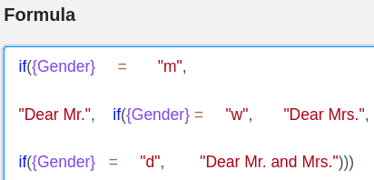

Aqui encontrará ajuda e conselhos para facilitar o seu trabalho com as fórmulas Seatable. Pode encontrar uma lista de todas as fórmulas disponíveis [aqui](https://seatable.io/pt/docs/formeln/formelreferenz/).

## Utilizar espaços e quebras de linha

Não tenha receio de utilizar **espaços** e **quebras de linha** ao criar fórmulas. Estas ajudam a manter uma visão geral das funções individuais e de outros elementos, especialmente em fórmulas mais complexas.

Os espaços e as quebras de linha podem ser definidos de forma quase arbitrária no **editor de fórmulas**. Só é necessário ter cuidado quando se utilizam **funções**. **Nenhum** espaço pode ser colocado diretamente **após** uma função, por exemplo, _lower()_.

### Exemplo de aplicação

## Utilizar a sintaxe no editor de fórmulas

Quando clica num **elemento** no editor de fórmulas que pretende adicionar à sua fórmula, são apresentadas informações úteis. Diretamente sob o nome do elemento selecionado, verá uma breve descrição do seu **funcionamento**, bem como uma possível **sintaxe** e um **exemplo** concreto **do** seu aspeto numa fórmula. Ao escrever fórmulas mais complexas, esta **informação** pode ser útil para evitar erros ou incertezas.

## Repare na coloração dos vários elementos do formulário

Para poder distinguir os diferentes elementos da sua fórmula, estes são marcados com uma **cor** diferente consoante o seu tipo. Pode ler [aqui](https://seatable.io/pt/docs/formeln/grundlagen-von-seatable-formeln/#klare-farbsprache-zur-orientierung) quais os elementos que são apresentados em que cor.

Utilize as diferentes **cores** como guia para obter uma melhor visão geral da sua fórmula. Além disso, o realce de cores dos elementos da fórmula pode também funcionar como uma espécie de **autocontrolo** em dois casos:

- **Os elementos de texto** não são marcados a **vermelho** na sua fórmula até serem colocados **entre aspas**.
- **As referências a colunas** não são marcadas a **roxo** na sua fórmula até estarem **entre parênteses rect** os.

Se os elementos da fórmula mencionados **não** estiverem marcados com a **cor** correspondente na sua fórmula, é porque foram introduzidos **incorretamente**. Para o corrigir, utilize a sintaxe ou consulte os nossos [artigos de ajuda](https://seatable.io/pt/docs-category/formeln/).

## Nota: realce dos parêntesis que pertencem uns aos outros

**Os parênteses que pertencem uns aos outros** são **realçados no** editor de fórmulas assim que clicar num parêntese de abertura ou de fecho. Isto facilita a deteção de substituições de parênteses **em falta** ou **incorrectas**.

## Fórmulas de planeamento

A lógica e a construção de uma fórmula podem, por vezes, ser um desafio. Um exercício útil é escrever numa linguagem simples o objectivo específico que se pretende alcançar.

Uma forma óptima de planear uma fórmula poderia ser a seguinte, por exemplo:

1. Primeiro, escreva por palavras suas o **objetivo** que pretende alcançar com a fórmula (por exemplo, calcular os dias que faltam para um evento).
2. Procure uma **função** adequada no editor de fórmulas (por exemplo, dateDif).
3. Utilize a **sintaxe da** função para verificar a ortografia correcta, por exemplo, dateDif(data de início, data de fim, unidade).
4. Escreva a **fórmula** no campo de texto fornecido no editor de fórmulas. Utilize **quebras de linha** e **espaços para** tornar a lógica da sua fórmula mais visível. Se existirem ambiguidades, verifique a fórmula utilizando a sintaxe.

**Dica**: Especialmente no início, pode ser útil escrever apenas partes de uma fórmula e depois adicionar gradualmente mais elementos.

6. Verificar a fórmula para detectar eventuais **mensagens de erro**. Se for apresentada alguma, tente primeiro corrigi-la. Se precisar de mais ajuda, utilize o nosso artigo de ajuda [Erros típicos ao trabalhar com fórmulas](https://seatable.io/pt/docs/formeln/typische-fehler-beim-arbeiten-mit-formeln/).
