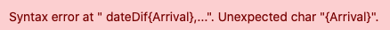

Die Formelfunktion eröffnet Ihnen neue Möglichkeiten in der Arbeit mit Ihren Daten. Mithilfe von _Formeln_ können Sie beispielsweise Werte von unterschiedlichen Spalten verknüpfen und basierend auf dem Inhalt dieser Spalten verschiedene Funktionen erstellen. Da die Arbeit mit komplexeren Formeln jedoch vor allem Anfänger leicht vor Probleme stellen kann, stellen wir Ihnen in diesem Artikel Lösungen für die uns bekanntesten und typischsten Probleme zur Verfügung.

## Typische Fehler bei der Arbeit mit Formeln



Jedes Textelement in Ihren Formeln **muss** zwingend in _Anführungszeichen_ gesetzt werden, damit es vom Formelwizard erkannt wird. Wird ein Text **nicht** in Anführungszeichen gesetzt, kann folgende **Fehlermeldung** erscheinen:

### Fehlerhafte Eingabe:

### Korrekte Eingabe:





**Nach** jeder _Funktion_ muss im Formeleditor zunächst immer eine _öffnende runde Klammer_ folgen, bevor weitere Elemente der Formel hinzugefügt werden dürfen. Wurden alle Elemente einer Funktion der Formel hinzugefügt, muss diese zudem mit einer _schließenden Klammer_ abgeschlossen werden. Werden **keine** Klammern gesetzt, kann die Funktion **nicht** vom Formelwizard erkannt werden und folgende Fehlermeldungen können erscheinen:

### Fehlerhafte Eingabe:

### Korrekte Eingabe:



Das korrekte Setzen von _Klammern_ ist eine der größten Herausforderungen bei der Eingabe von Formeln. Egal ob _runde_, _eckige_ oder _geschweifte_ _Klammern_, sie alle müssen stets an der **richtigen Stelle** in einer Formel gesetzt werden, damit diese vom _Formelwizard_ erkannt wird.



### Runde Klammern

Wie Sie _runde Klammern_ bei der Eingabe von Funktionen korrekt setzen, erfahren Sie im **vorherigen Punkt** dieses FAQ's.

### Geschweifte Klammern

_Geschweifte Klammern_ werden immer dann gesetzt, wenn auf bestimmte **Tabellenspalten** verwiesen wird. Dabei muss der **Name** der gewünschten Spalte stets von zwei _geschweiften Klammern_ umgeben sein. Werden **keine** geschweiften Klammern gesetzt oder die Klammern werden **falsch** gesetzt, kann der Spaltenverweis **nicht** vom _Formelwizard_ erkannt werden und folgende Fehlermeldungen können erscheinen:

### Fehlerhafte Eingabe:

### Korrekte Eingabe:

### Verweise auf Spaltennamen innerhalb Funktionen

Wenn Sie innerhalb einer _Funktion_ auf _Spaltennamen_ verweisen möchten, müssen Sie besonders auf eine **korrekte** Klammersetzung achten. Beachten Sie dabei die individuellen Regeln zur Klammersetzung bei _Funktionen_ und dem Verweis auf _Spaltennamen_ und versuchen Sie zunächst selbstständig, die Formel zu schreiben. Falls Sie sich unsicher sind, denken Sie daran, dass Ihnen die jeweils zugehörige _Klammer_ immer **hervorgehoben** wird, wenn Sie im _Formeleditor_ mit dem Cursor auf eine _auf- oder zugehende Klammer_ gehen.

### Fehlerhafte Eingabe:

### Korrekte Eingabe:


Wenn Sie mehrere _Funktionen_ in Ihrer Formel einbauen möchten, müssen Sie darauf achten, die einzelnen Funktionen stets mit einem **Komma** zu trennen.

Darüber hinaus müssen Sie Formeln, die mehrere Funktionen beinhalten auch mit mehreren _schließenden Klammern_ beenden. Beinhaltet Ihre Formel z.B. **drei** _Funktionen_, muss diese im Formeleditor auch mit **drei** _schließenden Klammern_ beendet werden.

Werden die genannten Punkte **nicht** beachtet, kann die eingegebene Formel **nicht** vom Formelwizard erkannt werden und folgende Fehlermeldungen können erscheinen:

### Fehlerhafte Eingabe:

### Korrekte Eingabe:



Um mehrere Textelemente in Ihrer Formel miteinander zu verknüpfen, müssen Sie die einzelnen _Textelemente_ jeweils mit einem "**&-Symbol**" voneinander trennen. Werden **keine** _&-Symbole_ zwischen den Textelementen hinzugefügt, kann der Formelwizard die eingegebene Formel **nicht** erkennen und folgende Fehlermeldung erscheint:

### Fehlerhafte Eingabe:

### Korrekte Eingabe:




