The formula function opens up new possibilities in working with your data. For example, you can use _formulas_ to link values from different columns and create different functions based on the contents of these columns.  
However, working with more complex formulas can easily pose problems, especially for beginners, so in this article we will provide you with solutions to the most familiar and typical problems we encounter.

## Typical mistakes when working with formulas

It is mandatory **to** enclose each text element in your formulas _in quotation marks_ in order for it to be recognized by the Formula Wizard. If a text is **not** enclosed in quotation marks, the following **error message** may appear:

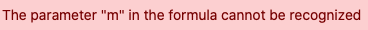

### Incorrect input:

### Correct input:

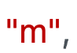



**In** the formula editor, each _function_ must be followed by an _opening parenthesis_ before further elements can be added to the formula.  
If all elements of a function have been added to the formula, it must also be _closed_ with a _closing parent_ hesis. If **no** parentheses are set, the function **cannot** be recognized by the formula wizard and the following error messages may appear:

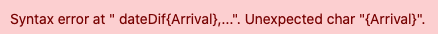

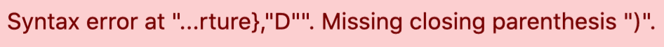

### Incorrect input:

### Correct input:

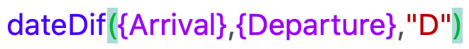



Setting _brackets_ correctly is one of the biggest challenges when entering formulas. Whether _round_, _square_ or _curly_ _brackets_, they all have to be set at the **right place** in a formula so that it is recognized by the _formula wizard._



### Round brackets

How to set _round brackets_ correctly when entering functions is explained in the **previous point of** this FAQ.

### Curly brackets

_Curly bra_ ces are always used when referring to specific **table columns**. The **name of** the desired column must always be surrounded by two _braces_. If **no** braces are set or the braces are set **incorrectly**, the column reference **cannot** be recognized by the _formula wizard_ and the following error messages may appear:

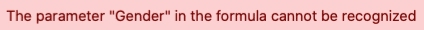

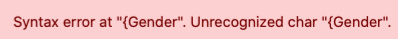

### Incorrect input:

### Correct input:

### References to column names within functions

If you want to refer to _column names_ within a _function_, you must pay special attention to **correct** bracket replacement. Observe the individual rules for bracket replacement for _functions_ and the reference to _column names_ and first try to write the formula yourself.  
If you are unsure, remember that the corresponding _parenthesis_ is always **highlighted** when you move the cursor over an _opening or closing parenthesis_ in the _formula editor_.

### Incorrect input:

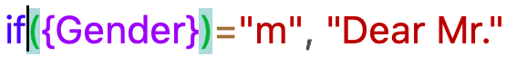

### Correct input:

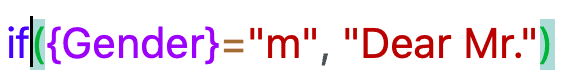

If you want to include several _functions_ in your formula, you must take care to always separate the individual functions with a **comma**.

In addition, you must also end formulas that contain multiple functions with multiple _closing brackets_. For example, if your formula contains **three** _functions_, it must also end with **three** _closing brackets_ in the formula editor.

If the above points are **not** observed, the formula entered **cannot** be recognized by the formula wizard and the following error messages may appear:

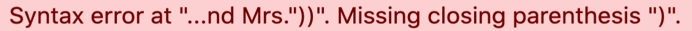

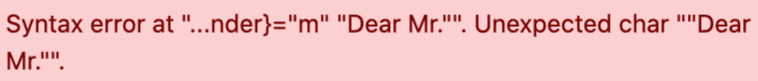

### Incorrect input:

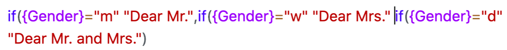

### Correct input:

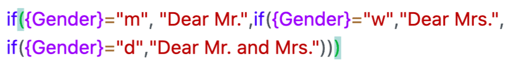







To link multiple text elements in your formula, you must separate each _text_ element with a "**& symbol**". If **no** _& symbols_ are added between the text elements, the formula wizard cannot recognize **the** entered formula and the following error message appears:

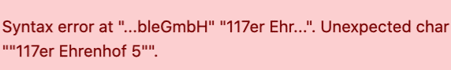

### Incorrect input:

### Correct input:




