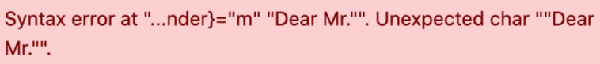

La función de fórmula abre nuevas posibilidades para trabajar con sus datos. Con la ayuda de las _fórmulas_ puede, por ejemplo, vincular valores de diferentes columnas y crear diferentes funciones basadas en el contenido de estas columnas.  
Sin embargo, dado que trabajar con fórmulas más complejas puede plantear problemas fácilmente, sobre todo para los principiantes, en este artículo te daremos soluciones a los problemas más conocidos y típicos.

## Errores típicos al trabajar con fórmulas

Cada elemento de texto de sus fórmulas **debe ir** _entre_ comillas para que sea reconocido por el asistente de fórmulas. Si un texto **no** va entre comillas, puede aparecer el siguiente **mensaje de error**:

### Entrada incorrecta:

### Entrada correcta:



**En** el editor de fórmulas, cada _función_ debe ir seguida de un _paréntesis de apertura_ antes de poder añadir más elementos a la fórmula.  
Si se han añadido todos los elementos de una función a la fórmula, ésta debe _cerrarse también con un paréntesis de cierre_. Si **no** se ponen paréntesis, la función **no puede** ser reconocida por el asistente de fórmulas y pueden aparecer los siguientes mensajes de error:

### Entrada incorrecta:

### Entrada correcta:



La colocación correcta de _los corchetes_ es uno de los mayores retos a la hora de introducir fórmulas. Ya sean _redondos_, _cuadrados_ o _rizados_, deben colocarse siempre en la **posición correcta** en una fórmula para que el _asistente la_ reconozca _._



### Soportes redondos

En el **punto anterior de** esta FAQ se explica cómo poner correctamente _los paréntesis redondos_ al introducir funciones.

### Paréntesis rizados

Las _llaves_ se utilizan siempre para referirse a **columnas** específicas **de la tabla**. El **nombre de** la columna deseada debe ir siempre rodeado de dos _llaves_. Si **no** se colocan corchetes o se colocan **incorrectamente**, el _asistente de fórmulas_ no **podrá** reconocer la referencia a la columna y pueden aparecer los siguientes mensajes de error:

### Entrada incorrecta:

### Entrada correcta:

### Referencias a nombres de columnas dentro de funciones

Si desea hacer referencia a _nombres de columnas_ dentro de una _función_, debe prestar especial atención a **la correcta** sustitución de corchetes. Observe las reglas individuales de sustitución de paréntesis para las _funciones_ y la referencia a nombres _de_ columnas e intente primero escribir la fórmula por su cuenta.  
Si no está seguro, recuerde que el _paréntesis_ correspondiente siempre **aparece resaltado** cuando desplaza el cursor a un _paréntesis de apertura o cierre_ en el _editor de fórmulas_.

### Entrada incorrecta:

### Entrada correcta:


Si desea incluir varias _funciones_ en su fórmula, debe tener cuidado de separar siempre las funciones individuales con una **coma**.

Además, las fórmulas que contienen varias funciones deben terminarse con varios _corchetes_ de cierre. Si su fórmula contiene **tres** _funciones_, por ejemplo, también debe terminar con **tres** _corchetes_ de cierre en el editor de fórmulas.

Si **no** se respetan los puntos anteriores, la fórmula introducida **no puede** ser reconocida por el asistente de fórmulas y pueden aparecer los siguientes mensajes de error:

### Entrada incorrecta:

### Entrada correcta:



Para enlazar varios elementos de texto en su fórmula, debe separar los _elementos de texto_ individuales entre sí con un**"símbolo &**". Si **no** se añaden _símbolos_ & entre los elementos de texto, el asistente de fórmulas **no puede** reconocer la fórmula introducida y aparece el siguiente mensaje de error:

### Entrada incorrecta:

### Entrada correcta:




