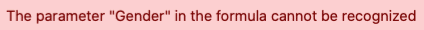
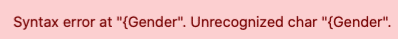
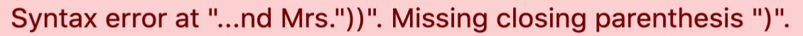
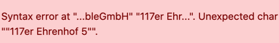

La fonction de formule vous ouvre de nouvelles possibilités pour travailler avec vos données. Les _formules_ vous permettent par exemple de combiner les valeurs de différentes colonnes et de créer différentes fonctions basées sur le contenu de ces colonnes.  
Toutefois, comme le travail avec des formules complexes peut facilement poser des problèmes, surtout aux débutants, nous vous proposons dans cet article des solutions aux problèmes les plus connus et les plus typiques.

## Erreurs typiques lors du travail avec des formules

Chaque élément de texte de vos formules **doit** impérativement être placé entre _guillemets_ pour être reconnu par l'assistant de formules. Si un texte **n'est pas** placé entre guillemets, le **message d'erreur** suivant peut apparaître :

### Erreur de saisie :

### Saisie correcte :



Dans l'éditeur de formules, chaque _fonction_ doit toujours être **suivie** d'une _parenthèse ouvrante_ avant que d'autres éléments puissent être ajoutés à la formule.  
Lorsque tous les éléments d'une fonction ont été ajoutés à la formule, celle-ci doit en outre être terminée par une _parenthèse fermante_. Si **aucune** parenthèse n'est placée, la fonction ne peut **pas** être reconnue par l'assistant de formules et les messages d'erreur suivants peuvent apparaître :

### Erreur de saisie :

### Saisie correcte :



Le placement correct des _parenthèses_ est l'un des plus grands défis lors de la saisie de formules. Qu'il s _'\_agisse de \_parenthèses_, de _crochets_ ou _d_ _'_ _accolades_, ils doivent toujours être placés au **bon endroit** dans une formule pour que celle-ci soit reconnue par l'_Assistant de formule_.



### Agrafes rondes

Le **point précédent** de cette FAQ vous explique comment placer correctement _les parenthèses rondes_ lors de la saisie de fonctions.

### Accolades

_Les accolades_ sont toujours placées lorsqu'il est fait référence à certaines **colonnes du tableau**. Le **nom** de la colonne souhaitée doit toujours être entouré de deux _accolades_. Si **aucune** accolade n'est placée ou si les accolades sont **mal** placées, la référence à la colonne ne peut **pas** être reconnue par l'_Assistant de formules_ et les messages d'erreur suivants peuvent apparaître :

### Erreur de saisie :

### Saisie correcte :

### Références aux noms de colonnes dans les fonctions

Si vous souhaitez faire référence à des _noms de colonnes_ au sein d'une _fonction_, vous devez faire particulièrement attention au remplacement **correct** des parenthèses. Respectez les règles individuelles de remplacement des parenthèses pour les _fonctions_ et les renvois aux _noms de colonnes_ et essayez d'abord d'écrire la formule vous-même.  
Si vous n'êtes pas sûr, n'oubliez pas que la _parenthèse_ correspondante est toujours **mise en évidence** lorsque vous passez le curseur sur une _parenthèse ouverte ou fermée_ dans l'_éditeur de formules_.

### Erreur de saisie :

### Saisie correcte :


Si vous souhaitez intégrer plusieurs _fonctions_ dans votre formule, vous devez veiller à toujours séparer les différentes fonctions par une **virgule**.

De plus, les formules qui contiennent plusieurs fonctions doivent être terminées par plusieurs _parenthèses fermantes_. Si votre formule contient par exemple **trois** _fonctions_, elle doit également se terminer par **trois** _parenthèses fermantes_ dans l'éditeur de formules.

Si les points mentionnés ne sont **pas** respectés, la formule saisie ne peut **pas** être reconnue par l'assistant de formules et les messages d'erreur suivants peuvent apparaître :

### Erreur de saisie :

### Saisie correcte :



Pour relier plusieurs éléments de texte dans votre formule, vous devez séparer chaque _élément de texte_ par un "**symbole &**". Si **aucun** _symbole &_ n'est ajouté entre les éléments de texte, l'Assistant de Formule ne peut **pas** reconnaître la formule saisie et le message d'erreur suivant apparaît :

### Erreur de saisie :

### Saisie correcte :




