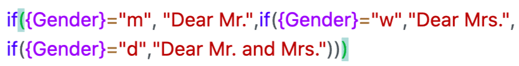

A função de fórmula abre novas possibilidades para trabalhar com os dados. Com a ajuda de _fórmulas_, é possível, por exemplo, ligar valores de diferentes colunas e criar diferentes funções com base no conteúdo dessas colunas.  
No entanto, uma vez que o trabalho com fórmulas mais complexas pode facilmente colocar problemas, especialmente para os principiantes, neste artigo iremos fornecer-lhe soluções para os problemas mais familiares e típicos.

## Erros típicos ao trabalhar com fórmulas

Cada elemento de texto nas suas fórmulas **deve ser** colocado entre _aspas_ para que seja reconhecido pelo assistente de fórmulas. Se um texto **não** estiver entre aspas, pode aparecer a seguinte **mensagem de erro**:

### Entrada incorrecta:

### Entrada correcta:



**No** editor de fórmulas, cada _função_ deve ser seguida por um _parêntesis de abertura_ antes de poderem ser adicionados outros elementos à fórmula.  
Se todos os elementos de uma função tiverem sido adicionados à fórmula, esta deve também ser _fechada_ com um parêntesis _de fecho_. Se **não** forem colocados parênteses, a função **não pode** ser reconhecida pelo assistente de fórmulas e podem aparecer as seguintes mensagens de erro:

### Entrada incorrecta:

### Entrada correcta:



A definição correcta dos _parênteses_ é um dos maiores desafios ao introduzir fórmulas. Quer sejam _parênteses_ _redondos_, _quadrados_ ou curvos, devem ser sempre colocados na **posição correcta** numa fórmula para que sejam reconhecidos pelo _assistente de fórmulas_.



### Suportes redondos

O **ponto anterior desta** FAQ explica como colocar correctamente _os parênteses redondos_ ao introduzir funções.

### Parêntesis enrolados

_As chavetas_ são sempre utilizadas quando se faz referência a **colunas** específicas **da tabela**. O **nome da** coluna pretendida deve ser sempre rodeado por duas _chavetas_. Se **não** forem colocadas chaves ou se as chaves forem colocadas **incorrectamente**, a referência à coluna não pode **ser** reconhecida pelo _assistente de fórmulas_ e podem aparecer as seguintes mensagens de erro:

### Entrada incorrecta:

### Entrada correcta:

### Referências a nomes de colunas em funções

Para fazer referência a _nomes de colunas_ dentro de uma _função_, é necessário prestar especial atenção à substituição **correcta** dos parênteses. Observe as regras individuais de substituição de parênteses para _funções_ e a referência a _nomes de colunas_ e tente primeiro escrever a fórmula por si próprio.  
Se não tiver a certeza, lembre-se que o _parêntese_ correspondente é sempre **realçado** quando move o cursor para um _parêntese de abertura ou de fecho_ no _editor de fórmulas_.

### Entrada incorrecta:

### Entrada correcta:


Se pretender incluir várias _funções_ na fórmula, deve ter o cuidado de separar sempre as funções individuais com uma **vírgula**.

Além disso, é necessário terminar as fórmulas que contêm várias funções com vários _colchetes de fechamento_. Se a fórmula contém **três** _funções_, por exemplo, ela também deve ser encerrada com **três** _colchetes_ no editor de fórmulas.

Se os pontos acima **não** forem respeitados, a fórmula introduzida **não pode** ser reconhecida pelo assistente de fórmulas e podem aparecer as seguintes mensagens de erro:

### Entrada incorrecta:

### Entrada correcta:



Para ligar vários elementos de texto na sua fórmula, deve separar os _elementos de texto_ individuais uns dos outros com um**"símbolo &**". Se **não** forem adicionados _símbolos &_ entre os elementos de texto, o assistente de fórmulas **não pode** reconhecer a fórmula introduzida e aparece a seguinte mensagem de erro:

### Entrada incorrecta:

### Entrada correcta:




