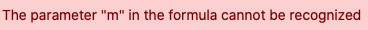
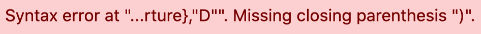
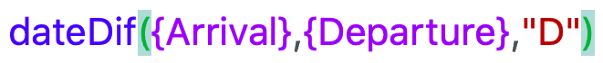
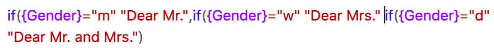

Функция формул открывает новые возможности для работы с данными. С помощью _формул_ можно, например, связывать значения из разных столбцов и создавать различные функции на основе содержимого этих столбцов.  
Однако, поскольку работа с более сложными формулами может легко вызвать проблемы, особенно у новичков, в этой статье мы предоставим вам решения наиболее знакомых и типичных проблем.

## Типичные ошибки при работе с формулами

Каждый текстовый элемент в ваших формулах **должен быть** заключен _в инвертированные запятые_, чтобы он был распознан мастером формул. Если текст **не** заключен в инвертированные запятые, может появиться следующее **сообщение об ошибке**:

### Неправильный ввод:

### Правильный ввод:



**В** редакторе формул за каждой _функцией_ должна следовать _открывающая скобка_, прежде чем в формулу будут добавлены последующие элементы.  
Если все элементы функции были добавлены в формулу, ее также необходимо _закрыть закрывающей скобкой_. Если скобки **не** установлены, функция **не** будет распознана мастером формул, и могут появиться следующие сообщения об ошибках:

### Неправильный ввод:

### Правильный ввод:



Правильная установка _скобок_ - одна из самых сложных задач при вводе формул. Будь то _круглые_, _квадратные_ или _фигурные_ _скобки_, все они должны всегда располагаться в **правильном положении** в формуле, чтобы она была распознана _мастером формул_.



### Круглые скобки

Как правильно расставить _круглые скобки_ при вводе функций, объясняется в **предыдущем пункте** этого FAQ.

### Фигурные скобки

_Фигурные скобки_ всегда используются при ссылке на конкретные **столбцы таблицы**. **Имя** нужного столбца всегда должно быть окружено двумя фигурными _скобками_. Если скобки **не** установлены или установлены **неправильно**, ссылка на столбец не **будет** распознана _мастером формул_, и могут появиться следующие сообщения об ошибках:

### Неправильный ввод:

### Правильный ввод:

### Ссылки на имена столбцов в функциях

Если вы хотите ссылаться на _имена столбцов_ внутри _функции_, необходимо обратить особое внимание на **правильную** замену скобок. Соблюдайте отдельные правила замены скобок для _функций_ и ссылки на _имена столбцов_ и сначала попробуйте написать формулу самостоятельно.  
Если вы не уверены, помните, что при наведении курсора на _открывающую или закрывающую_ _скобку_ в _редакторе формул_ всегда **выделяется** соответствующая _скобка_.

### Неправильный ввод:

### Правильный ввод:


Если вы хотите включить в формулу несколько _функций_, необходимо позаботиться о том, чтобы всегда разделять отдельные функции **запятой**.

Кроме того, формулы, содержащие несколько функций, необходимо завершать несколькими _закрывающими скобками_. Например, если ваша формула содержит **три** _функции_, то в редакторе формул она должна быть завершена **тремя** _закрывающими скобками_.

Если вышеуказанные пункты **не** соблюдены, введенная формула **не** будет распознана мастером формул, и могут появиться следующие сообщения об ошибках:

### Неправильный ввод:

### Правильный ввод:



Чтобы связать в формуле несколько текстовых элементов, необходимо отделить _их_ друг от друга **символом "&**". Если между текстовыми элементами **не** добавлены _символы &_, мастер формул **не сможет** распознать введенную формулу и выдаст следующее сообщение об ошибке:

### Неправильный ввод:

### Правильный ввод:




