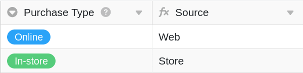
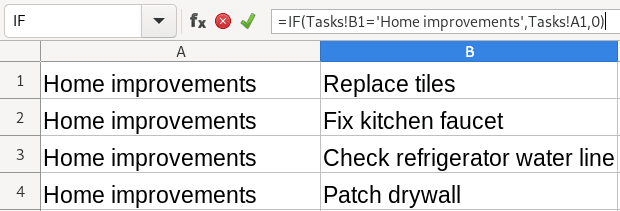
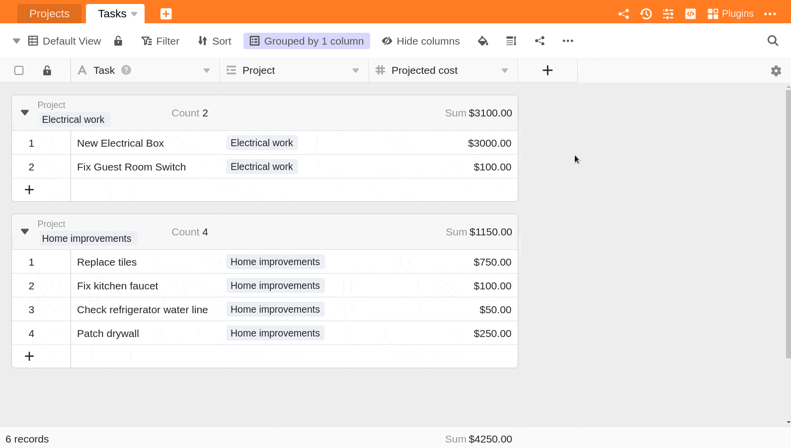

Vous êtes un utilisateur d'Excel familier avec l'écriture de formules et vous commencez tout juste à utiliser SeaTable ?  
Alors cet article est fait pour vous ! Bien que les principes des fonctions de formule dans SeaTable soient similaires, il y a quelques différences importantes que vous devez apprendre au début et qui porteront leurs fruits si vous souhaitez devenir un expert des formules SeaTable.

## Différence centrale

La différence la plus centrale et la plus importante entre la fonction de formule de SeaTable et celle d'Excel est le **champ d'action** des formules.

Alors qu'**Excel** vous permet de saisir une formule dans n'importe quelle cellule, qui renvoie ensuite à n'importe quelle autre cellule de la feuille de calcul, les formules de **SeaTable** renvoient à des _colonnes_ entières et **non** à des cellules spécifiques.

Dans ce contexte, SeaTable fonctionnant comme une base de données relationnelle, les formules sont appliquées à toute la _colonne_ d'un tableau, de sorte que la même formule s'applique à chaque entrée de cette colonne.

## Référencement des lignes

### Excel

Chaque cellule particulière peut être référencée dans une autre cellule. Par exemple, pour déterminer la source de chaque achat dans un tableau, vous écririez une formule qui renverrait à chaque  
cellule - comme A3 - pour vérifier la nature de la source.

La formule utilisée ci-dessous est la suivante :  
**\= IF(A3 = "Online", "Web", "Store")**

La formule fait référence à des _cellules_ spécifiques, par exemple A3.

### SeaTable

Une formule s'applique toujours à une _colonne_ entière et **non** à des cellules spécifiques. Par exemple, pour identifier la source de chaque achat, vous écririez une formule qui se réfère à la colonne {Type d'achat} et la formule vérifiera cette colonne pour chaque entrée du tableau.

La formule utilisée ci-dessous est la suivante :

**IF({Type d'achat}= "En ligne", "Web", "Boutique")**

La formule fait référence à des _colonnes_ entières, comme par exemple {Purchase Type}.

## Valeurs provenant d'autres tableaux

Les formules SeaTable fonctionnent à l'intérieur des _tableaux_, pas au-delà des _bases_.  
Comme ci-dessus, les formules SeaTable ne concernent par défaut que les _colonnes_ d'une même _table_. Il est toutefois possible de prendre une valeur dans un autre tableau pour la référencer dans un champ de calcul (cette approche utilise des enregistrements liés, qui sont traités plus en détail [ici]() ).

### Excel

Pour faire référence à un enregistrement dans un autre tableau, vous devez écrire des références spécifiques à l' dans un format tel que, par exemple, le suivant :

**\=IF(Tâches!B1='Home improvements',Tâches!A1,0).**

Ensuite, vous devez appliquer cette formule à chaque cellule dans laquelle vous souhaitez exécuter la formule (en modifiant les références de cellule pour chaque cellule dans laquelle vous souhaitez exécuter la formule).

### SeaTable

Pour référencer un enregistrement dans un autre tableau, vous pouvez d'abord les lier à l'aide du type de colonne **"Lien vers d'autres entrées"**. Une fois qu'un enregistrement d'un tableau, par exemple "Projects", est lié à un enregistrement d'un autre tableau, par exemple "Tasks", vous pouvez faire référence à chaque ligne des deux tableaux en utilisant une **colonne** **lookup**, **rollup** ou **count**.

Dans l'exemple ci-dessous, une **colonne déroulante** est utilisée pour faire référence de manière simple aux coûts de chaque tâche associée à un projet et pour additionner les dépenses afin de déterminer le coût total du projet.

La fonction crée ainsi une série de possibilités d'écrire des formules simples ou complexes pour référencer des données entre les tableaux.
