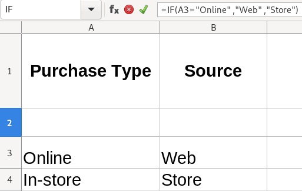
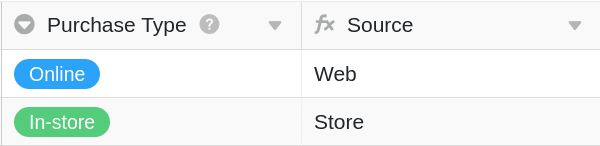

É um utilizador de Excel que está familiarizado com a escrita de fórmulas e está apenas a começar com o SeaTable?  
Então este artigo é para si! Embora os princípios das funções da fórmula em SeaTable sejam semelhantes, existem algumas diferenças importantes que precisa de aprender no início e que compensarão se quiser tornar-se um especialista em fórmulas SeaTable.

## Diferença central

A diferença mais central e importante na função da fórmula de SeaTable e Excel é a **gama eficaz das** fórmulas.

Enquanto no **Excel** pode introduzir uma fórmula em qualquer célula, que depois se refere a qualquer outra célula da folha de cálculo, as fórmulas no **SeaTable** referem-se a _colunas_ inteiras e **não** a células específicas.

Uma vez que o SeaTable actua como uma base de dados relacional neste contexto, as fórmulas são aplicadas a toda a _coluna_ de uma tabela de modo a que a mesma fórmula se aplique a cada entrada nessa coluna.

## Referenciação de linhas

### Excel

Qualquer célula em particular pode ser referenciada noutra célula. Por exemplo, para determinar a origem de cada compra numa tabela, escreveria uma fórmula que referiria cada  
célula - como A3 - para verificar o tipo de fonte.

A fórmula utilizada é a seguinte  
**\= IF(A3 = "Online", "Web", "Loja")**

A fórmula refere-se a _células_ específicas, tais como A3.

### SeaTable

Uma fórmula é sempre aplicada a uma _coluna_ inteira e **não a** células específicas. Por exemplo, para identificar a origem de cada compra, escreveria uma fórmula que faz referência à coluna {Tipo de compra} e a fórmula verificará essa coluna para cada entrada na tabela.

A fórmula utilizada abaixo é a seguinte:

**IF({Tipo de compra}= "Online", "Web", "Loja")**

A fórmula refere-se a _colunas_ inteiras, tais como {Tipo de Compra}.

## Valores de outros quadros

As fórmulas SeaTable funcionam dentro de _tabelas_, não através de _bases_.  
Tal como acima, por defeito, as fórmulas SeaTable referem-se apenas a _colunas_ dentro da mesma _tabela_. No entanto, há formas de tomar um valor de outra tabela para o referenciar num campo de fórmula (esta abordagem utiliza registos ligados, que são [aqui]() discutidos em mais pormenor).

### Excel

Para se referir a um registo noutra tabela, deve escrever referências específicas à outra tabela num formato tal como o seguinte:

**\=IF(Tarefas!B1='Melhorias na casa',Tarefas!A1,0).**

Depois é necessário aplicar esta fórmula a cada célula onde se pretende executar a fórmula (mudando as referências das células para cada célula onde se pretende executar a fórmula).

### SeaTable

Para fazer referência a um registo noutra tabela, pode primeiro ligá-lo utilizando o tipo de coluna **"Ligação a outros registos"**. Assim que um registo de uma tabela, por exemplo, "Projectos", estiver ligado a um registo de outra tabela, por exemplo, "Tarefas", pode fazer referência a cada linha de ambas as tabelas utilizando uma **coluna** de **pesquisa**, **rollup** ou **contagem**.

No exemplo seguinte, uma **coluna de roll-up** é utilizada para se referir facilmente aos custos das tarefas individuais associadas a um projecto e somar as despesas para determinar o custo total do projecto.

A função cria uma gama de possibilidades de escrever fórmulas simples e complexas para referenciar dados entre tabelas.
