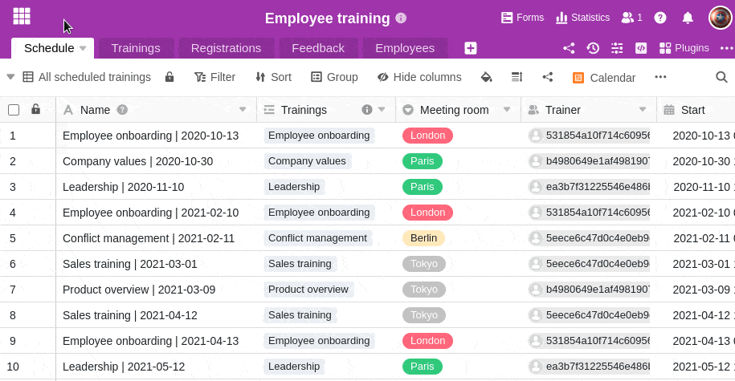

In SeaTable you can create and save different views for your tables. For example, if you want to filter a table by a certain value, you can save the filtered view of the table and thus access it faster in the future without having to filter again.  
Additionally, you have the option to create private views. In which points private views differ from normal views, you will learn **[In this article](https://seatable.io/en/?post_type=docs&p=17424)**.

## Creating a new view in SeaTable

1. Click the **triangle icon to** the left of the current table view name.
2. Click **View or Add Folder.**
3. Click **Add View**.
4. **Name** the new view.
5. Select whether the newly created view should be created **normally** or as a **private view**.
6. Confirm with **Submit**.
7. The newly created **view** opens automatically and you can, for example, **filter**, **sort** or **group** values.
   
