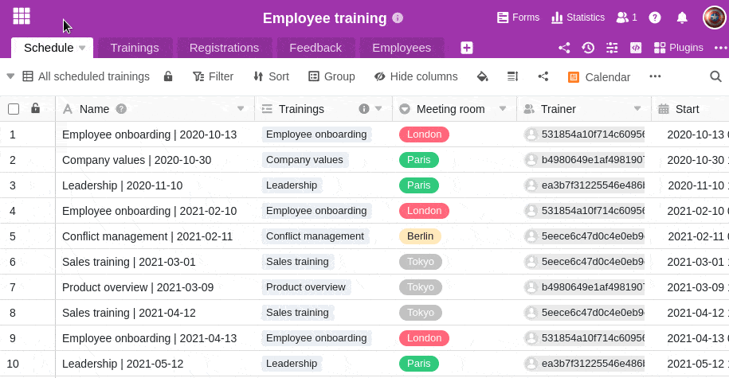

В SeaTable вы можете создавать и сохранять различные представления для своих таблиц. Например, если вы хотите отфильтровать таблицу по определенному значению, вы можете сохранить отфильтрованное представление таблицы и таким образом получить к ней более быстрый доступ в будущем без необходимости повторной фильтрации.  
Кроме того, у вас есть возможность создавать частные представления. О том, чем частные взгляды отличаются от обычных, можно узнать из следующих пунктов **[В этой статье](https://seatable.io/ru/?post_type=docs&p=17424)**.

## Создание нового представления в SeaTable

1. Нажмите на **символ треугольника** слева от названия текущего представления таблицы.
2. Нажмите на **Просмотр или Добавить папку**.
3. Нажмите кнопку **Добавить вид**.
4. **Назовите** новое представление.
5. Выберите, будет ли вновь созданное представление создаваться в **обычном** режиме или как **частное представление**.
6. Подтвердите с помощью кнопки **Отправить**.
7. Вновь созданное **представление** открывается автоматически, и вы можете, например, **фильтровать**, **сортировать** или **группировать** значения.
   
