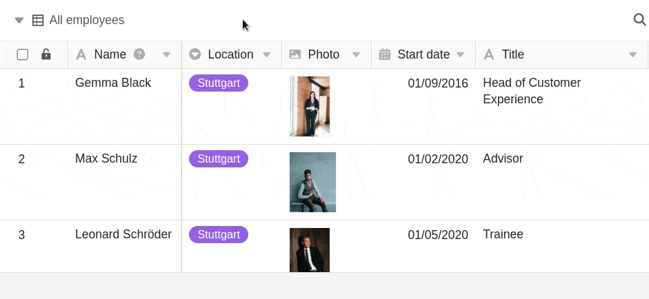

Dans chaque tableau, vous avez la possibilité d'afficher en permanence toutes les [vues](https://seatable.io/fr/docs/grundlagen-von-ansichten/was-ist-eine-ansicht/) disponibles dans une barre de navigation sur le bord gauche. Cela a surtout du sens si vous passez souvent d'une vue à l'autre et qu'un accès rend cela plus efficace.

Une **navigation** épinglée dans **les vues** reste visible même si vous faites défiler un tableau vers la droite. Vous pouvez ainsi facilement comparer des entrées dans différentes vues.

## Pour afficher ou masquer la navigation dans les vues, procédez comme suit

1. Cliquez sur l'icône déroulante  à côté de la vue actuellement ouverte.
2. Cliquez sur l'épingle .

Tant que l'épingle est marquée **en rouge**, les vues de tableau disponibles sont **épinglées** sur le bord gauche de la page. Pour **masquer** à nouveau la navigation des vues, cliquez à nouveau sur l'épingle.
