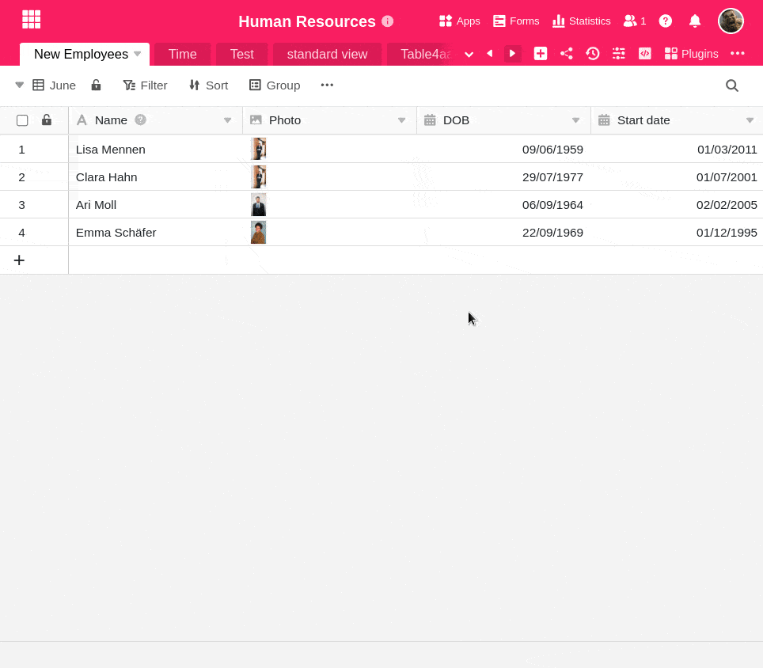

Las distintas **vistas** pueden facilitar el trabajo con tablas que contienen mucha información. También puede **imprimir** estas vistas.

## Imprimir una vista

1. Lo primero es lo primero: la vista que desea imprimir debe estar **seleccionada en ese momento**.
2. Haga clic en los **tres puntos** de las opciones de visualización del extremo derecho.
3. Seleccione la opción **Vista de impresión**.
4. Se abre la ventana **Configuración de impresión**. Realice aquí los ajustes de impresión que desee y haga clic en **Imprimir**.
5. Ahora se abre la **ventana de impresión estándar de** su máquina, donde puede ver una vista previa de la impresión y realizar otros ajustes,^ como la **impresora** que se va a utilizar, el **color** y el número de **copias**.
6. Vuelva a hacer clic en **Imprimir** en la ventana de impresión para iniciar la impresión.

## Posibles opciones de impresión

Tiene la opción de configurar las siguientes opciones de impresión:

- Tamaño del papel
- Alineación
- Escala de columnas
- Tamaño de letra
- Escala
- Título
- Imprimir número de líneas
- Envolver texto largo en varias líneas
- Mostrar sólo resultado sin tipo de resultado
