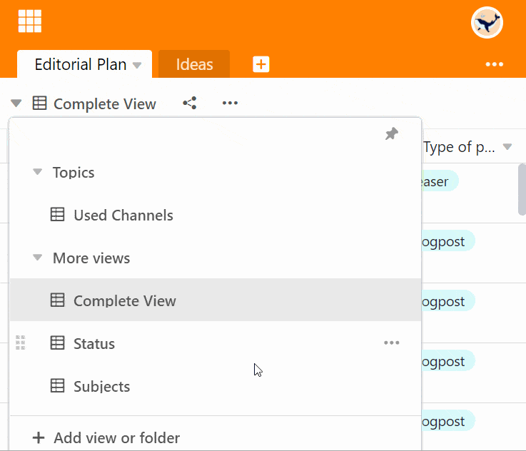

Вы можете изменить **порядок** перечисления представлений таблицы по своему усмотрению. Перемещение осуществляется удобным способом **перетаскивания**.

## Изменение порядка представления

1. Щелкните по **названию текущего представления**.
2. Подведите мышь к виду, который нужно переместить.
3. Удерживать появление **Символ с шестью точками**

    
    для перемещения и перетаскивания вида в нужное положение. A **чёрная линия** показывает позицию, в которую перейдет линия.

4. Отпустите кнопку мыши, как только вид окажется в нужном положении.

## Часто задаваемые вопросы



Является ли заказ индивидуальным для каждого пользователя?|||

Нет. Порядок просмотра одинаков для всех пользователей базы.

---

Можно ли также группировать представления?|||

Конечно. Представления можно легко организовать в [папки](https://seatable.io/ru/docs/grundlagen-von-ansichten/ansichten-in-ordnern-gruppieren).

---

Ведут ли себя частные взгляды по-другому?|||

Нет. Вы можете перемещать частные представления таким же образом, используя перетаскивание. Однако частные виды видны только вам.


