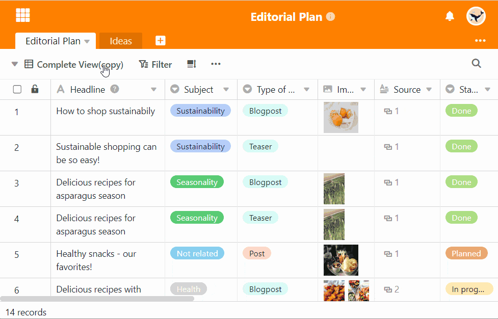

Falsch erstellte oder irrelevant gewordene Ansichten können Sie jederzeit löschen, indem Sie auf das Ansichtsmenü klicken und die Option **Ansicht löschen** auswählen.

## Löschen einer Ansicht

1. Klicken Sie auf den **Namen der aktuellen Ansicht**.
2. Fahren Sie mit der Maus über die Ansicht, die Sie löschen möchten.
3. In der Ansichtszeile werden **drei Punkte** sichtbar. Wählen Sie diese aus.
4. Wählen Sie die Option **Ansicht löschen** aus.

## Häufige Fragen

 Kann eine gelöschte Ansicht wiederhergestellt werden?

|||

**Nein**. Da eine Ansicht keine eigenen Daten enthält, sondern lediglich eine spezielle Darstellung der Daten ist, kann man eine gelöschte Ansicht weder über den Papierkorb noch über den Shortcut \[keybt\]STRG\[/keybt\] + \[keybt\]Z\[/keybt\] wiederherstellen.

---

Kann eine Ansicht immer gelöscht werden?

|||

Sie können Ansichten nur löschen, wenn Sie **mindestens eine zusätzliche Ansicht** zu der Default View erstellt haben.


