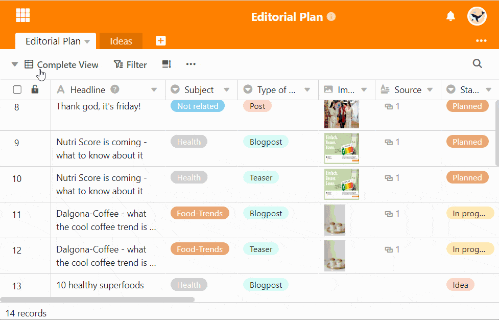

For the optimal overview of the data in your table, SeaTable offers you **views** in which you can store your filters, sorts and groupings. You should give these views a meaningful name. Even afterwards, you can **rename** your views at any time.

## Rename views

1. Click the **name of the current view**.
2. Hover the mouse over the view you want to rename.
3. **Three points** become visible in the view line. Select them.
4. Select the **Rename View** option.
5. Delete the old name and enter a **new** one.

