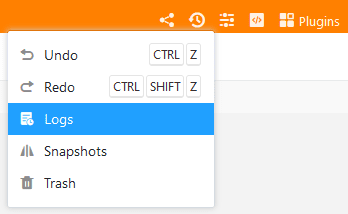
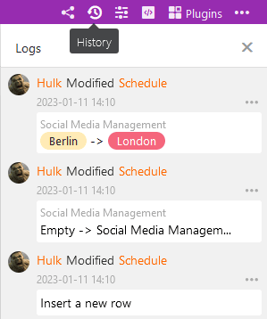

SeaTable logs all activities within a base in a log. This log can be used to restore not only individual values, but also rows, columns and tables. With the logs you can see the changes in more detail and undo more than with the recycle bin.

## To open the log of a base

You open the logs like the recycle bin via the versions icon in the upper right corner.

In the panel that opens you will find, in antichronological order, the most recent changes made in base. Each log entry contains the following information:

- Name of the processor
- Nature of the change
- Table concerned
- Date of the change
- Description of the change

## Load older log entries

When working intensively in a base, the log contains a lot of entries and it may be necessary to **scroll down the log**. This is because the list of entries does not load in full when you open it. By scrolling down, older entries of the log are successively reloaded, which you can then search.

For each base, you can view a maximum of the last 1,000 entries in the log. The documentation of changes even further in the past is deleted and usually no longer needed.

## Undo changes

You can undo a change by clicking **Restore** via the **three-dot icon** in the log entry. The restore is immediately executed in the corresponding table and confirmed with a short message.

An undone action remains documented in the log, but cannot be executed again. A corresponding attempt is acknowledged with an error message.


