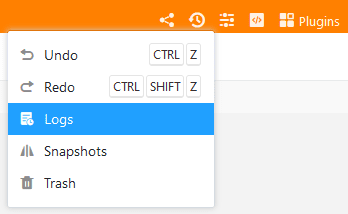

SeaTable regista todas as actividades dentro de uma base num tronco. Este registo pode ser utilizado para restaurar não só valores individuais, mas também linhas, colunas e tabelas. Os registos permitem visualizar as alterações com mais detalhe e desfazer mais do que através do caixote do lixo da reciclagem.

## Para abrir o registo de uma base

Abre-se os registos como o caixote do lixo da reciclagem através do ícone das versões no canto superior direito.

No painel que abre, encontrará as mais recentes alterações feitas na Base por ordem anticronológica. Cada entrada de registo contém a seguinte informação:

- Nome do editor
- Natureza da mudança
- Tabela em questão
- Data da alteração
- Descrição da alteração

## Carregar entradas de registo mais antigas

Se estiver a trabalhar intensivamente numa base, o registo contém muitas entradas e pode ser necessário **percorrer o registo para baixo**. A lista de entradas não é carregada na sua totalidade quando a abre. Ao rolar para baixo, as entradas mais antigas do registo são sucessivamente recarregadas, que pode depois procurar.

Para cada base, é possível visualizar no máximo as últimas 1000 entradas no registo. A documentação das alterações efectuadas no passado é eliminada e, normalmente, já não é necessária.

## Desfazer alterações

Pode desfazer uma alteração clicando em **Restaurar** através do **ícone de três pontos** na entrada do registo. A restauração é imediatamente executada na tabela correspondente e confirmada com uma breve mensagem.

Uma acção desfeita permanece documentada no registo, mas não pode ser executada novamente. Uma tentativa correspondente é reconhecida com uma mensagem de erro.


